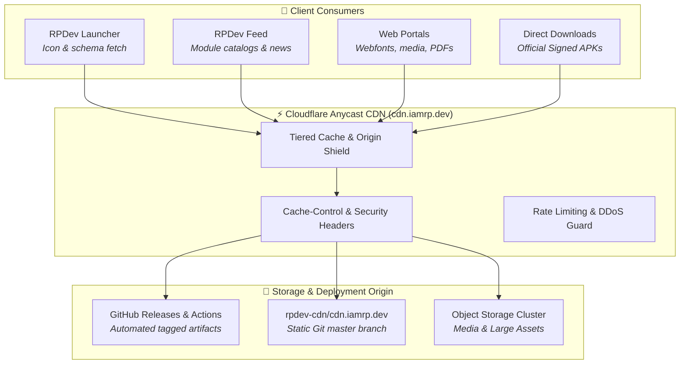

# 🌐 Edge Content Delivery Network (CDN)

> **The high-speed, global edge distribution network powering official APK releases, cryptographic checksums, JSON module catalogs, vector assets, and typography across the RPDev ecosystem.**

- **Base URL**: `https://cdn.iamrp.dev`
- **Origin Server**: Cloudflare Edge Ingress with S3/R2-compatible storage backend and local failover
- **Network Topology**: Anycast edge routing across 300+ global points of presence (PoPs)
- **Security**: Strict TLS 1.3, Subresource Integrity (SRI), and SHA-256 binary validation

---

## 🏛️ CDN Architecture Overview



---

## 📂 Directory Structure & Canonical Endpoints

The CDN repository is structured into distinct top-level asset domains:

| Path Prefix | Content Type | Caching Policy | Example Endpoint |
|---|---|---|---|
| `/feed/releases/` | Signed Feed APKs & SHA-256 checksums | `public, max-age=31536000, immutable` | [`/feed/releases/RPDev-Feed-v1.2.1.apk`](https://cdn.iamrp.dev/feed/releases/RPDev-Feed-v1.2.1.apk) |
| `/launcher/releases/` | Signed Launcher APKs & checksums | `public, max-age=31536000, immutable` | [`/launcher/releases/RPDev-Launcher-v1.2.0.apk`](https://cdn.iamrp.dev/launcher/releases/RPDev-Launcher-v1.2.0.apk) |
| `/feed/` | JSON card descriptors & schemas | `public, max-age=300, stale-while-revalidate=60` | [`/feed/modules.json`](https://cdn.iamrp.dev/feed/modules.json) |
| `/recordings/` | High-res recordings, GIFs & MP4 video | `public, max-age=86400, stale-while-revalidate=3600` | [`/recordings/demo_feed_swipe.gif`](https://cdn.iamrp.dev/recordings/demo_feed_swipe.gif) |
| `/logos/` | SVG and PNG ecosystem brand assets | `public, max-age=604800` | [`/logos/rpdev_logo.svg`](https://cdn.iamrp.dev/logos/rpdev_logo.svg) |
| `/fonts/` | Air-gapped JetBrains Mono WOFF2/TTF fonts | `public, max-age=31536000, immutable` | [`/fonts/jetbrains-mono/JetBrainsMono-Regular.woff2`](https://cdn.iamrp.dev/fonts/jetbrains-mono/JetBrainsMono-Regular.woff2) |
| `/pdf/` | Cryptographically signed resumes & papers | `public, max-age=3600` | [`/pdf/Richard_Dissell_Resume.pdf`](https://cdn.iamrp.dev/pdf/Richard_Dissell_Resume.pdf) |

---


---

## 📦 Sovereign Package Repositories (`repo.*.iamrp.dev`)

In addition to static asset delivery via `cdn.iamrp.dev`, the ecosystem hosts dedicated package distribution repositories configured with automated ingestion pipelines:

| Repository / Subdomain | Target Ecosystem | Primary Artifacts & Manifests | Integration Guide |
| :--- | :--- | :--- | :--- |
| **[`repo.iamrp.dev`](https://repo.iamrp.dev)** | **Ecosystem Master Hub** | Unified portal linking all package distribution endpoints | Browse catalog at [`repo.iamrp.dev`](https://repo.iamrp.dev) |
| **[`kodi.repo.iamrp.dev`](https://kodi.repo.iamrp.dev)** | **Kodi (Omega / Piers)** | `addons.xml`, `addons.xml.md5`, `repository.rpdevs-*.zip`, streaming resolvers | Add `https://kodi.repo.iamrp.dev/` as File Manager Source |
| **[`openwrt.repo.iamrp.dev`](https://openwrt.repo.iamrp.dev)** | **OpenWrt (OPKG / APK v3)** | `Packages.gz`, `APKINDEX.tar.gz`, `luci-app-nfs`, `openwrt-blackhole` | Add to `/etc/opkg/customfeeds.conf` or `/etc/apk/repositories.d/` |
| **[`firefox.repo.iamrp.dev`](https://firefox.repo.iamrp.dev)** | **Mozilla Firefox MV3** | `updates.json`, signed `.xpi` packages, DNS Forge extension | Direct install via [`firefox.repo.iamrp.dev`](https://firefox.repo.iamrp.dev) |
| **[`launcher.repo.iamrp.dev`](https://launcher.repo.iamrp.dev)** | **RPDev Launcher** | Pluggable Hub Card JSON schemas, descriptors, preview mockups | Explore 9 modules at [`launcher.repo.iamrp.dev`](https://launcher.repo.iamrp.dev) |

## 🔒 Security & Verification Headers

All responses served by `cdn.iamrp.dev` enforce hardened security headers:

```http
Strict-Transport-Security: max-age=63072000; includeSubDomains; preload
X-Content-Type-Options: nosniff
X-Frame-Options: SAMEORIGIN
Referrer-Policy: strict-origin-when-cross-origin
Access-Control-Allow-Origin: *
Access-Control-Allow-Methods: GET, HEAD, OPTIONS
```

### Verifying Binary Integrity
Every APK published to `/feed/releases/` and `/launcher/releases/` is accompanied by an adjacent `.sha256` text file. Clients can verify binaries locally using:

```bash
curl -sL https://cdn.iamrp.dev/feed/releases/RPDev-Feed-v1.2.1-beta.apk.sha256 | sha256sum -c -
```

---

## 🚀 CI/CD Automation & Release Pipeline

The CDN is managed via GitHub Actions:
1. **Trigger**: Pushing a release tag (e.g. `v1.2.1-beta`) in `RPDev-Feed` or `RPDev-Launcher`.
2. **Build & Sign**: The GitHub Actions runner compiles release APKs using production keystores.
3. **Artifact Sync**: The signed universal APK and `.sha256` file are committed directly to `rpdev-cdn/cdn.iamrp.dev` under `feed/releases/`.
4. **Cache Purge**: Cloudflare API is invoked via `cf-cache-purge` to invalidate any cached manifest or download index.

---

## 🧭 Navigation
- Explore all 9 cards in the **[[modules/index|Hub Modules Guide]]**
- Review the **[[feed/index|RPDev Feed User Manual]]**
- Return to the **[[index|Master Wiki Home]]**
