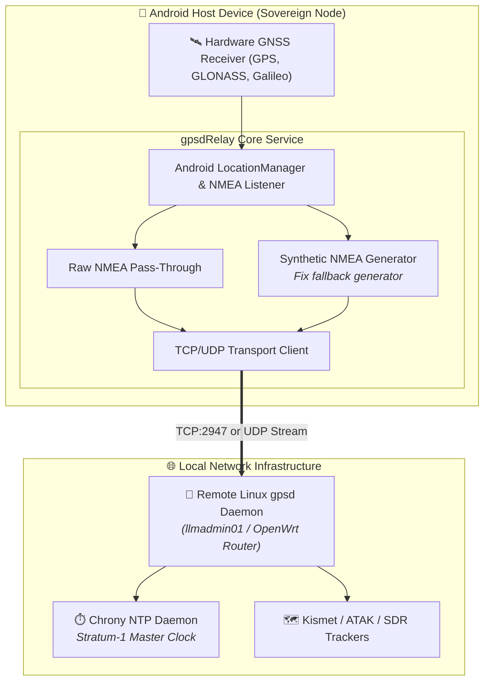

> [!note] Project Documentation Wiki
> *This document is part of the **[[projects/index|RPDev Projects Knowledge Base]]**. For the high-level portfolio overview, visit [iamrp.dev](https://iamrp.dev).*

> [!info] Project Maturity: **80% — Functional Mobile Utility (Tier 4)**
> - **Lifecycle Status**: Active Operational Utility
> - **Active Components**: F-Droid packaging, raw GNSS satellite sentence capture, synthetic NMEA reconstruction, TCP/UDP sockets to remote `gpsd`
> - **Pending Enhancements**: OEM aggressive battery saver (Doze mode) keep-alive tuning, background service wake-lock hardening

# gpsdRelay: Sovereign NMEA GPS Telemetry Daemon
## **Transforming Android Mobile GPS Hardware into Network-Accessible Stratum-1 Timing & Positioning References**

> [!abstract] Operational Overview
> **`gpsdRelay`** is an open-source Android background service that extracts raw satellite positioning sentences from on-device GNSS/GPS hardware and streams them to remote **`gpsd` servers** over TCP or UDP. It enables spare, air-gapped Android hardware to serve as reliable **Stratum-1 network time protocol (NTP) reference clocks** and centralized marine/aviation telemetry feeds without requiring specialized USB GPS dongles.

- **Repository**: [`https://github.com/RPDevs-Builds/gpsdRelay`](https://github.com/RPDevs-Builds/gpsdRelay)
- **F-Droid Package**: `io.github.project_kaat.gpsdrelay`
- **Protocols Supported**: NMEA-0183 (`$GPRMC`, `$GPGGA`, `$GPGSV`), Raw GNSS Measurement API, TCP socket, UDP unicast/multicast.

---

## 1. Key Engineering Features

1. **Dual-Mode NMEA Streaming:**
   - **Direct Hardware Pass-Through**: Captures raw NMEA-0183 sentences emitted directly by the Qualcomm/MediaTek GPS baseband chips, preserving high-precision fix metrics (DOP, active satellites in view).
   - **Synthetic NMEA Reconstruction**: For devices where Android OS abstracts raw NMEA strings, the engine synthetically synthesizes RFC-compliant `$GPGGA` and `$GPRMC` strings from high-precision `android.location.Location` coordinates.
2. **Resilient Background Service:**
   - Enforces a foreground persistent service with a low-overhead notification channel, preventing OEM aggressive battery killers (Doze mode) from dropping socket connections.
   - Automatic exponential backoff reconnection when switching between Wi-Fi and mobile networks.
3. **Stratum-1 NTP Clock Synchronization:**
   - When paired with `chrony` or `ntpd` on a local gateway, provides microsecond-accurate timekeeping for air-gapped homelabs disconnected from public NTP servers.

---

## 🧭 Navigation & Related Documentation
- Review mobile platform architecture in **[[projects/mobile-stack|Mobile Stack Unified Architecture]]**
- Review RF engineering in **[[projects/Networking/rf-board-tv|RF Board TV Combiner]]**
- Explore hardware nodes in **[[projects/Infrastructure/nodes|Hardware Nodes & Topology]]**
- Return to **[[projects/index|Projects Documentation Hub]]**
