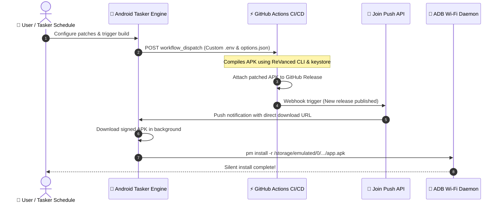

> [!note] Project Documentation Wiki
> *This document is part of the **[[projects/index|RPDev Projects Knowledge Base]]**. For the high-level portfolio overview, visit [iamrp.dev](https://iamrp.dev).*

> [!info] Project Maturity: **85% — Operational Utility (Tier 4)**
> - **Lifecycle Status**: Active Daily Mobile Automation
> - **Active Components**: Native Tasker Android GUI, Join push API webhooks, GitHub Actions workflow dispatch, custom keystore signing, silent ADB Wi-Fi install
> - **Pending Enhancements**: Automated OTA notification checks for upstream ReVanced CLI patch releases

# RVX-Builds: Zero-Touch Android Application Patching Pipeline
## **Automated Tasker GUI, Join API Webhooks, GitHub Actions Cloud Compilation & Silent ADB Wi-Fi Installation**

> [!abstract] Architectural Overview
> **`rvx-builds`** bridges mobile automation with cloud CI/CD pipelines. It connects an interactive **Tasker project on Android** with **GitHub Actions cloud builders** to automate the downloading, smali-bytecode patching, signing, and silent background installation of ReVanced Extended (RVX) applications without tethering the phone to a computer.

- **Repository**: [`https://github.com/RPDevs-Builds/rvx-builds`](https://github.com/RPDevs-Builds/rvx-builds)
- **Integration**: Tasker, Join Push API, GitHub Actions Workflow Dispatch, ADB over Wi-Fi.
- **Security**: Custom hardware keystore signing, environment secret encryption, and reproducible CLI patches.

---

## 1. System Components & Mobile-to-Cloud Handshake

1. **Tasker Client Control Plane:**
   - Provides a native Android configuration UI (`RVX-Builds - Manager`) allowing users to toggle specific app patches (sponsor block, ad removal, OLED black themes, microG bindings).
   - Generates and synchronizes `options.json` with the GitHub repository via Git commit API.
2. **Cloud Compilation Pipeline:**
   - Executes headlessly on GitHub-hosted runners using the ReVanced CLI and custom `.keystore` cryptographic keys to prevent signature mismatch conflicts upon updates.
   - Publishes tagged release assets with SHA-256 checksum validation.
3. **Automated Deployment & Silent Installation:**
   - Listens for Join webhook events upon release completion.
   - Leverages local ADB over Wi-Fi permissions to invoke `pm install -r` silently in the background, updating target applications seamlessly without user interaction.

---

## 🧭 Navigation & Related Documentation
- Review launcher ecosystem in **[[projects/Android/rpdev-launcher/index|RPDev Launcher User Manual]]**
- Review feed companion overlay in **[[projects/Android/rpdev-feed/index|RPDev Feed User Manual]]**
- Explore headless APK patching in **[[projects/Tools/apk-build-patch|APK Build-Patch Toolchain]]**
- Return to **[[projects/index|Projects Documentation Hub]]**
