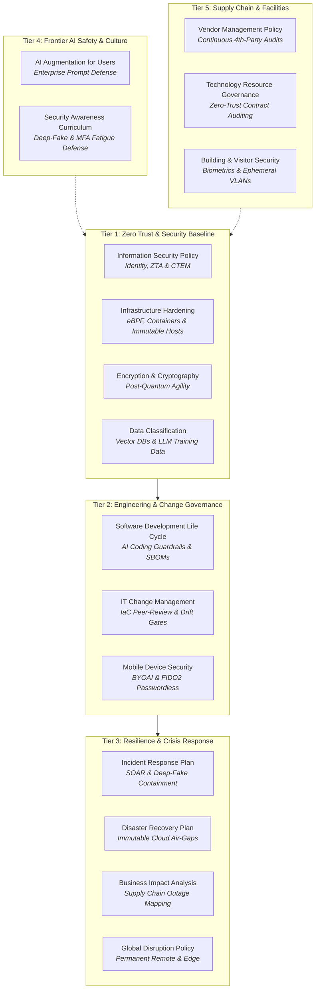

# 📋 Governance & Policies: Enterprise Standards & Compliance
> [!caution] Legal Notice & Non-Liability Disclaimer
> **Reference Models & Educational Examples Only**: All policies, standards, frameworks, procedures, and architectural artifacts provided within this section are shared strictly as informational, educational, and reference examples demonstrating enterprise documentation engineering. **Under no circumstances does Richard P. Dissell, RPDev, or affiliated contributors assume legal liability, fiduciary responsibility, regulatory accountability, or duty of care for their governance, implementation, omission, or operational impact.** These examples do not constitute formal legal counsel, statutory advice, or certified regulatory compliance determinations. Any organization or individual adapting or referencing these materials must perform their own due diligence and consult licensed legal and cybersecurity compliance counsel.

> **A production-grade, authoritative suite of 18 modernized enterprise IT and cybersecurity policies, leadership charters, and operational frameworks. Engineered for Zero Trust Architecture (ZTA), Post-Quantum Cryptography (PQC), frontier AI supply chain risk management, continuous behavioral training, and resilient engineering execution.**

---

## 🏛️ Enterprise Policy Tiers & Framework Catalog

### 🔒 Tier 1: Foundational Zero Trust & Security Baseline
*Foundational policies enforcing strict identity validation, cryptographic boundaries, and continuous asset exposure management across hybrid cloud and bare-metal environments.*

| Framework | Scope & Enforcement | Standards Alignment |
|---|---|---|
| **[[Projects/Governance-and-Policies/Information_Security_Policy|Information Security Policy]]** | Master cybersecurity charter: Zero Trust Architecture, Continuous Threat Exposure Management (CTEM), and least-privilege RBAC. | NIST CSF 2.0 (PR.AC, PR.DS), ISO 27001 A.5, SOC 2 CC6.1 |
| **[[Projects/Governance-and-Policies/Infrastructure_Hardening_Policy|Infrastructure Hardening Policy]]** | Hardening baselines for bare-metal Linux, Kubernetes container runtimes, eBPF kernel telemetry, and immutable hosts. | CIS Benchmarks, NIST SP 800-123, ISO 27001 A.8.20 |
| **[[Projects/Governance-and-Policies/Encryption_Policy|Encryption & Cryptographic Policy]]** | Cryptographic agility, TLS 1.3 enforcement, hardware security keys (FIDO2/Age), and Post-Quantum Cryptography (PQC) readiness. | FIPS 140-3, NIST SP 800-175B, ISO 27001 A.8.24 |
| **[[Projects/Governance-and-Policies/Data_Classification_Policy|Data Classification Policy]]** | 4-tier data taxonomy covering vector database embeddings, LLM fine-tuning corpora, client secrets, and GDPR/CCPA PII. | ISO 27001 A.5.12, SOC 2 CC6.4, NIST CSF PR.DS-1 |

---

### ⚙️ Tier 2: Engineering Integrity & Change Governance
*Standards governing software construction, infrastructure changes, and endpoint mobility to eliminate supply chain vulnerabilities and unauthorized drifts.*

| Framework | Scope & Enforcement | Standards Alignment |
|---|---|---|
| **[[Projects/Governance-and-Policies/Software_Development_Life_Cycle|Software Development Life Cycle (SDLC)]]** | Secure development practices: AI-assisted coding guardrails, automated SAST/DAST, Software Bill of Materials (SBOM) attestation, and signature verification. | NIST SSDF v1.1, OWASP SAMM, ISO 27001 A.8.25 |
| **[[Projects/Governance-and-Policies/IT_Change_Management_Policy|IT Change Management Policy]]** | Declarative GitOps workflows, mandatory dual-engineer peer review, automated drift reconciliation via [[Projects/Infrastructure-and-CICD/Infra_Audit_Engine|Infra Audit Engine]], and zero manual production changes. | ITIL v4, SOC 2 CC8.1, ISO 27001 A.8.32 |
| **[[Projects/Governance-and-Policies/Mobile_Device_Security_Policy|Mobile Device Security Policy]]** | Management of mobile operating systems (including [[Projects/Android/index|RPDev Mobile Ecosystem]]), Bring Your Own AI (BYOAI) guardrails, and hardware FIDO2 credentials. | NIST SP 800-124r2, ISO 27001 A.8.1 |

---

### 🚨 Tier 3: Resilience, Crisis & Operational Continuity
*Proactive and reactive procedures ensuring rapid containment of cyber attacks, automated disaster recovery, and continuous operations during global disruptions.*

| Framework | Scope & Enforcement | Standards Alignment |
|---|---|---|
| **[[Projects/Governance-and-Policies/Incident_Response_Plan|Incident Response Plan (IRP)]]** | 6-phase response lifecycle: SOAR playbook orchestration, ransomware isolation protocols, deep-fake crisis communications, and regulatory reporting SLAs. | NIST SP 800-61r2, ISO 27035, SOC 2 CC7.3 |
| **[[Projects/Governance-and-Policies/Disaster_Recovery_Plan|Disaster Recovery Plan (DRP)]]** | Immutable multi-cloud backup air-gapping, bare-metal bootloader recovery via [[Projects/Hardware-Security/Ventoy_Tech_Super_Tool|Ventoy Super Tool]], and sub-1-hour RTO / sub-15-minute RPO targets. | ISO 22301, NIST SP 800-34r1, SOC 2 CC9.1 |
| **[[Projects/Governance-and-Policies/Business_Impact_Analysis|Business Impact Analysis (BIA)]]** | Critical path dependency mapping, single points of failure (SPOF) identification, and SaaS / cloud outage tiering. | ISO 22317, NIST SP 800-34 |
| **[[Projects/Governance-and-Policies/Global_Disruption_Policy|Global Disruption & Remote Operations]]** | Permanent distributed work resilience, zero-trust edge tunnels, and offline survivability protocols. | ISO 22301 Clause 8, NIST CSF RC.CO |

---

### 🤖 Tier 4: Frontier AI Governance & Workforce Culture
*Modern governance models designed for the era of generative AI agents, automated development copilots, and sophisticated synthetic threat vectors.*

| Framework | Scope & Enforcement | Standards Alignment |
|---|---|---|
| **[[Projects/Governance-and-Policies/AI_Augmentation_for_Users|AI Augmentation & Safe Usage Guidelines]]** | Acceptable use policies for LLM tools, prompt injection defense, intellectual property protection, and customer data isolation. | NIST AI RMF 1.0, ISO/IEC 42001, OWASP Top 10 for LLM |
| **[[Projects/Governance-and-Policies/Security_Awareness_Training|Modern Security Awareness Curriculum]]** | Continuous adaptive training curriculum focused on real-world deep-fakes, MFA fatigue resistance, spear phishing, and social engineering simulation. | NIST SP 800-50, ISO 27001 A.6.3 |
| **[[Research-and-Ramblings/Articles/Philosophy|Technical Leadership & Management Philosophy]]** | Core engineering ethos: asynchronous autonomy, blameless post-mortems, psychological safety, and AI-augmented developer velocity. | Engineering Leadership Charter |

---

### 🌐 Tier 5: Supply Chain, Vendor Risk & Physical Security
*Defensive controls securing third-party SaaS contracts, upstream hardware manufacturers, and physical on-premises datacenter facilities.*

| Framework | Scope & Enforcement | Standards Alignment |
|---|---|---|
| **[[Projects/Governance-and-Policies/Vendor_Management_Policy|Vendor & Third-Party Risk Management]]** | Continuous vendor assessment, fourth-party dependency tracking, AI model provider audits, and contract termination data zeroization. | NIST SP 800-161r1, ISO 27001 A.5.19 |
| **[[Projects/Governance-and-Policies/Vendor_and_Resource_Management|Vendor & Technology Resource Management]]** | Strategic SaaS procurement, license consolidation, and cloud compute cost governance. | FinOps Framework, ISO 27001 A.5.20 |
| **[[Projects/Governance-and-Policies/Building_Security_Policy|Building & Physical Security Policy]]** | Physical facility access controls, biometric credentials, hardware key physical custody, and environmental monitoring. | ISO 27001 A.7, NIST SP 800-116 |
| **[[Projects/Governance-and-Policies/Visitor_Policy|Visitor Management Policy]]** | Secure guest escorting, visitor identity verification, and ephemeral guest VLAN segregation. | ISO 27001 A.7.2 |
| **[[Projects/Governance-and-Policies/Policy_Archive|Enterprise Policy Archive]]** | Complete historical inventory of authored enterprise compliance standards across NIST, CIS, and ISO audit cycles. | Governance Historical Record |

---

## 🧭 Navigation & Cross-Links
- Return to **[[Projects/index|All Projects Master Catalog]]**
- Review live compliance telemetry in **[[Projects/Infrastructure-and-CICD/Infra_Audit_Engine|Infra Audit Engine]]**
- Review SIEM detection rules in **[[Projects/Defensive-Security/Wazuh_CrowdSec_SIEM|Wazuh + CrowdSec Collaborative SIEM]]**
- Inspect hardware key enforcement in **[[Projects/Hardware-Security/Hardware_Security_Key|FIDO2 + Age Hardware Secrets]]**
