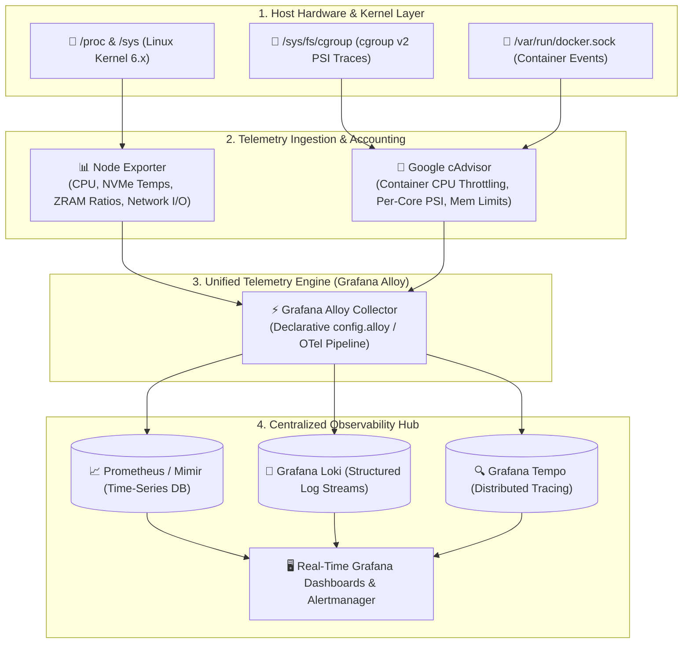

> [!note] Project Documentation Wiki
> *This document is part of the **[[projects/index|RPDev Projects Knowledge Base]]**. For the high-level portfolio overview, visit [iamrp.dev](https://iamrp.dev).*

# Unified Fleet Observability: Grafana Alloy, cAdvisor & eBPF Telemetry
## **Consolidating Multi-Node Metrics, cgroup v2 Pressure Stall Information (PSI) & OpenTelemetry Pipelines**

> [!abstract] Architectural Overview
> Traditional monitoring infrastructures rely on multiple overlapping collector daemons (Promtail, Telegraf, Node Exporter, OpenTelemetry Collector), introducing unnecessary memory and CPU overhead across fleet nodes. This architecture implements a **unified, lightweight observability stack** centered around **Grafana Alloy**, Google **cAdvisor**, and **Node Exporter**, streaming high-resolution hardware, container, and eBPF metrics to centralized time-series backbones.



---

## 1. The Power of Grafana Alloy vs Legacy Collectors

**Grafana Alloy** represents the next generation of OpenTelemetry collectors, merging the capabilities of Promtail, Agent Flow, and OpenTelemetry into a single unified binary:

* **Declarative Component Graph**: Replaces brittle YAML configuration with a native, programmable configuration syntax (`config.alloy`) supporting live configuration hot-reloading without daemon restarts.
* **Native OpenTelemetry & Prometheus Protocol Interop**: Seamlessly scrapes Prometheus endpoints (`/metrics`), translates OTel spans, and ships structured JSON logs without protocol translation proxies.
* **Minimal Footprint**: Operates with **< 40 MB RAM** footprint on compute hosts, ensuring monitoring agents do not steal memory from GPU/LLM workloads.

---

## 2. Containerized Stack Implementation

Deployed across bare-metal compute nodes (`llmadmin01`, `t430`) with direct host namespace visibility:

```yaml
# /mnt/sharedroot/compose/llmadmin01/logstack/compose.yml
services:
  node-exporter:
    image: prom/node-exporter:latest
    container_name: node-exporter
    restart: unless-stopped
    network_mode: "host"
    volumes:
      - /proc:/host/proc:ro
      - /sys:/host/sys:ro
      - /:/rootfs:ro
    command:
      - '--path.procfs=/host/proc'
      - '--path.sysfs=/host/sys'
      - '--path.rootfs=/rootfs'
      - '--collector.filesystem.mount-points-exclude=^/(sys|proc|dev|host|etc)($|/)'

  cadvisor:
    image: gcr.io/cadvisor/cadvisor:latest
    container_name: cadvisor
    restart: unless-stopped
    network_mode: "host"
    volumes:
      - /:/rootfs:ro
      - /var/run:/var/run:ro
      - /sys:/sys:ro
      - /var/lib/docker/:/var/lib/docker:ro
      - /dev/disk/:/dev/disk:ro

  alloy:
    image: grafana/alloy:latest
    container_name: alloy
    restart: unless-stopped
    network_mode: "host"
    volumes:
      - /var/run/docker.sock:/var/run/docker.sock:ro
      - ./config/alloy.yaml:/etc/alloy/config.alloy:ro
```

---

## 3. High-Fidelity Metrics Captured

1. **cgroup v2 Pressure Stall Information (PSI)**:
   - Tracks CPU, memory, and I/O pressure stalls in real time, detecting container micro-starvation before it causes user-facing latency spikes.
2. **GPU & ASIC Thermal Profiling**:
   - Captures PCIe bus link speeds, GPU memory allocation, Google Coral Edge TPU operational temperatures, and NVMe endurance metrics.
3. **ZRAM & Memory Compression Telemetry**:
   - Accurately tracks active compression ratios of memory swap pools (`/dev/zram0`), ensuring high-load multi-agent LLM inference never triggers Linux kernel OOM killers.

---

## 🔗 Related Architecture & Knowledge Graph

* **Production Systems:** Validated in [[Infra_Audit_Engine|Infra Audit Engine]], [[Wazuh_CrowdSec_SIEM|Wazuh CrowdSec SIEM]], [[Current_Environment|Current Environment]].
* **Governance & Compliance:** Governed by [[Projects/Governance-and-Policies/Information_Security_Policy|Information Security Policy]].
* **Technical Articles:** Deep dive in [[Articles/Architecture/Systems_Automation|Systems and Automation Architecture]].
* **Applied Research:** Investigated in [[Research/Security_Analysis_and_Research_Agent/Tools_and_Telemetry|Tools and Telemetry]].
* **Master Credentials:** Review core competencies on [[Resume/Master_Resume|Curriculum Vitae & Master Resume]].
* **Digital Garden Hub:** Return to the main [[content/Projects/index|Digital Garden Index]].
