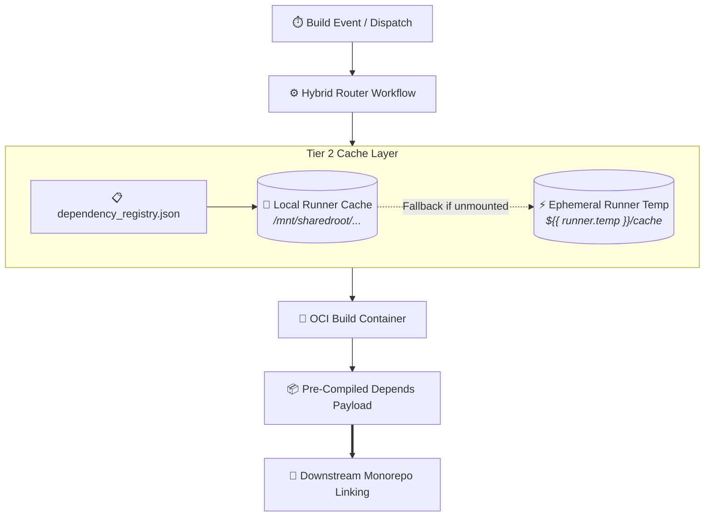

> [!note] Project Documentation Wiki
> *This document is part of the **[[projects/index|RPDev Projects Knowledge Base]]**. For the full lifecycle matrix, see the **[[projects/maturity-matrix|Project Maturity Matrix]]**.*

> [!info] Project Maturity: **70% — Active Beta (Tier 3)**
> - **Lifecycle Status**: Active Build & Cache Fleet Engine
> - **Active Components**: OCI container build scripts, dependency registry, multi-tier runner caching logic
> - **Pending Enhancements**: Resilient host-cache fallback for ephemeral runner environments, matrix concurrency throttling

# Builder Manager: Multi-Tier Build & Cache Fleet Engine
## **Automated Containerized Cross-Compilation, Runner Cache Acceleration & Artifact Lifecycle Management**

> [!abstract] Architectural Overview
> **`builder-manager`** functions as the Tier 2–2.5 build orchestration and caching layer for the RPDevs ecosystem. It manages containerized toolchains, pre-compiled dependency payloads, and local runner caches (`/mnt/sharedroot/github_runners/shared`) to reduce multi-hour C/C++ builds (Kodi, VLC, OpenWrt toolchains) down to incremental minutes.

- **Repository**: [`https://github.com/RPDevs-Builds/builder-manager`](https://github.com/RPDevs-Builds/builder-manager)
- **Primary Runners**: GitHub-hosted (`ubuntu-latest`) & Self-hosted (`t430-builds-multiarch-01`)
- **Key Subsystems**: Dependency Registry (`dependency_registry.json`), OCI Build Workers, Layered Caching.

---

## 1. Core Architecture & Registry

1. **Dependency Registry (`dependency_registry.json`)**:
   Tracks cryptographic hashes, upstream git tags, and compilation flags for heavy third-party C/C++ libraries.
2. **Resilient Multi-Tier Cache Fallback**:
   Allows builds to check for shared host-level NVMe/NFS caches when executing on dedicated self-hosted runners (`t430`), while automatically falling back to GitHub Actions runner temp caches when executing on cloud-hosted runners.

---

## 🧭 Navigation & Related Documentation
- Review cross-platform build fleet in **[[projects/Infrastructure/self-hosted-build-fleet|Self-Hosted Build Fleet Manual]]**
- Review Kodi cross-compilation in **[[projects/Tools/kodi-ecosystem|Kodi Addon Monorepo & Build Fleet]]**
- Explore project lifecycle ratings in **[[projects/maturity-matrix|Project Maturity Matrix]]**
