> [!note] Project Documentation Wiki
> *This document is part of the **[[projects/index|RPDev Projects Knowledge Base]]**. For the high-level portfolio overview, visit [iamrp.dev](https://iamrp.dev).*

> [!abstract] Architectural Challenge
> Blindly deploying containerized workloads across a heterogeneous compute fleet often results in catastrophic hardware failure. High-frequency database writes can quickly burn through the eMMC flash on embedded edge routers, while latency-sensitive R&D tools choke when assigned to bulk network storage (NFS).

This project details the implementation of a strict spatial storage protocol, ensuring that container volumes are mapped to appropriate physical media based on their specific IOPS and volatility profiles.

---

### ◈ The Solution: Spatial Storage Mapping

By decoupling the compute environment from the storage backend, workloads are pinned to specific hardware tiers without sacrificing the portability of the Docker manifests.

#### 1. High-I/O Transactional Tier (Local NVMe SSD)
Relational databases and systems requiring high-speed random writes are strictly localized.
- **PostgreSQL & Redis:** Volumes for these services are bound exclusively to localized NVMe arrays.
- This ensures minimal latency for database queries serving the internal R&D tools and prevents network-bottlenecking on the storage backbone.

#### 2. Embedded Protection Tier (RAM Disks / tmpfs)
Running containers on embedded edge hardware (like OpenWrt routers) poses a unique risk to the host's physical eMMC flash memory due to constant log writes.
- **Active Defense (Honeypots):** Systems like `Cowrie` and `Endlessh` are designed to be attacked and generate massive amounts of telemetry.
- These container volumes are mapped directly to `tmpfs` (RAM disks). Malicious payloads and logs are captured entirely in volatile memory, parsed by the telemetry engine, and wiped upon reboot, preventing any write-wear on the host flash.

#### 3. Bulk Cold-Storage Tier (NFS & Distributed Arrays)
Long-term artifacts, system backups, and non-volatile configurations are routed to the central storage area network.
- **GitOps Manifests & Artifacts:** Deployment files and generated software builds map directly to the shared network root (`/mnt/sharedroot`).
- This allows any compute node in the fleet to seamlessly mount and execute configurations, ensuring high availability during hardware failovers.

#### 4. Compressed Memory Tier (ZRAM)
To maximize memory efficiency on compute nodes without relying on slow disk-based swap (which degrades flash endurance):
- **llmadmin01**: Configured with a 16GB ZRAM block device (`/dev/zram0`).
- **t430**: Configured with a 4GB ZRAM block device (`/dev/zram0`).
- This ensures that inactive memory pages are compressed in RAM rather than paged to the SSD, drastically improving system responsiveness during memory spikes while protecting underlying local NVMe and eMMC storage from write exhaustion.

### ◈ Storage Topology Diagram

```mermaid
graph TD
    subgraph Compute Nodes
        A[Edge Router]
        B[High-Compute Server]
        C[General App Node]
    end
    
    subgraph Storage Tiers
        D[(Volatile tmpfs RAM)]
        E[(Local NVMe SSD)]
        F[(Network NFS Array)]
    end
    
    A -.->|Honeypot Logs| D
    B -.->|PostgreSQL Data| E
    C -.->|Container Configs| F
    B -.->|System Backups| F
    
    style A fill:#333,stroke:#666
    style B fill:#333,stroke:#666
    style C fill:#333,stroke:#666
    style D fill:#f9a826,stroke:#333,color:#000
    style E fill:#2b5c8f,stroke:#333
    style F fill:#4CAF50,stroke:#333,color:#000
```

---

### ◈ Business Impact
Implementing this strict tiering protocol extended the lifecycle of embedded edge hardware by years and entirely eliminated database locking issues caused by NFS latency. The architecture is now resilient to localized node failures, as stateful data is physically segregated by its operational requirement.

---

## 🔗 Related Architecture & Knowledge Graph

* **Production Systems:** Validated in [[OpenWrt_Kernel_NFS_Manager|OpenWrt Kernel NFS Manager]], [[Coral_Edge_TPU_Computer_Vision_NVR|Coral Edge TPU Computer Vision NVR]].
* **Governance & Compliance:** Governed by [[Projects/Governance-and-Policies/Disaster_Recovery_Plan|Disaster Recovery Plan]], [[Projects/Governance-and-Policies/Business_Impact_Analysis|Business Impact Analysis]].
* **Technical Articles:** Deep dive in [[Articles/Hardware/Component_Repair|Bare Metal Diagnostics Lessons]].
* **Applied Research:** Investigated in [[Research/Security_Analysis_and_Research_Agent/Lab_Requirements|Lab Requirements]].
* **Master Credentials:** Review core competencies on [[Resume/Master_Resume|Curriculum Vitae & Master Resume]].
* **Digital Garden Hub:** Return to the main [[content/Projects/index|Digital Garden Index]].
