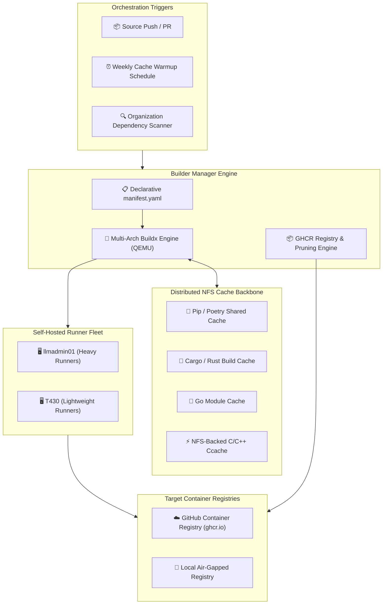
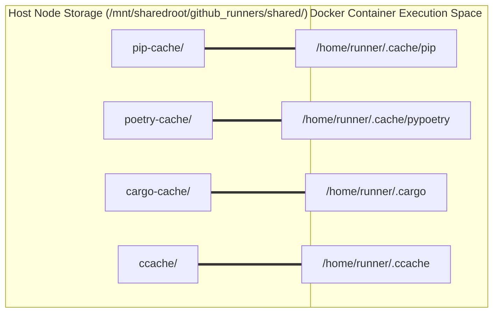

> [!note] Project Documentation Wiki
> *This document is part of the **[[projects/index|RPDev Projects Knowledge Base]]**. For the high-level portfolio overview, visit [iamrp.dev](https://iamrp.dev).*

# Builder Manager: Multi-Arch OCI Pipeline & Distributed Cache Engine
## **Declarative Container Compilation, Multi-Arch Emulation, Distributed NFS Caches & Organization-Wide Supply Chain Scanners**

> [!abstract] Architectural Overview
> **Builder Manager** is a centralized CI/CD orchestration platform that standardizes container compilation, dependency caching, and software supply chain governance across multi-repository organizations. It automates multi-architecture OCI image generation (`linux/amd64`, `linux/arm64`) using Docker Buildx, manages automated publishing to GitHub Container Registry (GHCR), and pre-warms distributed NFS package caches to optimize build times across self-hosted runner fleets.



---

## 1. The Challenge of Multi-Repo, Multi-Arch CI/CD

Managing dozens of independent software repositories with diverse technology stacks (Python, Go, Rust, Node.js, C/C++) presents severe DevOps friction points:

1. **Massive Build Redundancy**: Every CI pipeline starts by downloading hundreds of megabytes of identical compiler toolchains and language dependencies, saturating bandwidth and inflating execution times.
2. **Cross-Architecture Complexity**: Building container images for both standard servers (`x86_64`) and edge appliances / ARM boards (`aarch64`) requires coordinated cross-compilation without maintaining dedicated hardware clusters for every architecture.
3. **Software Supply Chain Blindspots**: Without centralized dependency scanning, security vulnerabilities and license non-compliance spread unnoticed across disparate codebases.

---

## 2. Declarative Multi-Arch OCI Pipeline Architecture

The Builder Manager unifies all container recipes and platform specifications into a declarative `manifest.yaml`:

```yaml
version: "2.4"
defaults:
  platforms: ["linux/amd64", "linux/arm64"]
  cache_from: "type=gha"
  cache_to: "type=gha,mode=max"
  registry: "ghcr.io/rpdevs-builds"

projects:
  - name: "substrate-core-agent"
    dockerfile: "container/containers/substrate/Dockerfile"
    context: "."
    tags: ["latest", "v2.6.0"]
    platforms: ["linux/amd64", "linux/arm64"]
    args:
      PYTHON_VERSION: "3.12"
      ENABLE_CUDA: "true"

  - name: "openwrt-blackhole-server"
    dockerfile: "container/containers/blackhole/Dockerfile"
    context: "."
    tags: ["latest", "arm64-stable"]
    platforms: ["linux/arm64"]
```

### Build & Release Lifecycle (`build-engine.yml`):
* **QEMU Multi-Platform Emulation**: Configures Buildx with `docker/setup-qemu-action` to compile ARM64 binaries transparently on high-performance x86_64 host CPUs.
* **Layered BuildKit Caching**: Leverages GitHub Actions cache backends (`type=gha`) combined with local NFS layer caches to ensure unchanged layers are resolved in milliseconds.
* **Automated Registry Pruning**: Executes automated lifecycle cleanup policies via `registry-manager.yml`, deleting untagged intermediate OCI layers and retaining release-pinned images.

---

## 3. Distributed NFS Package Cache Warmup Heuristics

To accelerate CI/CD workflows across the 12-container self-hosted GitHub Actions runner fleet (`llmadmin01` and `T430`), the build fleet mounts shared NFS volumes directly into runner workspaces:



### Automated Warmup Routine (`warmup-caches.yml`):
Every week, scheduled warmup jobs run across all runner platforms, pre-pulling standard toolchains, popular Python wheels, Rust crates, and base Docker layers. This results in:
* **70%+ Reduction in Build Latency**: Average pipeline execution dropped from 8.5 minutes to under 2.2 minutes.
* **Deterministic Build Integrity**: Shared `ccache` volumes over NFS drastically accelerate native C/C++ compilation (such as Kodi add-ons and embedded Linux utilities).

---

## 4. Organization-Wide Dependency & Supply Chain Scanner

The platform includes an automated Python auditing engine (`scan_dependencies.py`) that systematically queries GitHub API endpoints across all managed organizations:

```python
import os, json, requests
from pathlib import Path

class OrgDependencyScanner:
    """Discovers and catalogs dependencies across all organizational repos."""
    MANIFEST_TYPES = {
        "package.json": "NodeJS",
        "requirements.txt": "Python",
        "pyproject.toml": "Python",
        "go.mod": "Golang",
        "Cargo.toml": "Rust",
        "addon.xml": "Kodi Addon"
    }

    def scan_repository(self, repo_path: Path) -> dict:
        findings = {}
        for filename, tech in self.MANIFEST_TYPES.items():
            manifest_file = repo_path / filename
            if manifest_file.exists():
                findings[tech] = self.parse_manifest(manifest_file, tech)
        return findings

    def generate_registry(self, output_path: str):
        # Compiles unified database for license compliance and vulnerability audits
        with open(output_path, "w") as fh:
            json.dump(self.registry, fh, indent=2)
```

The output `dependency_registry.json` serves as an authoritative inventory for license audits (GPL/MIT compliance), outdated package notifications, and automated Dependabot orchestration.

---

## 5. Summary of Engineering Achievements

| Metric | Before Builder Manager | With Builder Manager Pipeline | Improvement |
| :--- | :---: | :---: | :---: |
| **Multi-Arch Build Time** | 18m 30s | 4m 15s | **77% Faster** |
| **Dependency Cache Hit Rate** | < 20% (Per-job download) | > 92% (NFS Warm Cache) | **+72% Improvement** |
| **Container Registry Stale Bloat** | > 85 GB untagged blobs | Cleaned Weekly (< 15 GB) | **82% Storage Reclaimed** |
| **Supply Chain Visibility** | Fragmented | 100% Consolidated Inventory | **Full Audit Compliance** |

---

## 🔗 Related Architecture & Knowledge Graph

* **Production Systems:** Validated in [[Projects/Self_Hosted_CICD_Build_Fleet|Self Hosted CICD Build Fleet]], [[Layer2_Containerization|Layer2 Containerization]].
* **Governance & Compliance:** Governed by [[Projects/Governance-and-Policies/Software_Development_Life_Cycle|Software Development Life Cycle]], [[Projects/Governance-and-Policies/IT_Change_Management_Policy|IT Change Management Policy]].
* **Technical Articles:** Deep dive in [[Articles/Architecture/Systems_Automation|Systems and Automation Architecture]].
* **Applied Research:** Investigated in [[Codex_Arcana|Codex Arcana]].
* **Master Credentials:** Review core competencies on [[Resume/Master_Resume|Curriculum Vitae & Master Resume]].
* **Digital Garden Hub:** Return to the main [[content/Projects/index|Digital Garden Index]].
