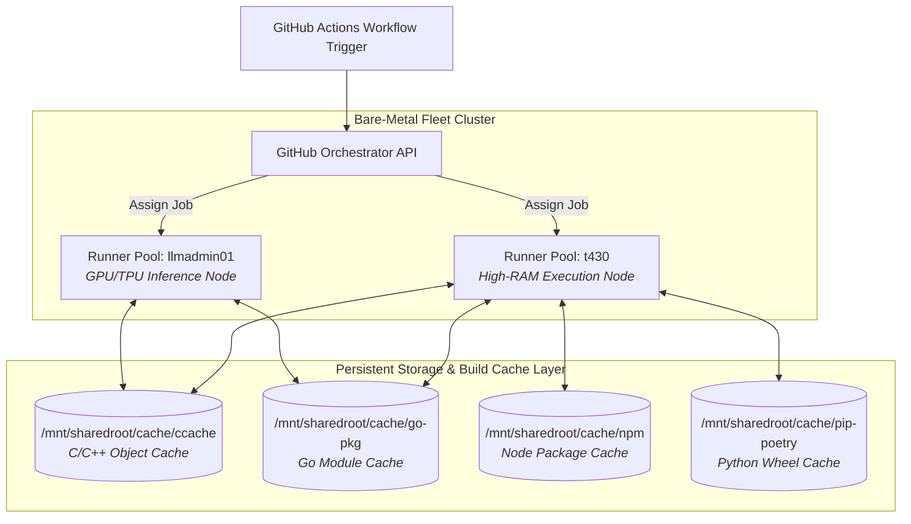

> [!note] Project Documentation Wiki
> *This document is part of the **[[projects/index|RPDev Projects Knowledge Base]]**. For the high-level portfolio overview, visit [iamrp.dev](https://iamrp.dev).*

# Self-Hosted Multi-Node CI/CD Build Fleet

> [!abstract] Build Pipeline Acceleration & Edge Fleet Orchestration
> Large cross-compiled C++ binaries (Kodi, OpenWrt), Linux kernels, and AI container layers require massive CPU throughput and heavy disk I/O. Standard public GitHub Actions runners frequently encounter memory exhaustion, restrictive CPU quotas, and zero persistent cache between runs. This architecture deploys a containerized, self-hosted GitHub Actions runner fleet across physical cluster nodes (`t430`, `llmadmin01`) with multi-tiered shared cache layers.

---

### ◈ Fleet Architecture

---

### ◈ Core Design Principles

1. **Custom Hardened Runner Images (`runner-linux-builder`):**
   * Built on top of minimal Ubuntu/Debian bases with pre-installed Node.js LTS, Docker-in-Docker socket integration, CMake, Clang/LLVM, and cross-compilation toolchains (`aarch64-linux-gnu`, `arm-linux-gnueabihf`).
   * Eliminates `sudo apt-get install` overhead during workflow runs, slashing pipeline initialization time from minutes to seconds.

2. **Persistent Shared Volume Mounts:**
   * Runners mount centralized cache directories on fast local storage (`/mnt/data` and `/mnt/sharedroot`).
   * C/C++ compilation steps achieve **>85% ccache hit rates**, reducing monolithic 45-minute builds down to under 4 minutes.

3. **Organizational Security Boundaries:**
   * Ephemeral runner token registration using scoped GitHub App authentication.
   * Hardened container privileges preventing host kernel escape while retaining full Docker build capabilities.

---

## 🔗 Related Architecture & Knowledge Graph

* **Production Systems:** Validated in [Builder Manager OCI Pipeline](https://iamrp.dev/projects/builder_manager_oci_pipeline), [Unified Fleet Observability Alloy](https://iamrp.dev/projects/unified_fleet_observability_alloy).
* **Governance & Compliance:** Governed by [[Projects/Governance-and-Policies/Software_Development_Life_Cycle|Software Development Life Cycle]], [[Projects/Governance-and-Policies/Infrastructure_Hardening_Policy|Infrastructure Hardening Policy]].
* **Technical Articles:** Deep dive in [Systems and Automation Architecture](https://iamrp.dev/systems_automation).
* **Applied Research:** Investigated in [[Codex_Arcana|Codex Arcana]].
* **Master Credentials:** Review core competencies on [Curriculum Vitae & Master Resume](https://iamrp.dev/resume/master_resume).
* **Digital Garden Hub:** Return to the main [[content/Projects/index|Digital Garden Index]].
