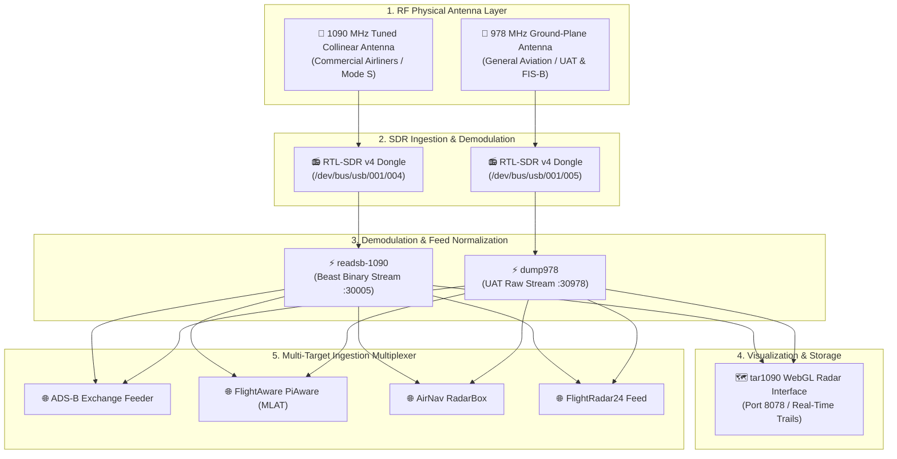

> [!note] Project Documentation Wiki
> *This document is part of the **[[projects/index|RPDev Projects Knowledge Base]]**. For the high-level portfolio overview, visit [iamrp.dev](https://iamrp.dev).*

# Dual-Band ADS-B & UAT SDR Aviation Telemetry Pipeline
## **Demodulating 1090MHz Mode S & 978MHz UAT with RTL-SDR, Real-Time WebGL Radar & Multi-Feed Multiplexing**

> [!abstract] Architectural Overview
> This station captures and demodulates real-time commercial and general aviation transponder broadcasts across two independent RF bands (**1090 MHz Mode S/ADS-B** and **978 MHz UAT**). Powered by containerized Software Defined Radio (SDR) demodulators (`readsb-1090`, `dump978`), the system renders a local WebGL/Leaflet spatial radar interface and multiplexes normalized Beast/BaseStation binary streams to global flight-tracking aggregators.



---

## 1. Dual-Band RF Signal Processing

Commercial and general aviation aircraft broadcast kinematic flight telemetry over two distinct radio frequencies:

1. **1090 MHz Extended Squitter (Mode S / ADS-B)**:
   - High-altitude commercial airliners broadcasting 112-bit pulses containing ICAO 24-bit transponder addresses, latitude/longitude (Compact Position Reporting), pressure altitude, ground speed, and heading.
   - Demodulated by `readsb` using customized sample rates and automatic gain calibration (`--gain=-10`) to prevent low-noise amplifier saturation from nearby flight corridors.
2. **978 MHz Universal Access Transceiver (UAT)**:
   - Utilized by general aviation, experimental aircraft, and low-altitude helicopters. Also carries Flight Information Services-Broadcast (FIS-B) weather and Traffic Information Services-Broadcast (TIS-B).
   - Demodulated by `dump978`, which decodes raw I/Q samples directly into structured Beast JSON frames.

---

## 2. Containerized Feed Multiplexing Architecture

The architecture decouples RF demodulation from upstream feeder clients using an in-memory TCP streaming pipeline:

```yaml
# /mnt/sharedroot/compose/llmadmin01/adsb-stack/docker-compose.yml
services:
  readsb-1090:
    image: mikenye/readsb:latest
    devices:
      - /dev/bus/usb:/dev/bus/usb
    ports:
      - "8087:8080"   # Diagnostics & metrics
      - "30002:30002" # Raw Beast output
      - "30003:30003" # BaseStation CSV format
      - "30005:30005" # Beast binary feed
    command:
      - --net
      - --net-bo-port=30005
      - --net-sbs-port=30003
      - --device-type=rtlsdr
      - --device=1090
      - --gain=-10
      - --write-json=/run/readsb
    volumes:
      - readsb-pb-data:/run/readsb

  tar1090:
    image: mikenye/tar1090:latest
    environment:
      - READSB_HOST=readsb-1090
      - READSB_PORT=30005
      - UAT_HOST=dump978
      - UAT_PORT=30978
    ports:
      - "8078:80"
```

### Decoupled Upstream Feeders:
Feeder containers connect internally to `readsb-1090:30005` and `dump978:30978`, eliminating duplicate radio tuner locks while simultaneously transmitting verified telemetry to:
* **ADS-B Exchange**: Unfiltered, non-censored aviation telemetry with MLAT (Multilateration) support.
* **FlightAware PiAware**: Feeds global commercial networks with synchronized UTC timestamps.
* **FlightRadar24 & AirNav RadarBox**: Global crowdsourced air traffic networks.

---

## 3. High-Performance Spatial Radar UI (`tar1090`)

The station exposes a zero-latency WebGL radar interface on local port `8078`:
* **Aircraft Trajectory History**: Stores recent aircraft position history in memory, rendering color-coded altitude gradients, speed vectors, and climbing/descending indicators.
* **Multilateration (MLAT) Tracking**: Identifies non-ADS-B Mode A/C aircraft by triangulating radio arrival time differences across collaborative receiver nodes.
* **Range Polar Plots**: Automatically generates 360-degree RF reception range rings, validating antenna line-of-sight and terrain obstruction boundaries up to 250+ nautical miles.

---

## 🔗 Related Architecture & Knowledge Graph

* **Production Systems:** Validated in [SDR and RF Exploration](https://iamrp.dev/projects--and--research/projects/rf--and--antennas/sdr_and_rf_exploration), [Unified Fleet Observability Alloy](https://iamrp.dev/projects/unified_fleet_observability_alloy).
* **Governance & Compliance:** Governed by [[Projects/Governance-and-Policies/Data_Classification_Policy|Data Classification Policy]].
* **Technical Articles:** Deep dive in [Bare Metal Diagnostics Lessons](https://iamrp.dev/component_repair).
* **Applied Research:** Investigated in [[Research/Security_Analysis_and_Research_Agent/index|index]].
* **Master Credentials:** Review core competencies on [Curriculum Vitae & Master Resume](https://iamrp.dev/resume/master_resume).
* **Digital Garden Hub:** Return to the main [[content/Projects/index|Digital Garden Index]].
