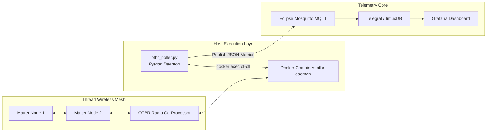

> [!note] Project Documentation Wiki
> *This document is part of the **[[projects/index|RPDev Projects Knowledge Base]]**. For the high-level portfolio overview, visit [iamrp.dev](https://iamrp.dev).*

# OpenThread Border Router Telemetry Poller: IoT Mesh Monitoring
## **Deterministic 802.15.4 Radio Inspection, MQTT State Ingestion & Live Mesh Topology Observability**

> [!abstract] Architectural Summary
> Low-power IPv6 wireless mesh networks (Thread/Matter) require continuous link-quality and routing topology monitoring. This Python system daemon interfaces directly with an OpenThread Border Router (OTBR) container instance, parses neighbor tables via `ot-ctl`, and streams real-time radio metrics (RSSI, Link Quality, MAC address, Frame Counters) to an MQTT broker for visualization in Grafana.

---

## 1. Engineering Highlights

1. **Deterministic Radio Inspection:**
   * Uses non-blocking subprocess calls to query `ot-ctl neighbor table` and `ot-ctl router table`.
   * Sanitizes ANSI terminal output and parses raw hex MAC addresses, RSSI (dBm), Link Quality In/Out metrics, and age intervals.

2. **Resilient MQTT State Publishing:**
   * Formats telemetry into structured JSON payloads with automatic reconnection backoff.
   * Emits Home Assistant-compliant MQTT discovery payloads allowing auto-provisioning of device sensors.

3. **Production Deployment:**
   * Deployed as a systemd service on the host node (`llmadmin01`) with automatic crash recovery, logging directly to journald.

---

## 🔗 Related Architecture & Knowledge Graph

* **Production Systems:** Validated in [[Substrate_Digital_Nervous_System|Substrate Digital Nervous System]], [OpenWrt ASU Image Builder](https://iamrp.dev/projects/openwrt_asu_image_builder).
* **Governance & Compliance:** Governed by [[Projects/Governance-and-Policies/Infrastructure_Hardening_Policy|Infrastructure Hardening Policy]].
* **Technical Articles:** Deep dive in [Bare Metal Diagnostics Lessons](https://iamrp.dev/component_repair).
* **Applied Research:** Investigated in [[Research/Security_Analysis_and_Research_Agent/Lab_Requirements|Lab Requirements]].
* **Master Credentials:** Review core competencies on [Curriculum Vitae & Master Resume](https://iamrp.dev/resume/master_resume).
* **Digital Garden Hub:** Return to the main [[content/Projects/index|Digital Garden Index]].
