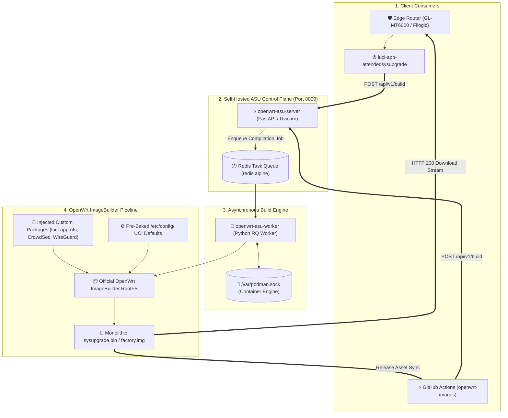

> [!note] Project Documentation Wiki
> *This document is part of the **[[projects/index|RPDev Projects Knowledge Base]]**. For the high-level portfolio overview, visit [iamrp.dev](https://iamrp.dev).*

> [!info] Project Maturity: **85% — Operational Control Plane (Tier 4)**
> - **Lifecycle Status**: Active Operational Deployment
> - **Active Components**: FastAPI REST API, RQ worker queue, Docker ImageBuilders, live on `llmadmin01:8000`, OpenAPI v1 endpoints
> - **Pending Enhancements**: Cloudflare Zero Trust tunnel ingress routing for public LuCI access, multi-profile batch queueing

# OpenWrt Attended Sysupgrade (ASU) Custom Image Builder
## **Automating On-Demand Kernel & SquashFS Firmware Compilation with FastAPI, RQ Build Workers & Containerized ImageBuilders**

> [!abstract] Architectural Overview
> Upgrading embedded OpenWrt routers across production fleets frequently causes downtime due to missing custom kernel modules, package incompatibilities, or overwritten configuration state. This architecture implements a **self-hosted OpenWrt Attended Sysupgrade (ASU) build server**: combining a **FastAPI REST API**, an **asynchronous Redis task queue (`rqworker`)**, and **containerized OpenWrt ImageBuilders** to compile customized, signed router firmware images on demand in under 45 seconds.

- **Local Host Access**: `http://127.0.0.1:8000/` (Loopback) | `http://10.13.0.11:8000/` (Internal LAN)
- **Interactive Documentation**: `http://127.0.0.1:8000/docs/` (Swagger UI) | `http://127.0.0.1:8000/redoc/` (ReDoc)
- **Primary Targets**: MediaTek Filogic MT7986 (`mediatek/filogic` - GL.iNet GL-MT6000), x86_64, and Rockchip RK3588.



---

## 1. The Challenge of Embedded Router Upgrades

Standard OpenWrt upgrades present significant friction in enterprise and lab environments:
1. **Lost Custom Packages**: Flashing an upstream release wipes out custom packages (like WireGuard, CrowdSec bouncers, or custom LuCI apps) unless manually reinstalled via OPKG/APK post-boot.
2. **Flash Storage Bloat**: Installing packages on overlayfs consumes valuable writeable root partition flash, whereas baking them into the read-only SquashFS partition compresses packages by over **60%**.
3. **Hardware Bricking Risks**: Incompatible kernel dependencies can leave routers unreachable if networking drivers fail to initialize during standard package upgrades.

---

## 2. ASU Server Architecture & Deployment

The build server decouples web requests from heavy C/Go toolchain compilation using an asynchronous worker pattern managed via Docker on `llmadmin01`:

```yaml
# /mnt/sharedroot/compose/llmadmin01/openwrtasu/compose.yml
services:
  server:
    image: "openwrt-asu:latest"
    container_name: openwrt-asu-server
    restart: unless-stopped
    command: uv run uvicorn --host 0.0.0.0 --port 8000 asu.main:app
    environment:
      - REDIS_URL=redis://127.0.0.1:6379/0
    volumes:
      - ./config/asu.toml:/app/asu.toml:ro
      - ./data/store:/public/store:ro
    ports:
      - "8000:8000"

  worker:
    image: "openwrt-asu:latest"
    container_name: openwrt-asu-worker
    restart: unless-stopped
    command: uv run rqworker --logging_level INFO
    volumes:
      - ./config/asu.toml:/app/asu.toml:ro
      - ./data:/public:rw
      - /run/podman/podman.sock:/var/podman.sock:rw

  redis:
    image: "redis:alpine"
    container_name: openwrt-asu-redis
    network_mode: "host"
```

---

## 3. OpenAPI v1 REST API Specification

The server exposes standard OpenAPI v1 endpoints implemented by official OpenWrt ASU clients:

| Method | Endpoint | Description | Expected Payload / Response |
|---|---|---|---|
| `POST` | `/api/v1/build` | Submit a firmware compilation request | JSON payload containing target, profile, version, and packages. Returns `{"request_hash": "..."}` |
| `GET` | `/api/v1/build/{request_hash}` | Poll status of a compilation job | Returns `{"status": "queued|building|success|failed", "image_url": "..."}` |
| `GET` | `/api/v1/latest` | Retrieve latest indexed OpenWrt versions | JSON list of available releases per target branch |
| `GET` | `/api/v1/overview` | Cluster statistics and build queue metrics | Total completed builds, failure count, active worker pool |
| `GET` | `/json/v1/overview.json` | Public status overview for LuCI clients | Client-friendly summary of targets and architecture availability |

### Example Build Submission Payload (MediaTek Filogic MT6000)
```json
{
  "target": "mediatek/filogic",
  "profile": "glinet_gl-mt6000",
  "version": "24.10.0",
  "packages": [
    "luci-app-attendedsysupgrade",
    "luci-app-nfs",
    "kmod-fs-nfsd",
    "kmod-nft-tproxy",
    "bash",
    "curl",
    "ca-certificates",
    "wireguard-tools",
    "crowdsec-firewall-bouncer"
  ]
}
```

### Polling Build Status via Shell Pipeline
```bash
# 1. Submit build request
RESPONSE=$(curl -s -X POST "http://10.13.0.11:8000/api/v1/build" \
  -H "Content-Type: application/json" \
  -d '{"target":"mediatek/filogic","profile":"glinet_gl-mt6000","version":"24.10.0","packages":["luci-app-nfs","curl"]}')

HASH=$(echo "$RESPONSE" | jq -r '.request_hash')

# 2. Poll until complete
while true; do
  STATUS_DATA=$(curl -s "http://10.13.0.11:8000/api/v1/build/${HASH}")
  STATE=$(echo "$STATUS_DATA" | jq -r '.status')
  echo "Current build state: $STATE"
  if [ "$STATE" = "success" ]; then
    DOWNLOAD_URL=$(echo "$STATUS_DATA" | jq -r '.image_url')
    echo "Firmware ready: $DOWNLOAD_URL"
    curl -sL "$DOWNLOAD_URL" -o sysupgrade.bin
    break
  elif [ "$STATE" = "failed" ]; then
    echo "Build failed!"
    exit 1
  fi
  sleep 3
done
```

---

## 4. GitHub Actions CI/CD Integration (`openwrt-images`)

The repository **`RPDevs-Builds/openwrt-images`** incorporates `.github/workflows/asu-sysupgrade.yml` to trigger attended builds directly from GitHub Actions:
- **Execution**: Can run on GitHub-hosted (`ubuntu-latest`) or self-hosted runners.
- **Workflow Parameters**: Allows specifying architecture, profile, OpenWrt release, and package manifests via `workflow_dispatch`.
- **Artifact Release**: Once compiled, the workflow automatically downloads the generated SquashFS image, computes SHA-256 checksums, and publishes a tagged GitHub release.

---

## 🧭 Navigation & Related Documentation
- Learn about high-performance kernel storage in **[[projects/Networking/openwrt-kernel-nfs|OpenWrt Kernel NFS Server]]**
- Review cluster node roles in **[[projects/Infrastructure/nodes|Hardware Nodes & Topology]]**
- Explore Edge CDN distribution in **[[cdn/index|Edge CDN Network & Asset Delivery]]**
- Return to **[[projects/index|Projects Documentation Hub]]**
