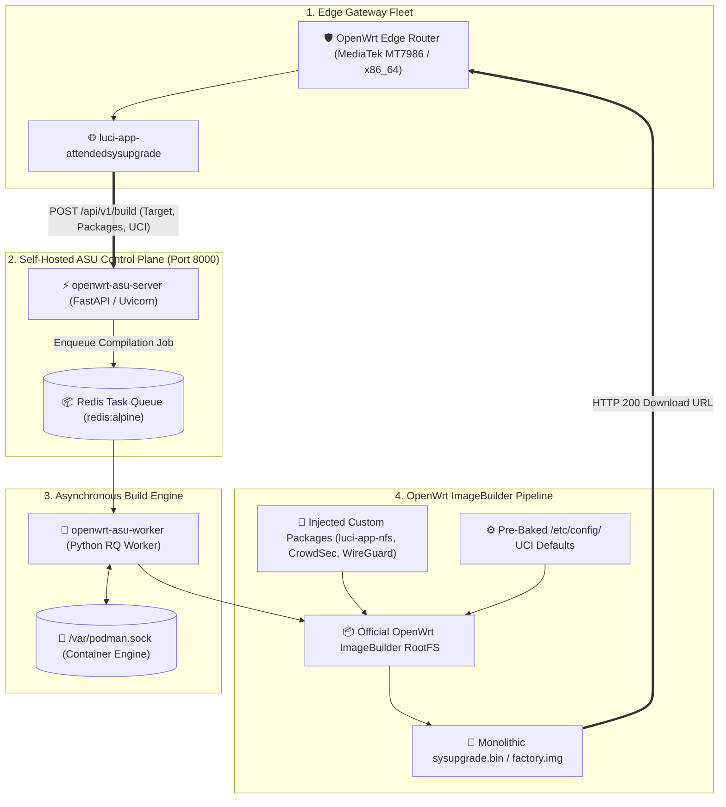

> [!note] Project Documentation Wiki
> *This document is part of the **[[projects/index|RPDev Projects Knowledge Base]]**. For the high-level portfolio overview, visit [iamrp.dev](https://iamrp.dev).*

# OpenWrt Attended Sysupgrade (ASU) Custom Image Builder
## **Automating On-Demand Kernel & SquashFS Firmware Compilation with FastAPI, RQ Build Workers & Containerized ImageBuilders**

> [!abstract] Architectural Overview
> Upgrading embedded OpenWrt routers across production fleets frequently causes downtime due to missing custom kernel modules, package incompatibilities, or overwritten configuration state. This architecture implements a **self-hosted OpenWrt Attended Sysupgrade (ASU) build server**: combining a **FastAPI REST API**, an **asynchronous Redis task queue (`rqworker`)**, and **containerized OpenWrt ImageBuilders** to compile customized, signed router firmware images on demand in under 45 seconds.



---

## 1. The Challenge of Embedded Router Upgrades

Standard OpenWrt upgrades present significant friction in enterprise and lab environments:
1. **Lost Custom Packages**: Flashing an upstream release wipes out custom packages (like WireGuard, CrowdSec bouncers, or custom LuCI apps) unless manually reinstalled via OPKG/APK post-boot.
2. **Flash Storage Bloat**: Installing packages on overlayfs consumes valuable writeable root partition flash, whereas baking them into the read-only SquashFS partition compresses packages by over **60%**.
3. **Hardware Bricking Risks**: Incompatible kernel dependencies can leave routers unreachable if networking drivers fail to initialize during standard package upgrades.

---

## 2. ASU Server Architecture

The build server decouples web requests from heavy C/Go toolchain compilation using an asynchronous worker pattern:

```yaml
# /mnt/sharedroot/compose/llmadmin01/openwrtasu/compose.yml
services:
  server:
    image: "openwrt-asu:latest"
    container_name: openwrt-asu-server
    restart: unless-stopped
    command: uv run uvicorn --host 0.0.0.0 --port 8000 asu.main:app
    environment:
      - REDIS_URL=redis://127.0.0.1:6379/0
    volumes:
      - ./config/asu.toml:/app/asu.toml:ro
      - ./data/store:/public/store:ro
    ports:
      - "8000:8000"

  worker:
    image: "openwrt-asu:latest"
    container_name: openwrt-asu-worker
    restart: unless-stopped
    command: uv run rqworker --logging_level INFO
    volumes:
      - ./config/asu.toml:/app/asu.toml:ro
      - ./data:/public:rw
      - /run/podman/podman.sock:/var/podman.sock:rw # Container socket for sandbox builds

  redis:
    image: "redis:alpine"
    container_name: openwrt-asu-redis
    network_mode: "host"
```

---

## 3. End-to-End Automated Compilation Workflow

1. **Router Inventory Scan**:
   - The router executes `auc` (Attended Upgrade CLI) or opens the LuCI interface, cataloging its exact architecture target (`mediatek/filogic`), subtarget (`mac80211`), and installed package list.
2. **REST API Invocation**:
   - Sends a JSON payload to `http://asu.internal.iamrp.dev:8000/api/v1/build`.
3. **Sandboxed Image Generation**:
   - The RQ worker spins up an isolated OpenWrt ImageBuilder container, resolves dependencies, compiles the SquashFS rootfs, injects custom `/etc/uci-defaults/` provisioning scripts, and signs the resulting binary.
4. **Zero-Touch Flashing**:
   - The router downloads the custom `sysupgrade.bin` artifact directly from the ASU local cache and applies the upgrade in under **60 seconds**, rebooting with 100% of services and network tunnels operational.

---

## 🔗 Related Architecture & Knowledge Graph

* **Production Systems:** Validated in [[OpenWrt_Kernel_NFS_Manager|OpenWrt Kernel NFS Manager]], [[OpenWRT_Blackhole_Webserver|OpenWRT Blackhole Webserver]].
* **Governance & Compliance:** Governed by [[Projects/Governance-and-Policies/Infrastructure_Hardening_Policy|Infrastructure Hardening Policy]], [[Projects/Governance-and-Policies/IT_Change_Management_Policy|IT Change Management Policy]].
* **Technical Articles:** Deep dive in [[Articles/Architecture/Systems_Automation|Systems and Automation Architecture]].
* **Applied Research:** Investigated in [[Research/Security_Analysis_and_Research_Agent/Lab_Requirements|Lab Requirements]].
* **Master Credentials:** Review core competencies on [[Resume/Master_Resume|Curriculum Vitae & Master Resume]].
* **Digital Garden Hub:** Return to the main [[content/Projects/index|Digital Garden Index]].
