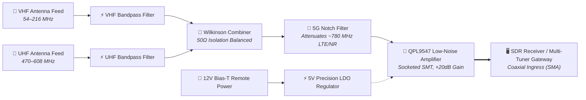

> [!note] Project Documentation Wiki
> *This document is part of the **[[projects/index|RPDev Projects Knowledge Base]]**. For the high-level portfolio overview, visit [iamrp.dev](https://iamrp.dev).*

> [!info] Project Maturity: **25% — Hardware Prototype (Tier 1)**
> - **Lifecycle Status**: Hardware Schematics & PCB Layout Complete
> - **Active Components**: KiCad 8.x schematics, 2-layer RF layout, Wilkinson microstrip divider, 5G elliptic notch filter (~780 MHz), QPL9547 LNA stage
> - **Pending Enhancements**: Physical PCB fabrication, SMD component soldering, VNA S-parameter insertion loss & isolation validation

# RF Board TV Combiner: Passive UHF/VHF Coupler & LNA
## **2-Way Antenna Combiner, Band-Pass Filters, 5G Notch Attenuation & QPL9547 Low-Noise Amplification**

> [!abstract] Engineering Summary
> The **RF Board TV Combiner** is an open-source, custom PCB design engineered to couple dual terrestrial antenna feeds across VHF and UHF spectra while suppressing cellular interference and boosting signal margins for SDR receivers and digital TV demodulators. It integrates a **Wilkinson power divider/combiner**, a **steep 5G notch filter (~780 MHz)**, and a **socketed QPL9547 Ultra Low-Noise Amplifier (LNA)** powered via a 12V Bias-T.

- **Repository**: [`https://github.com/RPDevs-Builds/rf-board-tv`](https://github.com/RPDevs-Builds/rf-board-tv)
- **Design Suite**: KiCad 8.x (Schematics, Layout, Gerbers, Interactive BOM)
- **Spectrum Bands**: VHF (54–216 MHz) & UHF (470–608 MHz) | 5G Band Notch (~780 MHz)
- **Active RF Stage**: QPL9547 High-Linearity LNA (< 0.5 dB Noise Figure)

---

## 1. Circuit Design & RF Architecture

### A. Frequency Selective Filtering
- **VHF Bandpass (54–216 MHz)**: Preserves lower and high VHF broadcast television and amateur radio channels with minimal insertion loss (< 0.8 dB).
- **UHF Bandpass (470–608 MHz)**: Optimized for post-repack digital broadcast television and digital audio broadcasting.
- **5G Cellular Notch (~780 MHz)**: Sharp-skirt elliptic notch filter providing **> 35 dB attenuation** against adjacent 700/800 MHz commercial cellular base stations that frequently overload wideband SDR front-ends.

### B. Wilkinson Power Combiner
- Employs a microstrip-based Wilkinson power divider/combiner with a 100Ω precision thin-film balancing resistor.
- Delivers equal amplitude and phase summation between the two antenna ports while maintaining **> 22 dB port-to-port isolation**, preventing mutual antenna detuning and reflection artifacts.

### C. Active Amplification & Bias-T Power
- **Low-Noise Amplifier**: Socketed QPL9547 GaAs pHEMT transistor providing **+20 dB gain** across 50–1000 MHz with a noise figure below **0.45 dB**.
- **Remote DC Feeding**: Powered remotely over the output coaxial line using a 12V Bias-T, stepping down locally via an ultra-low-noise 5V linear regulator (LDO) with ferrite choke decoupling.

---

## 2. PCB Layout & Manufacturing Specs

- **Layer Stack**: 2-Layer FR4 (1.6 mm thickness, 1 oz copper, ENIG gold surface finish for high-frequency conductivity).
- **Impedance Control**: 50Ω coplanar waveguide with ground (CPWG) traces designed with stitched via fences to eliminate parasitic substrate resonances.
- **Mechanical Form Factor**: 4x M3 corner mounting holes, dedicated perimeter RF shielding fence pads, and SMA edge-launch connectors.

---

## 🧭 Navigation & Related Documentation
- Review aviation signal capture in **[[projects/Networking/adsb-aviation-sdr|ADS-B Aviation SDR Telemetry]]**
- Understand cluster node hardware in **[[projects/Infrastructure/nodes|Hardware Nodes & Topology]]**
- Return to **[[projects/index|Projects Documentation Hub]]**
