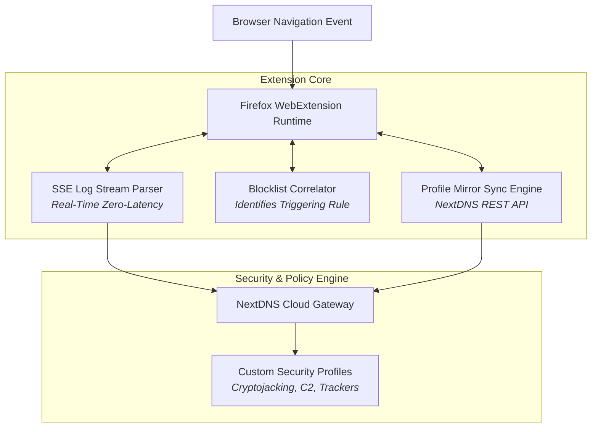

> [!note] Project Documentation Wiki
> *This document is part of the **[[projects/index|RPDev Projects Knowledge Base]]**. For the high-level portfolio overview, visit [iamrp.dev](https://iamrp.dev).*

# DNS Forge: NextDNS Firefox Add-on
## **Manifest V3 WebExtension, Real-Time Server-Sent Events (SSE) Stream Parsing & Automated Blocklist Correlation**

> [!abstract] Architectural Summary
> Modern privacy-focused web browsing requires dynamic, fine-grained control over DNS-over-HTTPS (DoH) routing and real-time blocklist auditing. **DNS Forge** is a modular Firefox WebExtension built to interface directly with NextDNS APIs, providing real-time Server-Sent Events (SSE) log streaming, blocklist correlation, automated security rule auditing, and multi-profile synchronization.

---

## 1. Key Technical Features

1. **Zero-Latency SSE Log Streaming:**
   * Uses native `EventSource` connections to stream live DNS queries with sub-millisecond DOM updates.
   * Renders query protocols (DoH, DoQ, IPv6), client IP geolocations, and domain categorization badges.

2. **Real-Time Blocklist Debugger:**
   * When a website breaks, instantly correlates the blocked asset with the exact active security list (e.g. OISD, Steven Black, NextDNS Threat Intelligence) allowing single-click allowlisting.

3. **100% Mozilla AMO Compliance:**
   * Strictly adheres to Firefox Manifest V3 security boundaries with zero unvetted third-party dependencies, clean Content Security Policy (CSP), and automated CodeQL audit pipelines.

---

## 🔗 Related Architecture & Knowledge Graph

* **Production Systems:** Validated in [[OpenWRT_Blackhole_Webserver|OpenWRT Blackhole Webserver]], [[Perimeter_Deception_and_Tarpits|Perimeter Deception and Tarpits]].
* **Governance & Compliance:** Governed by [[Projects/Governance-and-Policies/Information_Security_Policy|Information Security Policy]].
* **Technical Articles:** Deep dive in [[Articles/Whitepapers/Zero_Trust_Edge|Zero Trust Edge Routing]].
* **Applied Research:** Investigated in [[Research/Security_Analysis_and_Research_Agent/Tools_and_Telemetry|Tools and Telemetry]].
* **Master Credentials:** Review core competencies on [[Resume/Master_Resume|Curriculum Vitae & Master Resume]].
* **Digital Garden Hub:** Return to the main [[content/Projects/index|Digital Garden Index]].
