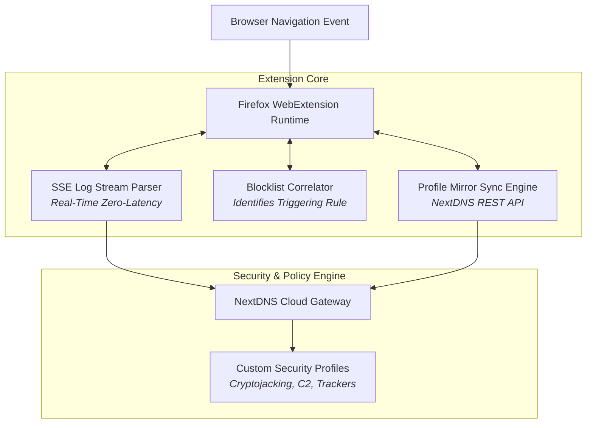

> [!note] Project Documentation Wiki
> *This document is part of the **[[projects/index|RPDev Projects Knowledge Base]]**. For the high-level portfolio overview, visit [iamrp.dev](https://iamrp.dev).*

> [!info] Project Maturity: **92% — Release-Ready Extension (Tier 5)**
> - **Lifecycle Status**: Release Candidate (AMO Compliant)
> - **Active Components**: Manifest V3 extension, single delegated document event listener, strict NextDNS JSON schema mapping, Server-Sent Events (SSE) query log parser, Jest tests
> - **Pending Enhancements**: Official Mozilla Add-ons (AMO) store listing publication

# DNS Forge: Sovereign NextDNS Firefox Privacy Extension
## **Manifest V3 WebExtension, Real-Time Server-Sent Events (SSE) Stream Parsing & Automated Blocklist Correlation**

> [!abstract] Architectural Summary
> Modern privacy-focused web browsing requires dynamic, fine-grained control over DNS-over-HTTPS (DoH) routing and real-time blocklist auditing. **DNS Forge** is a modular Firefox WebExtension built to interface directly with NextDNS APIs, providing real-time Server-Sent Events (SSE) log streaming, blocklist correlation, automated security rule auditing, and multi-profile synchronization.

- **Repository**: [`https://github.com/RPDevs-Builds/nextdns-firefox-addon`](https://github.com/RPDevs-Builds/nextdns-firefox-addon)
- **Specification**: Firefox Manifest V3 WebExtension (AMO Compliant)
- **Runtime Architecture**: Node.js 22, Jest test suite, zero-telemetry client storage.



---

## 1. Key Engineering Principles & Architectural Lessons

### A. Single Delegated UI Event Listener Pattern
In complex, multi-tab WebExtension popups, attaching event listeners directly to dynamic DOM elements creates event collision, shadowing, and memory leaks upon popup re-renders. 
DNS Forge enforces a **single delegated event listener at the `document` root**:
```javascript
// Delegated event listener at document root
document.addEventListener('click', async (event) => {
  const toggleBtn = event.target.closest('[data-action="toggle-feature"]');
  if (!toggleBtn) return;
  
  const featureId = toggleBtn.dataset.feature;
  const targetState = toggleBtn.checked;
  await updateNextDNSSetting(featureId, targetState);
});
```

### B. Strict Third-Party API Schema Mapping
When defining UI state IDs or component datasets that sync with the NextDNS REST API, derive keys using an explicit, hardcoded dictionary rather than algorithmic string conversion:
```javascript
// Explicit schema key dictionary
const NEXTDNS_API_KEY_MAP = {
  cryptojackingProtection: 'cryptojacking',
  threatIntelligenceFeeds: 'threatIntelligenceFeeds',
  dnsRebindingGuard: 'dnsRebinding',
  typosquattingGuard: 'typosquatting'
};
```

### C. Root-First State Fetching
To avoid race conditions and UI desynchronization when loading profiles with multiple toggle switches, DNS Forge fetches the root profile resource (`GET /profiles/{id}`) in a single atomic request, populating client storage atomically before rendering UI controls.

---

## 2. CI/CD & Automated Quality Gates

The repository enforces automated validation on every commit via GitHub Actions (`ubuntu-latest`):
1. **Jest Unit Tests**: Validates SSE stream parsing, event deserialization, and schema key translation.
2. **AMO Compliance Linting**: Invokes `addons-linter` to verify manifest permissions, absence of remote code execution, and strict CSP.
3. **OpenSSF Scorecard & CodeQL**: Automated security scanning on GitHub-hosted runners auditing dependency trees and token handling.

---

## 🧭 Navigation & Related Documentation
- Review edge firewalling in **[[projects/Networking/openwrt-asu-builder|OpenWrt ASU Custom Firmware Builder]]**
- Understand hardware secrets in **[[projects/Security/fido2-age|FIDO2 + Age Hardware Secrets]]**
- Return to **[[projects/index|Projects Documentation Hub]]**
