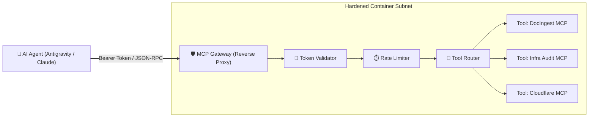

> [!note] Project Documentation Wiki
> *This document is part of the **[[projects/index|RPDev Projects Knowledge Base]]**. For the full lifecycle matrix, see the **[[projects/maturity-matrix|Project Maturity Matrix]]**.*

> [!info] Project Maturity: **50% — Architectural Prototype (Tier 3)**
> - **Lifecycle Status**: Active Architecture & Container Scaffold
> - **Active Components**: Docker Compose stack, reverse proxy configuration, token authentication scheme
> - **Pending Enhancements**: Dynamic tool routing, audit telemetry logging, per-agent rate-limiting middleware

# MCP Security Gateway: Isolated Agent Execution Proxy
## **Enforcing Authentication, Network Isolation & Granular Execution Boundaries for Model Context Protocol Agents**

> [!abstract] Engineering Overview
> As autonomous AI agents interact with local infrastructure and internal APIs, untrusted LLM tool calls introduce significant security risks. **`mcp_gateway`** implements a Dockerized reverse proxy and security boundary, terminating external agent connections, validating cryptographic bearer tokens, and routing permitted tool requests to isolated backend services.

- **Repository**: [`https://github.com/RPDevs-Builds/mcp_gateway`](https://github.com/RPDevs-Builds/mcp_gateway)
- **Deployment**: Docker Compose on `llmadmin01`
- **Security Boundaries**: Mutual TLS / Token Auth, Non-Root execution, Isolated Docker bridge networks.

---

## 🧭 Navigation & Related Documentation
- Review hardware secrets in **[[projects/Security/fido2-age|FIDO2 + Age Hardware Secrets]]**
- Review agent research in **[[research/agents-and-architecture|Multi-Agent Swarm Topology]]**
- Explore project lifecycle ratings in **[[projects/maturity-matrix|Project Maturity Matrix]]**
