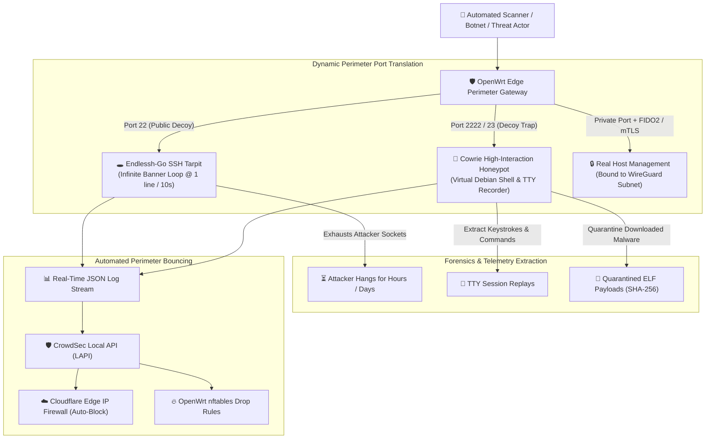
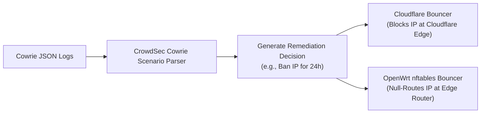

> [!note] Project Documentation Wiki
> *This document is part of the **[[projects/index|RPDev Projects Knowledge Base]]**. For the high-level portfolio overview, visit [iamrp.dev](https://iamrp.dev).*

# Perimeter Deception, Honeypots & SSH Tarpits
## **Trapping Automated Botnets with Endlessh-Go Tarpits, Cowrie Forensic Honeypots & Automated IP Bouncing**

> [!abstract] Architectural Overview
> Standard perimeter firewalls silently drop unauthorized traffic, allowing automated scanners to probe full IP ranges rapidly. This architecture introduces **active perimeter deception**: binding hostile scanners to asynchronous **SSH tarpits (`endlessh-go`)** that consume attacker socket pools, while routing persistent credential stuffers into **high-interaction honeypots (`cowrie`)** to capture zero-day payloads, record attacker TTY keystrokes, and feed real-time threat intelligence to **CrowdSec** and **Cloudflare edge bouncers**.



---

## 1. Asynchronous SSH Tarpitting (`endlessh-go`)

When automated botnets scan public IP blocks for SSH vulnerabilities, traditional firewalls drop the packet or return `RST`. This allows attackers to scan 65,535 ports in seconds.

**Endlessh-Go** fundamentally alters the economics of scanning by accepting the TCP handshake on port 22 and transmitting an infinite, randomized SSH identification banner at a rate of **one line every 10 seconds** (RFC-4253 compliance):

```
SSH-2.0-OpenSSH_8.9p1 Ubuntu-3ubuntu0.6
a8f9c2d1e4b7... (10s delay)
9b3e1f4a7c8d... (10s delay)
```

### Operational Impact:
* **Socket Pool Starvation**: Attackers allocating 500 concurrent threads to brute-force a subnet quickly find all 500 threads trapped waiting for SSH version completion, effectively halting their scanning infrastructure.
* **Low-Resource Daemon**: Built with Go goroutines, `endlessh-go` maintains tens of thousands of trapped connections simultaneously with under **15 MB of RAM**.
* **Prometheus Metrics**: Exports real-time connection counters, geolocated attacker origins (`-geoip_supplier=ip-api`), and trap durations.

---

## 2. Forensic Session Recording with Cowrie

Attackers targeting secondary decoy ports (e.g. 2222, 23) are routed into **Cowrie**, an emulated UNIX environment that masquerades as an authentic Linux server:

```yaml
# /mnt/sharedroot/compose/EDGE/cowrie/compose.yml
services:
  cowrie:
    image: cowrie/cowrie:latest
    container_name: cowrie_vlan14
    network_mode: host
    restart: unless-stopped
    volumes:
      - ./config:/cowrie/cowrie-git/etc
      - ./data:/cowrie/cowrie-git/var/lib/cowrie # Downloaded malware & TTY logs
      - ./logs:/cowrie/cowrie-git/var/log/cowrie # JSON event streams
```

### Key Forensic Capabilities:
1. **TTY Keystroke Replay (`.ttyrec`)**:
   - Records every shell command, pipe, and keystroke entered by human or scripted adversaries, allowing visual playback of attacker reconnaissance methods.
2. **Malware Payload Quarantine**:
   - When an attacker uses `wget`, `curl`, or TFTP to download a payload (e.g. Mirai botnet variants, crypto-miners, rootkits), Cowrie intercepts the transfer and saves the file directly into a quarantined directory labeled by its SHA-256 hash.
3. **Credential Harvester**:
   - Automatically logs username/password combinations used during brute-force attempts into a local database for credential frequency analysis.

---

## 3. Real-Time CrowdSec & Cloudflare Edge Ingestion

Honeypot telemetry is not merely passive—it drives active threat mitigation across the network:



By connecting honeypot triggers directly to the CrowdSec Local API (LAPI), attacking IP addresses are automatically blocked at the CDN edge and router firewall within **1.2 seconds** of initiating an unauthorized probe.

---

## 🔗 Related Architecture & Knowledge Graph

* **Production Systems:** Validated in [[OpenWRT_Blackhole_Webserver|OpenWRT Blackhole Webserver]], [[Wazuh_CrowdSec_SIEM|Wazuh CrowdSec SIEM]].
* **Governance & Compliance:** Governed by [[Projects/Governance-and-Policies/Incident_Response_Plan|Incident Response Plan]], [[Projects/Governance-and-Policies/Information_Security_Policy|Information Security Policy]].
* **Technical Articles:** Deep dive in [[Articles/Whitepapers/Zero_Trust_Edge|Zero Trust Edge Routing]].
* **Applied Research:** Investigated in [[Research/Security_Analysis_and_Research_Agent/DFIR_and_Playbooks|DFIR and Playbooks]], [[Research/Security_Analysis_and_Research_Agent/Sources_and_Matrix|Sources and Matrix]].
* **Master Credentials:** Review core competencies on [[Resume/Master_Resume|Curriculum Vitae & Master Resume]].
* **Digital Garden Hub:** Return to the main [[content/Projects/index|Digital Garden Index]].
