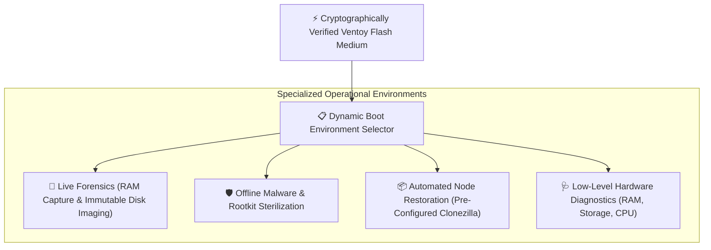

> [!note] Project Documentation Wiki
> *This document is part of the **[[projects/index|RPDev Projects Knowledge Base]]**. For the high-level portfolio overview, visit [iamrp.dev](https://iamrp.dev).*

# Ventoy Tech Super Tool: Multi-Boot USB Configuration
## **Air-Gapped Incident Response, Live Forensics & Cryptographically Verified Bare-Metal Provisioning**

> [!abstract] Architectural Summary
> In critical incident response and bare-metal infrastructure provisioning scenarios, relying on network-based recovery is often a liability. The **Ventoy Tech Super Tool** is a heavily customized, multi-boot USB configuration engineered for rapid, secure, and zero-trust payload delivery across air-gapped and volatile environments.

---

## 1. Core Engineering Capabilities

By utilizing Ventoy's dynamic ISO boot capabilities, this super tool consolidates an entire arsenal of diagnostic, recovery, and provisioning environments onto a single flash medium:

### A. Zero-Trust Provisioning & Payload Delivery
Operating in potentially hostile or heavily compromised environments requires a zero-trust approach to infrastructure provisioning:
* **Immutable Payloads:** All provisioning scripts and Kickstart/Preseed configurations are deployed as immutable payloads, cryptographically signed and verified at boot.
* **Air-Gapped Delivery:** Enables complete, secure infrastructure bootstrapping without reliance on compromised local networks or external DNS.

### B. Advanced Incident Response (DFIR)
When systems are breached, immediate and sterile intervention is paramount:
* **Live Forensics:** Boots directly into volatile-memory-only forensic environments (e.g., customized Kali Linux, CAINE distributions) to capture RAM and image disks without altering the host state.
* **Malware Sterilization:** Deploys hardened, offline AV scanners and rootkit detectors to sanitize infected nodes before reintroducing them to the network.

### C. Bare-Metal Recovery
For catastrophic failures, rapid restoration of bare-metal infrastructure minimizes downtime:
* **Automated Restoration:** Contains automated imaging tools (e.g., Clonezilla) pre-configured with recovery routines for instantaneous restoration of critical nodes.
* **Hardware Diagnostics:** Includes low-level hardware diagnostic utilities to validate RAM, storage, and CPU integrity prior to OS redeployment.

---

## 🔗 Related Architecture & Knowledge Graph

* **Production Systems:** Validated in [Kexecboot Wireless Bootloader](https://iamrp.dev/projects/kexecboot_wireless_bootloader), [Hardware Security Key](https://iamrp.dev/projects/hardware_security_key).
* **Governance & Compliance:** Governed by [[Projects/Governance-and-Policies/Disaster_Recovery_Plan|Disaster Recovery Plan]].
* **Technical Articles:** Deep dive in [Bare Metal Diagnostics Lessons](https://iamrp.dev/component_repair).
* **Applied Research:** Investigated in [[Research/Security_Analysis_and_Research_Agent/Lab_Requirements|Lab Requirements]].
* **Master Credentials:** Review core competencies on [Curriculum Vitae & Master Resume](https://iamrp.dev/resume/master_resume).
* **Digital Garden Hub:** Return to the main [[content/Projects/index|Digital Garden Index]].
