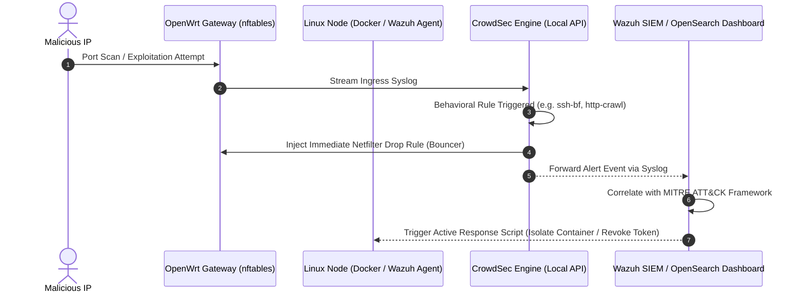

> [!note] Project Documentation Wiki
> *This document is part of the **[[projects/index|RPDev Projects Knowledge Base]]**. For the high-level portfolio overview, visit [iamrp.dev](https://iamrp.dev).*

# Enterprise SIEM & Collaborative XDR Defense: Wazuh + CrowdSec

> [!abstract] Architectural Summary
> Unified threat visibility and active response across hybrid bare-metal nodes, Docker containers, and edge OpenWrt gateways. This architecture integrates **Wazuh SIEM/XDR** (endpoint detection, FIM, compliance mapping) with **CrowdSec** (behavioral log parsing, consensus threat intelligence, automated kernel firewall blocking).

---

### ◈ Detection & Response Pipeline

---

### ◈ Core Operational Capabilities

1. **Endpoint Integrity & File Integrity Monitoring (FIM):**
   * Wazuh agents on all nodes monitor critical system directories (`/etc`, `/usr/bin`, `/boot`, `/etc/uci-defaults`) for unauthorized binary or configuration alterations.

2. **Collaborative Threat Intelligence (CrowdSec):**
   * Parses logs across SSH traps, reverse proxies, and Honeypots.
   * Leverages global consensus blocklists to preemptively drop known malicious scanning networks at the border router before traffic reaches compute nodes.

3. **Regulatory Compliance Automation:**
   * Automated compliance mapping against **NIST 800-53**, **PCI-DSS 4.0**, and **CIS Benchmarks** with weekly drift reports.

---

## 🔗 Related Architecture & Knowledge Graph

* **Production Systems:** Validated in [[Perimeter_Deception_and_Tarpits|Perimeter Deception and Tarpits]], [[Unified_Fleet_Observability_Alloy|Unified Fleet Observability Alloy]].
* **Governance & Compliance:** Governed by [[Projects/Governance-and-Policies/Incident_Response_Plan|Incident Response Plan]], [[Projects/Governance-and-Policies/Information_Security_Policy|Information Security Policy]].
* **Technical Articles:** Deep dive in [[Articles/Whitepapers/Zero_Trust_Edge|Zero Trust Edge Routing]].
* **Applied Research:** Investigated in [[Research/Security_Analysis_and_Research_Agent/DFIR_and_Playbooks|DFIR and Playbooks]], [[Research/Security_Analysis_and_Research_Agent/Tools_and_Telemetry|Tools and Telemetry]].
* **Master Credentials:** Review core competencies on [[Resume/Master_Resume|Curriculum Vitae & Master Resume]].
* **Digital Garden Hub:** Return to the main [[content/Projects/index|Digital Garden Index]].
