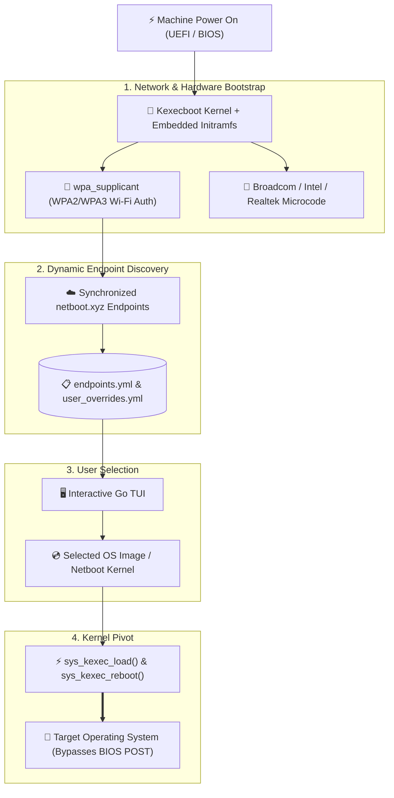

> [!note] Project Documentation Wiki
> *This document is part of the **[[projects/index|RPDev Projects Knowledge Base]]**. For the high-level portfolio overview, visit [iamrp.dev](https://iamrp.dev).*

> [!info] Project Maturity: **45% — Experimental Bootloader Core (Tier 2)**
> - **Lifecycle Status**: Active Proof-of-Concept & Upstream Sync
> - **Active Components**: Buildroot external tree, Go TUI interface, Linux kernel direct memory `kexec_load()` pivot, netboot.xyz automated data sync
> - **Pending Enhancements**: Broad Wi-Fi vendor firmware blob integration (iwlwifi, ath10k), UEFI secure boot shim signing

# kexecboot.xyz: Wireless Network Bootloader & Kernel Pivot
## **Pre-OS WPA2/3 Wi-Fi Authentication, Interactive Go TUI, and Memory Kernel Transitions**

> [!abstract] Architectural Summary
> Traditional network booting (PXE / iPXE) requires wired Ethernet connections and local DHCP options. **`kexecboot.xyz`** is an ultra-minimal, Wi-Fi capable network bootloader combining a specialized Linux kernel + Buildroot initramfs, an interactive terminal UI (TUI) written in Go, and automated synchronization with upstream `netboot.xyz` endpoints.

- **Repository**: [`https://github.com/RPDevs-Builds/kexecboot.xyz`](https://github.com/RPDevs-Builds/kexecboot.xyz)
- **Domain**: `kexecboot.xyz`
- **Core Technologies**: Linux `kexec_load()`, Go 1.24, Buildroot, `wpa_supplicant`.

---

## 1. Key Engineering Features

1. **Integrated Wireless Microcode**:
   - Bundles firmware blobs for Intel Wireless (`iwlwifi`), Realtek (`rtlwifi`), and Atheros (`ath9k`/`ath10k`), enabling network booting on modern laptops without Ethernet ports.
2. **Direct Memory `kexec` Execution**:
   - Instead of rebooting through the hardware BIOS/UEFI, `kexecboot` loads the target OS kernel and initrd directly into RAM and calls `kexec_load()`, executing the new operating system in under **2 seconds**.
3. **Automated Upstream Data Pipeline**:
   - GitHub Actions workflow (`sync-upstream.yml`) runs daily on `ubuntu-latest`, pulling the latest operating system URLs and hashes from `netbootxyz/netboot.xyz` and submitting automated pull requests to keep boot manifests fresh.

---

## 🧭 Navigation & Related Documentation
- Review bootable recovery tools in **[[projects/Security/ventoy-super-tool|Ventoy Super Tool Architecture]]**
- Understand cluster node roles in **[[projects/Infrastructure/nodes|Hardware Nodes & Topology]]**
- Return to **[[projects/index|Projects Documentation Hub]]**
