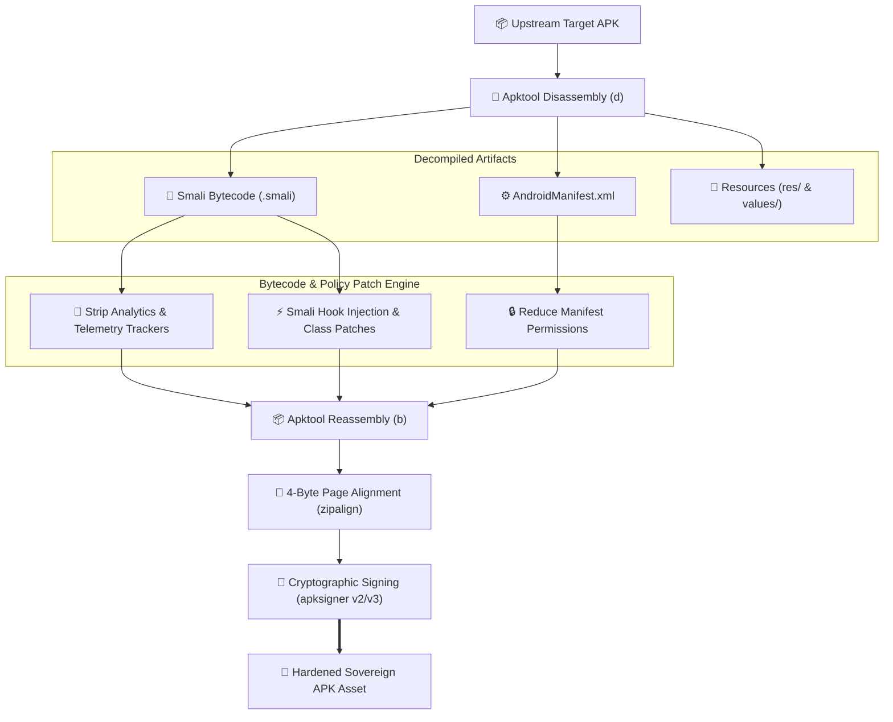

> [!note] Project Documentation Wiki
> *This document is part of the **[[projects/index|RPDev Projects Knowledge Base]]**. For the high-level portfolio overview, visit [iamrp.dev](https://iamrp.dev).*

> [!info] Project Maturity: **70% — Headless CLI Toolchain (Tier 3)**
> - **Lifecycle Status**: Operational Script & Pipeline Engine
> - **Active Components**: Headless `apktool` disassembly, AST smali bytecode patching, 4-byte `zipalign` optimization, `apksigner` v2/v3 signing
> - **Pending Enhancements**: Automated multi-APK regression test harness, automated upstream toolchain version bump checks

# APK Build-Patch: Headless Android Binary Engineering
## **Automated APKTool Disassembly, Smali Bytecode Patching, Keystore Signing & CI/CD Pipeline Orchestration**

> [!abstract] Engineering Overview
> **`APK_Build-Patch`** is a specialized toolchain designed for headless, automated Android application modification. It orchestrates **`apktool`**, **`baksmali/smali`**, **`apksigner`**, and **`zipalign`** within automated GitHub Actions pipelines, enabling rapid bytecode patching, resource localization, telemetry stripping, and cryptographic resigns without manual desktop IDE interaction.

- **Repository**: [`https://github.com/RPDevs-Builds/APK_Build-Patch`](https://github.com/RPDevs-Builds/APK_Build-Patch)
- **Key Utilities**: Apktool, Baksmali, Android Build-Tools (`zipalign`, `apksigner`), JDK 21.

---

## 1. Key Engineering Workflows

1. **Deterministic Smali Patching**:
   - Executes regex and AST-based patches across smali class files to bypass anti-tamper routines, strip tracking beacons, and re-route telemetry endpoints to loopback `127.0.0.1`.
2. **Page-Boundary 4-Byte Alignment (`zipalign`)**:
   - Aligns uncompressed data files inside the APK zip on 4-byte boundaries, enabling Android's `mmap()` subsystem to read assets directly from the package without RAM copies.
3. **Cryptographic Signing (V2 / V3 Signature Schemes)**:
   - Uses `apksigner` with dedicated organization keystores, supporting whole-file APK Signature Scheme v2/v3 for Android 11+ tamper verification.

---

## 🧭 Navigation & Related Documentation
- Review Tasker automation pipeline in **[[projects/Android/rvx-builds|RVX-Builds Automation]]**
- Review mobile platform architecture in **[[projects/mobile-stack|Mobile Stack Unified Architecture]]**
- Return to **[[projects/index|Projects Documentation Hub]]**
