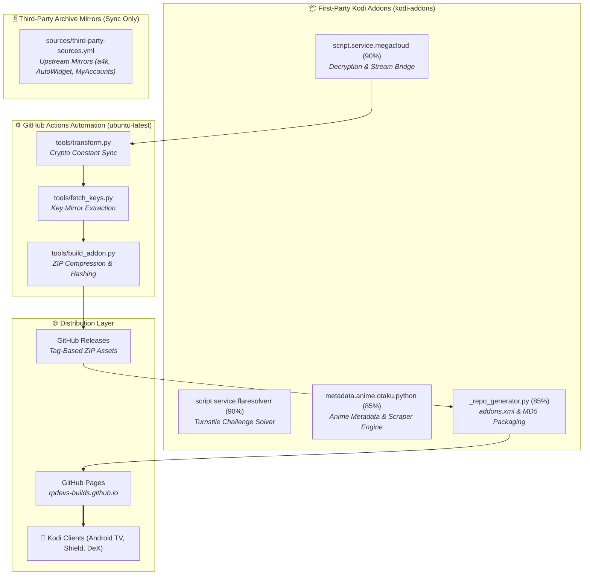

> [!note] Project Documentation Wiki
> *This document is part of the **[[projects/index|RPDev Projects Knowledge Base]]**. For the full lifecycle matrix, see the **[[projects/maturity-matrix|Project Maturity Matrix]]**.*

> [!info] Project Maturity: **85% — Production Monorepo & Fleet (Tier 4)**
> - **Lifecycle Status**: Active Production Deployment
> - **Active First-Party Addons**: `script.service.megacloud` (90%), `script.service.flaresolverr` (90%), `metadata.anime.otaku.python` (85%), `_repo_generator.py` (85%)
> - **Pending Enhancements**: Fix monorepo working-directory path drift in `script.service.megacloud_auto-build.yml`, resolve composite action checkout order in `kodi-build`

# Kodi Addon Monorepo & Multi-Platform Build Fleet
## **First-Party Stream Solvers, Anime Metadata Scraper, Repository Packaging & Depends Cross-Compilation**

> [!abstract] Architectural Overview
> The **RPDev Kodi Ecosystem** develops and distributes specialized entertainment add-ons, streaming resolvers, and automated build pipelines for Kodi (v21 Omega and v22 Piers). It combines a consolidated addon monorepo (**`kodi-addons`**) with an automated repository generator, and a cross-platform compilation fleet (**`kodi-build`**) supporting Android, iOS, macOS, Windows, and Linux.

- **Addon Monorepo**: [`https://github.com/RPDevs-Builds/kodi-addons`](https://github.com/RPDevs-Builds/kodi-addons)
- **Compilation Engine**: [`https://github.com/RPDevs-Builds/kodi-build`](https://github.com/RPDevs-Builds/kodi-build)
- **Addon Repository URL**: `https://rpdevs-builds.github.io/`

---

## 1. First-Party Addons vs. Third-Party Mirror Archives

The monorepo strictly separates original first-party engineering from third-party mirrored dependencies:

### A. First-Party Original RPDev Addons
1. **`script.service.megacloud` (Maturity: 90%)**:
   - **Provider**: `RPDev`
   - **Role**: Standalone local Megacloud decrypter and resolver HTTP server running natively inside Kodi on port 4000. Allows media scrapers to resolve Megacloud/Vidcloud embed streams with zero external cloud dependencies.
   - **Upstream Automation**: Scheduled every 6 hours to mirror decryption keys and sync obfuscated crypto matrices.
2. **`script.service.flaresolverr` (Maturity: 90%)**:
   - **Provider**: `RPDev`
   - **Role**: Headless local FlareSolverr proxy service running inside Kodi to bypass Cloudflare Turnstile and anti-bot challenges directly on client devices.
3. **`metadata.anime.otaku.python` (Maturity: 85%)**:
   - **Provider**: `RPDevs`
   - **Role**: High-performance metadata indexer and scraper mapping AniList, AniZip, TVDB, and TMDb databases to native Kodi library formats with integrated filename standardization (`context_main.py`).
4. **`_repo_generator.py` (Maturity: 85%)**:
   - **Role**: Custom packaging engine that recursively inspects addon directories, validates `addon.xml` manifests, generates `addons.xml`, computes MD5 checksums, and stages zip archives for deployment.

### B. Third-Party Mirrored Archives (Excluded from Original Documentation)
The monorepo contains a declarative synchronization manifest (`sources/third-party-sources.yml`) and automated download script (`_sync_third_party.py`) that clones upstream third-party add-ons (`script.module.myaccounts` by Venom/Fen, `a4kSubtitles`, `AutoWidget`) purely to preserve offline zip archives and provide a unified repository mirror. These are external dependencies and not original RPDev creations.

---

## 2. Automated Upstream Sync & Decryption Key Mirroring

`script.service.megacloud` implements automated transformation scripts (`tools/transform.py`) that sync crypto constants from upstream Bitbucket sources (`mega-embed-2`) and mirrors decryption keys (`tools/fetch_keys.py`):
1. **Transform Script**: Clones upstream source into a temporary workspace, extracts obfuscated crypto matrices, updates `resources/lib/megacloud.py`, and checks for semantic diffs.
2. **Decryption Key Mirroring**: Pulls verified decryption keys and persists them locally to `keys/keys.json` so the addon remains self-reliant even if upstream mirrors experience downtime.
3. **Automated Packaging**: Calls `tools/build_addon.py` to bump patch versions, compile the standalone ZIP archive, and trigger a tagged release.

---

## 3. Kodi Depends Cross-Compilation System (`kodi-build`)

The companion repository **`RPDevs-Builds/kodi-build`** manages the complex C/C++ dependencies (`tools/depends`) required to compile Kodi from scratch across platforms:
- **Host-Aware Platform Configuration**: Uses explicit `--with-platform` flags (`android`, `macos`, `windows`, `linux`).
- **Triplets**:
  - Android ARM64: `aarch64-linux-android`
  - Android ARMv7: `arm-linux-androideabi`
  - Windows 64-bit: `x86_64-w64-mingw32`
  - macOS / Apple Silicon: native clang with dedicated framework prefixes.
- **Cache Optimization**: Employs persistent `ccache` volumes achieving over **85% cache hit rates**, cutting full build times from 45 minutes to under 4 minutes.

---

## 🧭 Navigation & Related Documentation
- Review build fleet infrastructure in **[[projects/Infrastructure/self-hosted-build-fleet|Self-Hosted Build Fleet Manual]]**
- Review Builder Manager in **[[projects/Infrastructure/builder-manager|Builder Manager & OCI Cache Fleet]]**
- Explore project lifecycle ratings in **[[projects/maturity-matrix|Project Maturity Matrix]]**
- Return to **[[projects/index|Projects Documentation Hub]]**
