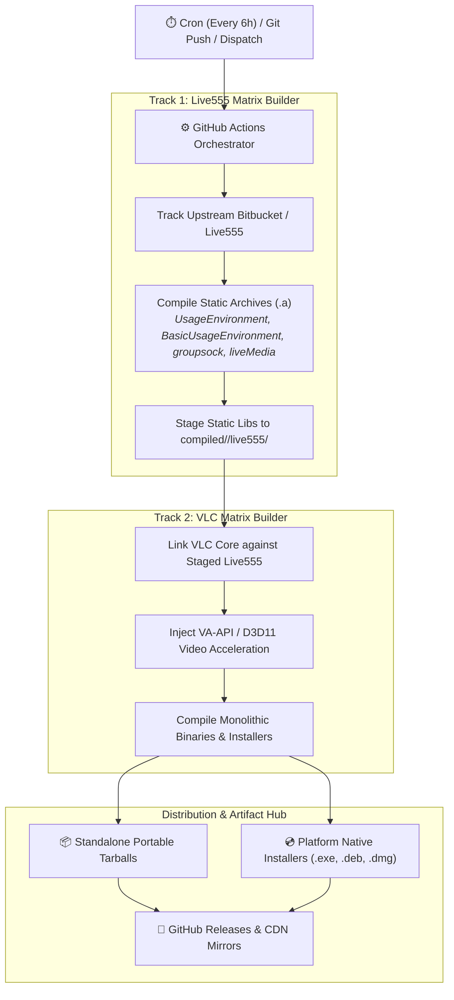

> [!note] Project Documentation Wiki
> *This document is part of the **[[projects/index|RPDev Projects Knowledge Base]]**. For the high-level portfolio overview, visit [iamrp.dev](https://iamrp.dev).*

> [!info] Project Maturity: **75% — Automated Matrix Engine (Tier 4)**
> - **Lifecycle Status**: Operational CI/CD Build System
> - **Active Components**: Dual-track CI/CD matrix, Live555 static archive compilation (`.a`), Linux VA-API hardware acceleration integration
> - **Pending Enhancements**: macOS Apple Silicon cross-compilation pipeline stability, automated release tarball verification

# VLC & Live555 Automated Multi-Arch Build Engine
## **Automated Dual-Track CI/CD Matrix, C/C++ Cross-Compilation & Hardware-Accelerated RTSP Streaming**

> [!abstract] Architectural Overview
> **`vlc-live-555`** is an automated cross-compilation engine designed to build and package **Live555 Streaming Media** libraries and **VLC Media Player** across multiple operating systems (Linux, Windows via MinGW-w64, macOS). It implements a **dual-track CI/CD pipeline** with containerized self-hosted runners, static library linking, and hardware-accelerated video decoding (VA-API).

- **Repository**: [`https://github.com/RPDevs-Builds/vlc-live-555`](https://github.com/RPDevs-Builds/vlc-live-555)
- **Core Components**: Live555 RTSP/RTP/RTCP Streaming Engine & VLC 3.x/4.x VideoLAN Core
- **Target Architectures**: `linux64` (x86_64, aarch64), `mingw-w64` (Windows x64/x86), `macosx` (Apple Silicon/Intel).

---

## 1. Dual-Track CI/CD Architecture

The engine decouples Live555 C++ library generation from VLC frontend builds to maximize compilation caching and minimize build failure blast radius:

1. **Track 1 (Live555 Matrix Builder)**:
   - Polls upstream Live555 sources every 6 hours.
   - Compiles static libraries (`.a`) targeting diverse architectures (`libliveMedia.a`, `libgroupsock.a`, `libBasicUsageEnvironment.a`, `libUsageEnvironment.a`).
   - Archives raw binaries and headers under `compiled/<OS>/live555/<Version>/`.
2. **Track 2 (VLC Matrix Builder)**:
   - Cross-compiles VLC, linking dynamically to the pre-compiled Live555 static libraries.
   - Integrates hardware acceleration modules: VA-API on Linux (via `intel-media-va-driver`) and Direct3D11 on Windows.
   - Produces standalone portable tarballs and release installers.

---

## 2. Hardware Acceleration Guide (Linux VA-API)

To achieve zero-lag, ultra-low-CPU playback of 4K RTSP/CCTV camera streams:
1. Open **Tools** > **Preferences** (`Ctrl+P`).
2. Switch to the **Input / Codecs** tab.
3. Under **Hardware-accelerated decoding**, select **VA-API video decoder via DRM**.
4. Click **Save** and restart VLC.

---

## 🧭 Navigation & Related Documentation
- Review cross-platform build fleet in **[[projects/Infrastructure/self-hosted-build-fleet|Self-Hosted Build Fleet Manual]]**
- Review Kodi cross-platform pipelines in **[[projects/Tools/kodi-ecosystem|Kodi Addon Monorepo & Build Fleet]]**
- Explore Edge CDN downloads in **[[cdn/index|Edge CDN Network & Asset Delivery]]**
- Return to **[[projects/index|Projects Documentation Hub]]**
