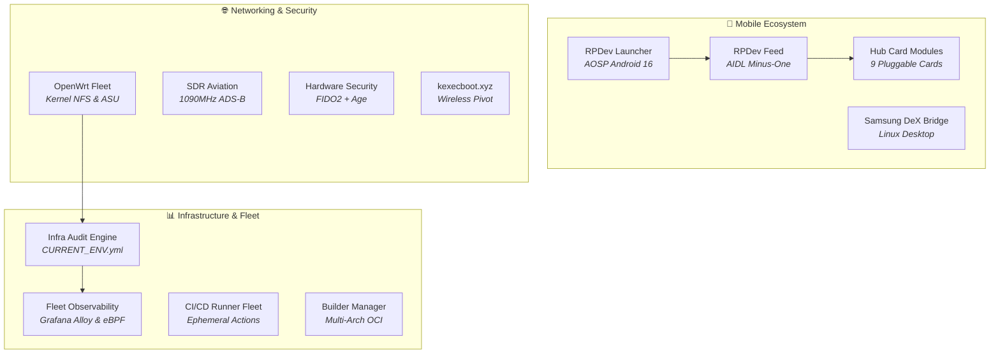

# 🛠️ RPDev Ecosystem Projects Documentation

> **Detailed operational documentation, deployment playbooks, and engineering manuals for all software and infrastructure projects built across the RPDevs ecosystem.**

---

## 🧭 Projects Knowledge Catalog

### 📱 Android & Mobile Systems
- **[[projects/Android/rpdev-launcher/index|RPDev Launcher User & Architecture Manual]]** — *AOSP Android 16 home screen, DataStore state flows, recursive folder cycle guards.*
- **[[projects/Android/rpdev-feed/index|RPDev Feed Companion Manual]]** — *Sovereign -1 screen, AIDL overlay server, on-device RSS parsing, Room database.*
- **[[projects/Android/rpdev-feed-modules/index|Hub Card Modules Ecosystem]]** — *Technical guides and JSON schemas for all 9 card plugins.*
- **[[projects/mobile-stack|Mobile Stack Unified Architecture]]** — *End-to-end specification connecting launcher, feed overlay, and edge CDN.*

### 📊 Infrastructure & Observability
- **[[projects/Infrastructure/infra-audit-engine/index|Infra Audit Engine Manual]]** — *Multi-node hardware detection, SSH key verification, and `CURRENT_ENV.yml` compilation.*
- **[[projects/Infrastructure/nodes|Hardware Nodes & Topology]]** — *Hardware specifications and role assignments for `edge`, `llmadmin01`, and `t430`.*
- **[[projects/Infrastructure/storage|Tiered Storage Architecture]]** — *ZFS, NVMe local SSD, and NFS SharedRoot tiering rules.*

### 🌐 Networking & IoT
- **[[projects/Networking/openwrt-fleet/index|OpenWrt Fleet Operations]]** — *Kernel NFS configuration, unattended sysupgrades, and UCI state normalization.*
- **[[projects/Networking/cloudflare-tunnels|Cloudflare Edge Tunnels]]** — *Zero-trust ingress routing and SSL termination for public endpoints.*

### 🔒 Security & Cryptography
- **[[projects/Security/fido2-age|FIDO2 + Age Hardware Secrets]]** — *Physical security key derivation, PAM hardware authentication, and chezmoi integration.*

### 🧪 Theory, Bootloaders & Tools
- **[[projects/TheoryandEarlyDev/kexecboot/index|kexecboot.xyz Wireless Bootloader]]** — *Pre-OS WPA2/3 Wi-Fi authentication and direct memory kernel kexec pivot.*
- **[[projects/Tools/docingest/index|DocIngest Crawler Suite]]** — *High-throughput documentation crawler, markdown conversion, and MCP vector retrieval.*

---

## 🔗 Quick Links
- Return to **[[index|Master Wiki Home]]**
- Visit **[[getting-started/index|Quick Start Guide]]**
- Explore all 9 cards in **[[modules/index|Modules Hub]]**
- Review source code on **[GitHub](https://github.com/RPDevs-Builds)**
