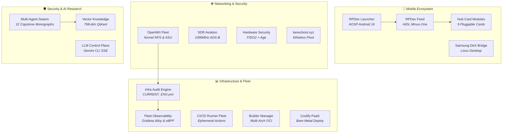

# 🛠️ RPDev Ecosystem Projects Documentation

> **Detailed operational documentation, deployment playbooks, and engineering manuals for all software and infrastructure projects built across the RPDevs ecosystem.**

---

## 🧭 Projects Knowledge Catalog

### 📱 Android & Mobile Systems
- **[[projects/Android/rpdev-launcher/index|RPDev Launcher User & Architecture Manual]]** — *AOSP Android 16 home screen, DataStore state flows, recursive folder cycle guards.*
- **[[projects/Android/rpdev-feed/index|RPDev Feed Companion Manual]]** — *Sovereign -1 screen, AIDL overlay server, on-device RSS parsing, Room database.*
- **[[projects/Android/rpdev-feed-modules/index|Hub Card Modules Ecosystem]]** — *Technical guides and JSON schemas for all 9 card plugins.*
- **[[projects/mobile-stack|Mobile Stack Unified Architecture]]** — *End-to-end specification connecting launcher, feed overlay, and edge CDN.*

### 🛡️ Security & AI Research Hub
- **[[research/index|Master Thesis & Capstone Research Overview]]** — *Autonomous multi-agent swarms, vector retrieval, and empirical RF anomaly modeling.*
- **[[research/agents-and-architecture|Multi-Agent Swarm Topology & Consensus]]** — *Agent hierarchy, quorum gating, and MCP execution boundaries.*
- **[[research/vector-knowledge-and-telemetry|Vector Knowledge Base & Qdrant HNSW]]** — *Mathematical foundation of 768-dim Cosine vector space and chunking.*
- **[[research/dfir-and-playbooks|DFIR Volatility 3 & eBPF Telemetry]]** — *Live memory analysis, kernel symbols, and runtime eBPF auditing.*
- **[[research/codex-arcana|Codex Arcana Growth Vault]]** — *Engineering root causes, debugging breakthroughs, and architectural lessons.*

### 📊 Infrastructure & Observability
- **[[projects/Infrastructure/infra-audit-engine/index|Infra Audit Engine Manual]]** — *Multi-node hardware detection, SSH key verification, and `CURRENT_ENV.yml` compilation.*
- **[[projects/Infrastructure/nodes|Hardware Nodes & Topology]]** — *Hardware specifications and role assignments for `edge`, `llmadmin01`, and `t430`.*
- **[[projects/Infrastructure/storage|Tiered Storage Architecture]]** — *ZFS, NVMe local SSD, and NFS SharedRoot tiering rules.*
- **[[projects/Infrastructure/coolify-paas|Coolify PaaS Integration]]** — *Production self-hosted application platform on bare metal.*
- **[[projects/Infrastructure/alloy-observability|Grafana Alloy Observability]]** — *eBPF container metrics and distributed logging.*

### 🌐 Networking & IoT
- **[[projects/Networking/openwrt-fleet/index|OpenWrt Fleet Operations]]** — *Kernel NFS configuration, unattended sysupgrades, and UCI state normalization.*
- **[[projects/Networking/cloudflare-tunnels|Cloudflare Edge Tunnels]]** — *Zero-trust ingress routing and SSL termination for public endpoints.*
- **[[projects/Networking/adsb-aviation-sdr|ADS-B Aviation SDR Telemetry]]** — *Demodulating 1090MHz flight telemetry with RTL-SDR.*

### 🔒 Security & Cryptography
- **[[projects/Security/fido2-age|FIDO2 + Age Hardware Secrets]]** — *Physical security key derivation, PAM hardware authentication, and chezmoi integration.*
- **[[projects/Security/wazuh-crowdsec-siem|Wazuh + CrowdSec SIEM]]** — *Collaborative threat intelligence and host integrity monitoring.*
- **[[projects/Security/perimeter-deception-tarpits|Perimeter Deception & Tarpits]]** — *Endlessh-Go and Cowrie honeypots trapping malicious scanners.*

### 🧪 Theory, Bootloaders & Tools
- **[[projects/TheoryandEarlyDev/kexecboot/index|kexecboot.xyz Wireless Bootloader]]** — *Pre-OS WPA2/3 Wi-Fi authentication and direct memory kernel kexec pivot.*
- **[[projects/Tools/docingest/index|DocIngest Crawler Suite Overview]]** — *High-throughput documentation crawler, markdown conversion, and MCP vector retrieval.*
- **[[projects/Tools/docingest/add|DocIngest Ingestion Console (Add)]]** — *Live interactive interface to submit and crawl documentation sites.*
- **[[projects/Tools/docingest/view|DocIngest Corpus Explorer (View)]]** — *Live interactive browser for indexed developer documentation.*

### 📋 Enterprise Governance & Policies
- **[[projects/Governance/index|Enterprise Policy Standards & Charters]]** — *18 modernized IT and cybersecurity policies aligned to NIST CSF 2.0 and SOC 2.*

---

## 🔗 Quick Links
- Return to **[[index|Master Wiki Home]]**
- Visit **[[getting-started/index|Quick Start Guide]]**
- Explore all 9 cards in **[[modules/index|Modules Hub]]**
- Review executive portfolio at **[iamrp.dev](https://iamrp.dev)**
