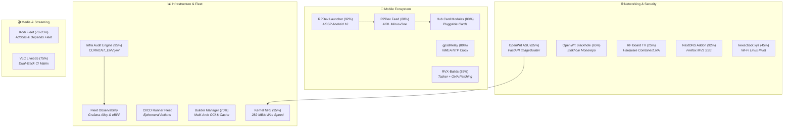

# 🛠️ RPDev Ecosystem Projects Documentation

> **Detailed operational documentation, deployment playbooks, and engineering manuals for all software and infrastructure projects built across the RPDevs ecosystem.**

> [!important] **Ecosystem Maturity & Lifecycle Registry**
> All 26 active projects have been empirically evaluated and assigned completion ratings from **10% to 99%**. Explore the full comparative dashboard in the **[[projects/maturity-matrix|RPDev Ecosystem Project Maturity & Lifecycle Matrix]]** or track live milestones on the **[GitHub Projects v2 Board](https://github.com/orgs/RPDevs-Builds/projects/1)**.

---

## 🧭 Projects Knowledge Catalog

### 📱 Android & Mobile Systems
- **[[projects/Android/rpdev-launcher/index|RPDev Launcher User & Architecture Manual]]** `92% [Production]` — *AOSP Android 16 home screen, DataStore state flows, recursive folder cycle guards.*
- **[[projects/Android/rpdev-feed/index|RPDev Feed Companion Manual]]** `88% [Production]` — *Sovereign -1 screen, AIDL overlay server, on-device RSS parsing, Room database.*
- **[[projects/Android/rpdev-feed-modules/index|Hub Card Modules Ecosystem]]** `80% [Operational]` — *Technical guides and JSON schemas for all pluggable card modules.*
- **[[projects/Android/gpsd-relay|gpsdRelay: Stratum-1 NMEA GPS Telemetry]]** `80% [Operational]` — *Transforms Android GNSS hardware into network-accessible reference clocks.*
- **[[projects/Android/rvx-builds|RVX-Builds Mobile-Cloud Pipeline]]** `85% [Operational]` — *Zero-touch Tasker, Join API, and GitHub Actions automated binary compilation and silent ADB Wi-Fi installs.*
- **[[projects/mobile-stack|Mobile Stack Unified Architecture]]** — *End-to-end specification connecting launcher, feed overlay, and edge CDN.*

### 🛡️ Security & AI Research Hub
- **[[projects/Security/dns-forge-firefox-addon|DNS Forge NextDNS Firefox Addon]]** `92% [Production Ready]` — *AMO-compliant MV3 extension with single delegated event listener and SSE log parser.*
- **[[projects/Security/mcp-gateway|MCP Security Gateway]]** `50% [Architectural Prototype]` — *Dockerized security proxy, token authentication, and tool execution boundaries for AI agents.*
- **[[projects/Security/cloudflare-mcp|Cloudflare MCP Integrations]]** `40-45% [Alpha]` — *Authenticated and anonymous tool interfaces for Cloudflare infrastructure.*
- **[[projects/Security/fido2-age|FIDO2 + Age Hardware Secrets]]** `95% [Production]` — *Physical security key derivation, PAM hardware authentication, and chezmoi integration.*
- **[[projects/Security/wazuh-crowdsec-siem|Wazuh + CrowdSec SIEM]]** — *Collaborative threat intelligence and host integrity monitoring.*
- **[[projects/Security/perimeter-deception-tarpits|Perimeter Deception & Tarpits]]** — *Endlessh-Go and Cowrie honeypots trapping malicious scanners.*

### 📊 Infrastructure & Observability
- **[[projects/Infrastructure/infra-audit-engine/index|Infra Audit Engine Manual]]** `95% [Production]` — *Multi-node hardware detection, SSH key verification, and CURRENT_ENV.yml compilation.*
- **[[projects/Infrastructure/builder-manager|Builder Manager & OCI Cache Fleet]]** `70% [Active Beta]` — *Tier 2-2.5 multi-architecture build orchestration and runner cache management.*
- **[[projects/Infrastructure/nodes|Hardware Nodes & Topology]]** — *Hardware specifications and role assignments for edge, llmadmin01, and t430.*
- **[[projects/Infrastructure/storage|Tiered Storage Architecture]]** — *ZFS, NVMe local SSD, and NFS SharedRoot tiering rules.*
- **[[projects/Infrastructure/coolify-paas|Coolify PaaS Integration]]** — *Production self-hosted application platform on bare metal.*
- **[[projects/Infrastructure/alloy-observability|Grafana Alloy Observability]]** — *eBPF container metrics and distributed logging.*

### 🌐 Networking & IoT
- **[[projects/Networking/openwrt-kernel-nfs|OpenWrt Kernel NFS Server (luci-app-nfs)]]** `95% [Production]` — *Full UCI LuCI integration, dual APKv3/OPKG packaging, and 282 MB/s wire speed.*
- **[[projects/Networking/openwrt-asu-builder|OpenWrt Attended Sysupgrade (ASU) Server]]** `85% [Operational]` — *Self-hosted FastAPI server with containerized ImageBuilders compiling firmware on demand.*
- **[[projects/Networking/openwrt-blackhole|OpenWrt Blackhole DNS Sinkhole Monorepo]]** `65% [Active Beta]` — *Sovereign network ad-blocking, high-performance Go sinkhole daemon, and LuCI frontend.*
- **[[projects/Networking/openwrt-fleet/index|OpenWrt Fleet Operations]]** — *Kernel NFS configuration, unattended sysupgrades, and UCI state normalization.*
- **[[projects/Networking/cloudflare-tunnels|Cloudflare Edge Tunnels]]** — *Zero-trust ingress routing and SSL termination for public endpoints.*
- **[[projects/Networking/rf-board-tv|RF Board TV Combiner & LNA]]** `25% [Hardware Prototype]` — *Custom UHF/VHF Wilkinson power divider, 5G notch filter, and QPL9547 LNA hardware design.*
- **[[projects/Networking/adsb-aviation-sdr|ADS-B Aviation SDR Telemetry]]** — *Demodulating 1090MHz flight telemetry with RTL-SDR.*

### 🎬 Streaming, Media & Tools
- **[[projects/Tools/kodi-ecosystem|Kodi Addon Monorepo & Multi-Platform Build Fleet]]** `85% [Production]` — *Automated crypto constant synchronization, Megacloud & FlareSolverr packaging, and depends build fleet.*
- **[[projects/Tools/vlc-live-555|VLC & Live555 Multi-Arch Build Engine]]** `75% [Operational]` — *Automated cross-compilation of Live555 streaming media and VLC Media Player with VA-API acceleration.*
- **[[projects/Tools/apk-build-patch|APK Build-Patch Suite]]** `70% [Active Beta]` — *Headless smali disassembly, bytecode patching, and keystore signing toolchain.*
- **[[projects/TheoryandEarlyDev/kexecboot/index|kexecboot.xyz Wireless Bootloader]]** `45% [Experimental Core]` — *Pre-OS WPA2/3 Wi-Fi authentication and direct memory kernel kexec pivot.*
- **[[projects/Tools/docingest/index|DocIngest Crawler Suite Overview]]** `55% [Active Beta]` — *High-throughput documentation crawler, markdown conversion, and MCP vector retrieval.*

### 📋 Enterprise Governance & Policies
- **[[projects/Governance/index|Enterprise Policy Standards & Charters]]** — *18 modernized IT and cybersecurity policies aligned to NIST CSF 2.0 and SOC 2.*

---

## 🔗 Quick Links
- **[[projects/maturity-matrix|RPDev Ecosystem Project Maturity & Lifecycle Matrix]]**
- **[[index|Master Wiki Home]]**
- **[iamrp.dev](https://iamrp.dev)**
