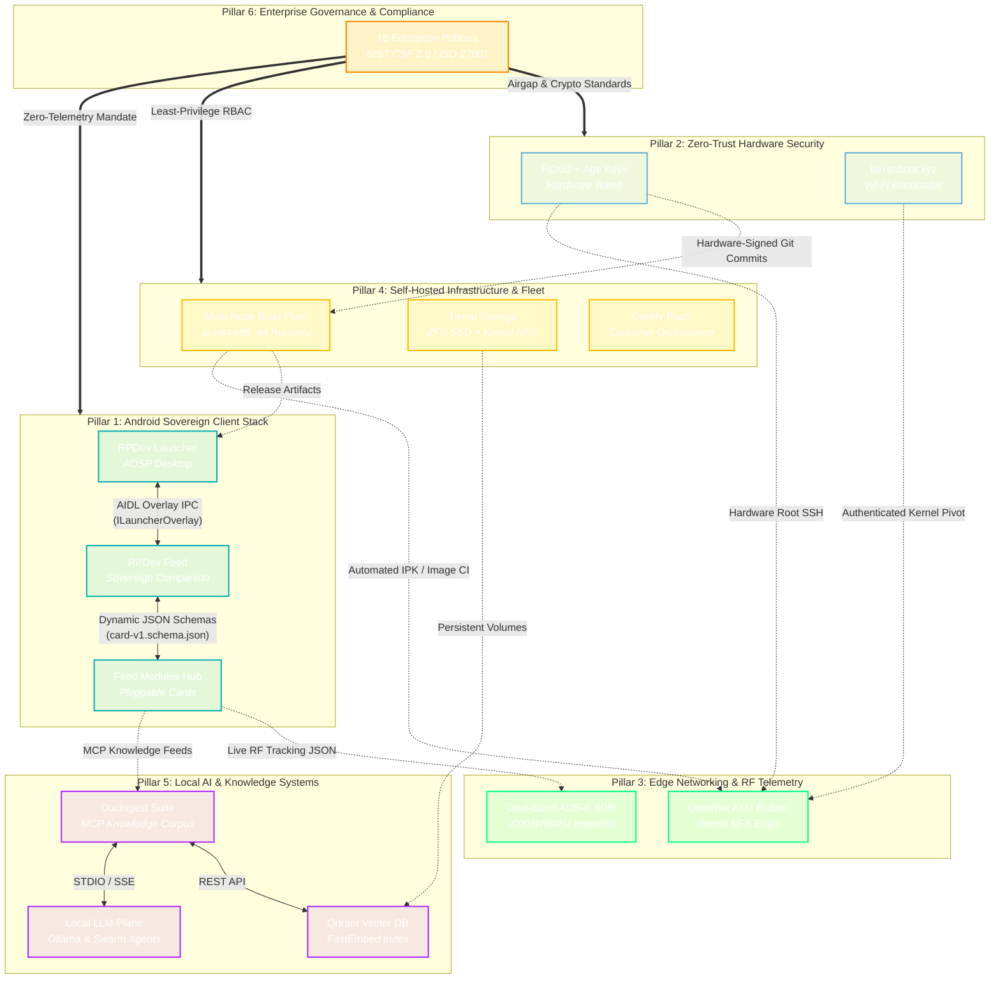

> [!note] Authoritative Systems Architecture Manual
> *This guide provides the complete architectural specification for the decentralized RPDev knowledge graph, protocol bindings, and semantic tag taxonomy. To explore the live, interactive graphic view and relational node matrix, visit the **[Central Interactive Graphic View at iamrp.dev/tags/](https://iamrp.dev/tags/)**.*

# 🕸️ Ecosystem Knowledge Graph, Tag Taxonomy & Interconnected Works
## **Decentralized Protocol Bindings, Architectural Topology & Semantic Classification**

Modern sovereign infrastructure requires more than individual decoupled repositories; it demands an integrated, transparent, and deterministic mesh where mobile clients, edge routers, cryptographic keys, distributed build runners, and localized AI models interoperate seamlessly.

The RPDev ecosystem achieves this cohesion through two complementary mechanisms:
1. **Deterministic Protocol Bindings**: Rigid, typed interfaces (Android AIDL, JSON Schema validation, Model Context Protocol, and OCI image registries) that govern data exchange between independent services.
2. **Unified Semantic Tag Ontology**: A 7-domain hierarchical taxonomy (indexing 128+ tags across 39+ repositories) that allows engineers, automated auditors, and local LLM agents to trace features, security controls, and hardware requirements across the entire stack.

---

## 🧭 Live Interactive Graphic View

The complete topological layout of all projects, repositories, and protocol bindings is rendered as an interactive, draggable network graph on the flagship portfolio:

  <h3 style="margin-top: 0; color: #00ff88;">🌐 Explore the Live Central Graphic View</h3>
  

    Pan, zoom, drag nodes, filter by architectural pillar, and inspect real-time protocol bindings connecting Android clients, hardware tokens, edge networks, and local AI swarms.
  

  <a href="https://iamrp.dev/tags/" target="_blank" rel="noopener" style="display: inline-block; background: #00afaf; color: #000; font-weight: 700; padding: 0.65rem 1.25rem; border-radius: 4px; text-decoration: none;">
    Launch Central Graphic View (iamrp.dev/tags/) ↗
  </a>

---

## 🏛️ The 6-Pillar Topological Architecture

---

## 🔌 Cross-Project Integration Protocols

The integration between repositories follows explicit, contract-first boundaries to prevent vendor lock-in, circular dependencies, and runtime failures:

### 1. Android AIDL IPC Interface (`iamrp.dev.feed.aidl`)
- **Producer / Consumer**: Bound between `RPDev Launcher` and `RPDev Feed`.
- **Mechanism**: Linux binder transaction passing window tokens, touch coordinates, and scroll percentages with zero Java reflection.
- **Specification**: Defined in detail at **[[developers/aidl-overlay-protocol|AIDL Overlay Protocol]]**.

### 2. Dynamic JSON Card Schemas (`card-v1.schema.json`)
- **Producer / Consumer**: Hosted on `cdn.iamrp.dev/schemas/card-v1.schema.json`, consumed by `RPDev Feed Modules` and validated via JSON Schema Draft-07.
- **Mechanism**: Decouples UI card rendering from the underlying feed service. Any card module (weather, Docker health, ADS-B radar) can emit standard JSON without requiring a launcher app update.

### 3. Model Context Protocol (MCP) Tools
- **Producer / Consumer**: `DocIngest` and `qdrant-security-agent` act as MCP servers; local LLM agents (Claude Code, Google Antigravity, Ollama Swarms) act as clients.
- **Mechanism**: Exposes deterministic tools (`find-docs`, `read-docs`, `query-docs`) over JSON-RPC (STDIO and SSE) to query offline markdown corpora without sending data to third-party clouds.

### 4. Open Container Initiative (OCI) & Buildroot Fleet
- **Producer / Consumer**: `builder-manager` builds multi-arch container images and OpenWrt IPK packages across `t430`, `llmadmin01`, and `edge`.
- **Mechanism**: Ephemeral GitHub Actions runner containers mounted with shared ccache and Docker daemon sockets, pushing artifacts directly to `repo.iamrp.dev` and `cdn.iamrp.dev`.

---

## 🏷️ The 7-Domain Semantic Tag Taxonomy

To maintain taxonomy coherence across all documentation sites (`iamrp.dev`, `wiki.iamrp.dev`, and `blog.iamrp.dev`), all frontmatter tags adhere to strict classification guidelines:

| Domain | Tag Prefix / Slug Examples | Purpose & Scope | Target Systems |
| :--- | :--- | :--- | :--- |
| **🛡️ Zero-Trust Security** | `#security`, `#zerotrust`, `#fido2`, `#age`, `#cryptography`, `#pgp`, `#crowdsec`, `#siem` | Hardware-backed secrets, public-key infrastructure, intrusion detection, and endpoint hardening. | Security Keys, Chezmoi, Wazuh, Linux Kernel. |
| **📱 Mobile & AOSP** | `#android`, `#launcher`, `#aosp`, `#compose`, `#kotlin`, `#aidl`, `#modules`, `#plugins` | Native mobile client architecture, AIDL IPC bridges, Jetpack Compose UI, and AOSP build variants. | RPDev Launcher, RPDev Feed, Modules Hub. |
| **🌐 Edge & RF Telemetry** | `#networking`, `#openwrt`, `#sdr`, `#rf`, `#aviation`, `#telemetry`, `#nextdns`, `#nfs` | Wireless spectrum analysis, custom OpenWrt firmware, DNS sinkholing, and SDR radio ingestion. | OpenWrt Edge, RTL-SDR, ADS-B Pipeline. |
| **🏗️ Infrastructure & CI/CD** | `#infrastructure`, `#cicd`, `#docker`, `#githubactions`, `#automation`, `#alloy`, `#storage` | Multi-arch compilation runners, automated container pipelines, telemetry collectors, and storage. | Self-Hosted Fleet, Builder Manager, Coolify. |
| **🧠 Local AI & MCP** | `#ai`, `#llms`, `#mcp`, `#docingest`, `#qdrant`, `#python`, `#computervision` | Model Context Protocol servers, local vector search, agent swarms, and private LLM inference. | DocIngest, Ollama, Qdrant Vector Engine. |
| **🔬 Baremetal & Firmware** | `#baremetal`, `#bootloaders`, `#kernel`, `#buildroot`, `#embedded`, `#iot`, `#netboot` | Low-level C/Go bootloaders, custom Linux kernels, embedded camera firmware, and hardware diagnostics. | kexecboot.xyz, Ventoy Tool, Camera IP. |
| **📋 Enterprise Governance** | `#governance`, `#policy`, `#nist`, `#iso27001`, `#soc2`, `#risk-management`, `#modernized-2026` | Formal institutional policies, change management frameworks, incident response runbooks, and audit trails. | 18 Security Policies, SDLC, Compliance. |

### Tagging Rules for Contributors
1. **Lowercase Only**: Always format tags in lowercase (`#openwrt`, not `#OpenWrt`).
2. **Kebab-Case Multiword**: Use hyphens for multiword terms (`#zero-trust`, `#risk-management`).
3. **No Redundant Aliasing**: Never add an alias matching the canonical slug of a note in frontmatter.
4. **Pillar Anchoring**: Every project note should include at least one primary pillar tag and 2–4 domain-specific technology tags.

---

## 📊 Complete Interconnected Works Registry

The following matrix documents the relationship between repositories, interfaces, and primary tags:

| Repository / Project | Architectural Role | Primary Tags | Key Interfaces & Protocols | Connected Systems |
| :--- | :--- | :--- | :--- | :--- |
| **`RPDev-Launcher`** | Sovereign Desktop Orchestrator | `#android`, `#launcher`, `#aosp` | AIDL `ILauncherOverlay` | `RPDev-Feed`, `RPDev-Feed-Modules` |
| **`RPDev-Feed`** | Minus-One Screen Companion | `#android`, `#compose`, `#aidl` | AIDL Callback, JSON Card Spec | `RPDev-Launcher`, `RPDev-Feed-Modules` |
| **`RPDev-Feed-Modules`** | Pluggable Card Hub | `#modules`, `#plugins`, `#cdn` | `card-v1.schema.json`, REST | `RPDev-Feed`, `DocIngest`, `ADS-B SDR` |
| **`FIDO2-Security-Toolkit`** | Hardware Secret Management | `#fido2`, `#age`, `#security` | `age-plugin-fido2prf` | OpenWrt, CI/CD Fleet, Chezmoi |
| **`kexecboot.xyz`** | Wi-Fi Baremetal Bootloader | `#baremetal`, `#kernel`, `#golang` | HTTPS Kernel Ingestion, kexec | `repo.iamrp.dev`, OpenWrt |
| **`openwrt-asu-builder`** | Attended Sysupgrade Image CI | `#openwrt`, `#buildroot`, `#nfs` | ASU REST API, Kernel NFS | OpenWrt Edge, NextDNS, Fleet |
| **`adsb-aviation-sdr`** | Dual-Band RF Flight Telemetry | `#sdr`, `#rf`, `#aviation` | RTL-SDR TCP, OpenTelemetry | `RPDev-Feed-Modules`, Alloy, Grafana |
| **`self-hosted-build-fleet`** | Multi-Arch Compilation Fleet | `#infrastructure`, `#cicd`, `#docker` | GitHub Actions Runner Protocol | All 39+ Repositories, OCI Registry |
| **`builder-manager`** | OCI Cache & Pipeline Engine | `#docker`, `#githubactions`, `#automation` | BuildKit, OCI Registry API | Build Fleet, OpenWrt ASU, Docker |
| **`docingest`** | Documentation Crawler & MCP | `#docingest`, `#mcp`, `#qdrant` | Model Context Protocol (STDIO/SSE) | `RPDev-Feed-Modules`, Qdrant, LLMs |
| **`18 Enterprise Policies`** | Cybersecurity Governance Suite | `#governance`, `#policy`, `#nist` | NIST CSF 2.0 / ISO 27001 Controls | All Operational Infrastructure |

---

## 🔗 Related Resources & Portals

- 🌐 **[Central Interactive Graphic View (iamrp.dev/tags/)](https://iamrp.dev/tags/)**: Visual interactive topology with real-time node dragging and filtering.
- 📊 **[[projects/maturity-matrix|Project Maturity & Lifecycle Matrix]]**: Empirical scoring (10% to 99%) across all fleet repositories.
- 📱 **[[projects/mobile-stack|RPDev Mobile Stack Technical Brief]]**: Deep architectural analysis of the decoupled AOSP client ecosystem.
- 🛠️ **[[developers/aidl-overlay-protocol|AIDL Overlay Protocol Specification]]**: Technical reference for client binder interfaces.
- 📦 **[Master Repository Hub (repo.iamrp.dev)](https://repo.iamrp.dev)**: Download custom packages, APKs, IPKs, and extensions.
