> [!note] Authoritative Project Lifecycle Registry
> *This document establishes the empirical maturity percentages and lifecycle status for all active repositories in the **`RPDevs-Builds`** organization. For high-level architecture narratives, consult the **[[projects/index|Projects Documentation Hub]]**.*

> [!tip] **Live GitHub Project Board**
> Track real-time sprint progress, backlog status, and milestone delivery on the official GitHub Organization Project Board: **[RPDev Ecosystem Fleet & Roadmap Tracker (Projects v2)](https://github.com/orgs/RPDevs-Builds/projects/1)**.

# 📊 RPDev Ecosystem Project Maturity & Lifecycle Matrix

Every engineering initiative within the RPDevs ecosystem undergoes rigorous lifecycle evaluation. Projects are not classified merely as "done" or "abandoned"; rather, each repository is scored on an **evidence-based completion scale from 10% to 99%** based on architectural completeness, production deployment, CI/CD pipeline health, and test coverage.

```mermaid
graph LR
    subgraph T1["Tier 1: Prototype (10–29%)"]
        RF["rf-board-tv (25%)<br><i>Hardware Schematics</i>"]
    end
    subgraph T2["Tier 2: Alpha (30–49%)"]
        CF["Cloudflare MCPs (40-45%)<br><i>Tool Interfaces</i>"]
        Kexec["kexecboot.xyz (45%)<br><i>Bare-Metal Bootloader</i>"]
    end
    subgraph T3["Tier 3: Beta (50–74%)"]
        MCPG["mcp_gateway (50%)<br><i>Agent Security Proxy</i>"]
        DocIng["docingest-quartz (55%)<br><i>Doc Rendering Engine</i>"]
        RNFS["runnernfs (60%)<br><i>Mount Automation</i>"]
        Blackhole["openwrt-blackhole (65%)<br><i>Sinkhole Monorepo</i>"]
        Images["openwrt-images (65%)<br><i>Custom Firmware CI</i>"]
        APK["APK_Build-Patch (70%)<br><i>Smali Toolchain</i>"]
        BuildMgr["builder-manager (70%)<br><i>OCI Build/Cache Fleet</i>"]
        ISB["inputstream-builders (70%)<br><i>Binary Addon Fleet</i>"]
        KBuild["kodi-build (70%)<br><i>Depends Cross-Compiler</i>"]
    end
    subgraph T4["Tier 4: Operational (75–89%)"]
        VLC["vlc-live-555 (75%)<br><i>Dual-Track CI/CD Matrix</i>"]
        GPSD["gpsdRelay (80%)<br><i>Mobile GPS/NTP Daemon</i>"]
        Ops["ops-manager (80%)<br><i>Cluster Cockpit & Audit</i>"]
        ASU["openwrt-asu (85%)<br><i>FastAPI Sysupgrade Engine</i>"]
        KAddons["kodi-addons (85%)<br><i>Addon Monorepo</i>"]
        RVX["rvx-builds (85%)<br><i>Tasker + GHA Patching</i>"]
    end
    subgraph T5["Tier 5: Production (90–99%)"]
        NextDNS["nextdns-firefox-addon (92%)<br><i>Privacy Browser Extension</i>"]
        NFS["luci-app-nfs (95%)<br><i>Kernel NFS Package</i>"]
        Audit["infra-audit-engine (95%)<br><i>FIDO2 Topology Auditor</i>"]
        WebPages["rpdevs-builds.github.io (95%)<br><i>Static Pages Redirect</i>"]
        FeedMod["RPDev-Feed-Modules (95%)<br><i>Card Plugins Catalog</i>"]
        Launcher["RPDev-Launcher (98%)<br><i>Android 16 Home Screen GA</i>"]
        Feed["RPDev-Feed (98%)<br><i>AIDL Minus-One Overlay GA</i>"]
    end

    T1 --> T2 --> T3 --> T4 --> T5
```

---

## 1. The 5-Tier Maturity Framework

| Tier | Maturity Range | Lifecycle Stage | Definition & Architectural Gates |
| :--- | :---: | :--- | :--- |
| **Tier 1** | **10% – 29%** | **Hardware / Concept Prototype** | Schematics, PCB layouts, initial architectural specifications, or initial repo scaffolding without full automated test coverage. |
| **Tier 2** | **30% – 49%** | **Alpha / Experimental Core** | Functional proof-of-concept, experimental drivers/APIs, initial CLI or TUI, active upstream protocol research. |
| **Tier 3** | **50% – 74%** | **Beta / Active Development** | Functional core engine, passing unit tests, working container/build matrix, ongoing integration and edge case hardening. |
| **Tier 4** | **75% – 89%** | **Operational / Utility-Grade** | High reliability, deployed in daily personal or cluster operations, active telemetry/logging, stable APIs. |
| **Tier 5** | **90% – 99%** | **Production-Hardened** | Automated CI/CD, cryptographic signing, multi-architecture verification, zero known deadlocks, comprehensive documentation. |

---

## 2. Master Fleet Maturity Inventory (26 Qualifying Projects)

The following table provides the comprehensive audit of all active, qualifying projects across the **RPDevs-Builds** organization:

| # | Project / Repository | Category | Maturity | Lifecycle Stage | Active Core Components | Outstanding Gaps to 100% |
|---|---|---|:---:|---|---|---|
| 1 | **[[projects/Android/rpdev-launcher/index|RPDev-Launcher]]** | Mobile | **98%** | Production-Hardened GA | AOSP Android 16 SDK 37, DataStore flows, folder cycle guards, DeX bridge, AB-BA deadlock eliminated, GC listener retention, R8 shrinker | F-Droid inclusion metadata & tablet layout polish |
| 2 | **[[projects/Android/rpdev-feed/index|RPDev-Feed]]** | Mobile | **98%** | Production-Hardened GA | AIDL overlay server, on-device RSS, Room DB, SSRF private IP blocking, Rome XXE protection, 2MB stream limit, OverlayView lifecycle cleanup, R8 ProGuard | Horizontal foldable tablet dual-pane feed polish |
| 3 | **[[projects/Networking/openwrt-kernel-nfs|luci-app-nfs]]** | Networking | **95%** | Production Package | UCI schema, LuCI controllers, dual APKv3/OPKG, 282 MB/s MT6000 wire speed | Upstream OpenWrt community package feed submission |
| 4 | **[[projects/Infrastructure/infra-audit-engine/index|infra-audit-engine]]** | Infrastructure | **95%** | Production Fleet Core | FIDO2 hardware decryption, multi-host SSH probing, `CURRENT_ENV.yml` drift generator | Webhook alert dispatch on uncommitted config drift |
| 5 | **`rpdevs-builds.github.io`** | Web / CDN | **95%** | Production Landing | Automated hourly sync workflow, clean `ubuntu-latest` execution, canonical zip redirect | Search index for hosted zip artifacts |
| 6 | **[[projects/Android/rpdev-feed-modules/index|RPDev-Feed-Modules]]** | Mobile | **95%** | Production-Hardened GA | Modular Hub Card plugins (sensors, weather, telemetry), 2MB stream bounds, JSON schemas, live on `launcher.repo.iamrp.dev` | In-app dynamic APK module signing verification |
| 7 | **[[projects/Security/dns-forge-firefox-addon|nextdns-firefox-addon]]** | Security | **92%** | Release-Ready Extension | AMO-compliant MV3, single delegated event listener, SSE log streaming, Jest test suite | Official AMO store publication |
| 8 | **[[projects/Networking/openwrt-asu-builder|openwrt-asu]]** | Networking | **85%** | Operational Control Plane | FastAPI REST API, RQ worker queue, Docker ImageBuilders, live on `llmadmin01:8000` | Cloudflare Zero Trust tunnel ingress routing |
| 9 | **[[projects/Tools/kodi-ecosystem|kodi-addons]]** | Streaming | **85%** | Production Monorepo | Monorepo packaging Megacloud & FlareSolverr, automated XML repo generator, key sync | Fix `working-directory` path drift in build workflows |
| 10 | **[[projects/Android/rvx-builds|rvx-builds]]** | Mobile | **85%** | Operational Utility | Tasker native GUI, Join webhook push, GHA workflow dispatch, silent ADB Wi-Fi install | Automated upstream CLI patch version checks |
| 11 | **[[projects/Android/gpsd-relay|gpsdRelay]]** | Mobile | **80%** | Functional Mobile Utility | F-Droid package, raw GNSS sentence capture, synthetic NMEA generator, TCP/UDP sockets | Aggressive OEM Doze mode keep-alive tuning |
| 12 | **`ops-manager`** | Operations | **80%** | Operational Hub | Cluster housekeeping scripts, license audits, telemetry checks, `ubuntu-latest` CI | Unified CLI wrapper and central logging dashboard |
| 13 | **[[projects/Tools/vlc-live-555|vlc-live-555]]** | Streaming | **75%** | Automated Matrix Engine | Dual-track CI/CD matrix compiling Live555 static libs and VLC with Linux VA-API | macOS cross-compilation pipeline stability |
| 14 | **`inputstream-builders`** | Streaming | **70%** | Modular Monorepo | Monorepo consolidating `inputstream.adaptive` and `inputstream.ffmpegdirect` builds | Runner group targeting for hosted vs self-hosted |
| 15 | **[[projects/Tools/kodi-ecosystem|kodi-build]]** | Streaming | **70%** | Matrix Build Fleet | Multi-platform Kodi depends compiler for macOS, Windows MinGW, Linux, Android | Composite action checkout sequence deadlock fix |
| 16 | **[[projects/Infrastructure/builder-manager|builder-manager]]** | Infrastructure | **70%** | Build & Cache Engine | OCI container build scripts, dependency registry, multi-tier runner caching logic | Resilient fallback for `/mnt/sharedroot` runner mounts |
| 17 | **[[projects/Tools/apk-build-patch|APK_Build-Patch]]** | Mobile / Tools | **70%** | Headless CLI Toolchain | Apktool disassembly, smali AST patching, zipalign 4-byte alignment, apksigner v2/v3 | Automated multi-APK regression test harness |
| 18 | **[[projects/Networking/openwrt-blackhole|openwrt-blackhole]]** | Networking | **65%** | Monorepo Integration | Monorepo uniting Go daemon, LuCI frontend, and OPKG package feed | nftables tproxy kernel integration & LuCI JS view |
| 19 | **`openwrt-images`** | Networking | **65%** | Cloud Build Pipeline | Automated GHA workflow compiling MT6000 images and publishing firmware tarballs | Replace `wget` with `curl` & update to ASU v1 API |
| 20 | **`runnernfs`** | Infrastructure | **60%** | Internal Utility | Automated bash provisioning for remote NFS mounts across CI/CD runner nodes | Systemd automount unit generation with monitoring |
| 21 | **[[projects/Tools/docingest/index|docingest-quartz]]** | Tools | **55%** | UI Migration | Node.js / Quartz documentation rendering portal for crawled DocIngest corpora | Quartz 5.0 TypeScript build configuration fix |
| 22 | **[[projects/Security/mcp-gateway|mcp_gateway]]** | Security / AI | **50%** | Architectural Prototype | Docker Compose stack, reverse proxy config, token authentication scheme | Dynamic tool routing and rate-limiting middleware |
| 23 | **[[projects/TheoryandEarlyDev/kexecboot/index|kexecboot.xyz]]** | Bootloaders | **45%** | Experimental Bootloader | Buildroot external tree, Go TUI, direct memory `kexec_load()` pivot, netboot sync | Broad Wi-Fi vendor firmware blob packaging |
| 24 | **[[projects/Security/cloudflare-mcp|authless-cloudflare-mcp]]** | Security / AI | **45%** | Alpha Integration | Node.js MCP server providing anonymous/read-only Cloudflare API tool interfaces | Tool schema expansion & error boundaries |
| 25 | **[[projects/Security/cloudflare-mcp|auth-cloudflare-mcp]]** | Security / AI | **40%** | Alpha Integration | TypeScript MCP server with Cloudflare API token auth and account management tools | Automated tests & zone DNS mutation safety guards |
| 26 | **[[projects/Networking/rf-board-tv|rf-board-tv]]** | Hardware / RF | **25%** | Hardware Prototype | KiCad 8 schematics & PCB, Wilkinson combiner, 5G notch filter (~780MHz), QPL9547 LNA | Physical PCB fabrication, SMD soldering, VNA testing |

---

## 3. Excluded Repository Inventory (24 Excluded Projects)

Per ecosystem governance rules, archived repositories, upstream base forks with zero architectural deltas, and empty scaffolding repositories are excluded from primary documentation:

| Excluded Repository | Type | Rationale for Exclusion |
|---|---|---|
| **`blackhole-server`** | Archived Repo | Merged into the unified monorepo **`openwrt-blackhole`**. |
| **`luci-app-blackhole`** | Archived Repo | Merged into the unified monorepo **`openwrt-blackhole`**. |
| **`openwrt-blackhole-feed`** | Archived Repo | Merged into the unified monorepo **`openwrt-blackhole`**. |
| **`script.service.megacloud`** | Archived Repo | Standalone repository consolidated into active monorepo **`kodi-addons`**. |
| **`script.service.flaresolverr`**| Archived Repo | Standalone repository consolidated into active monorepo **`kodi-addons`**. |
| **`inputstream.adaptive-build`**| Archived Repo | Standalone builder consolidated into monorepo **`inputstream-builders`**. |
| **`inputstream.ffmpegdirect-build`**| Archived Repo| Standalone builder consolidated into monorepo **`inputstream-builders`**. |
| **`xbmc-build`** | Archived Repo | Deprecated builder replaced by **`kodi-build`** and **`builder-manager`**. |
| **`repo-plugins-build`** | Archived Repo | Consolidated into central Kodi build fleet. |
| **`repo-scrapers-build`** | Archived Repo | Consolidated into central Kodi build fleet. |
| **`repo-scripts-build`** | Archived Repo | Consolidated into central Kodi build fleet. |
| **`otaku-client-kodi`** | Archived Repo | Historical client snapshot superseded by modern addon fleet. |
| **`repo`** | Archived Repo | Legacy index superseded by **`kodi-addons`** automated generation. |
| **`netboot_menu`** | Archived Repo | Legacy iPXE menu superseded by **`kexecboot.xyz`**. |
| **`chezmoi-fido2-bridge`** | Archived Repo | Standalone script archived after consolidation into the master dotfiles system. |
| **`demo-repository`** | Archived Repo | Internal sandbox repository. |
| **`github-actions-repo`** | Archived Repo | Historical workflow template repository. |
| **`Builds-Archive`** | Archived Repo | Read-only static archive container for deprecated repositories. |
| **`Neo-Launcher`** | Upstream Fork | Upstream reference fork; active custom development is tracked in **`RPDev-Launcher`**. |
| **`coolify`** | Upstream Fork | Upstream deployment fork with minimal/no custom architectural changes. |
| **`script.module.myaccounts`** | Upstream Fork | Unmodified dependency mirror fork. |
| **`RPDevs-Android-Tools`** | Empty Scaffolding | Placeholder repository with 0 commits and 0 files. |
| **`kodi-repo-builders`** | Empty Placeholder | Archived placeholder repository with 0 files. |
| **`.github`** | Org Meta Config | Organization-wide health files and issue templates. |

---

## 🧭 Navigation & Related Documentation
- Return to **[[projects/index|RPDev Ecosystem Projects Documentation Hub]]**
- Review cluster nodes in **[[projects/Infrastructure/nodes|Hardware Nodes & Topology]]**
- Review mobile platform architecture in **[[projects/mobile-stack|Mobile Stack Unified Architecture]]**
