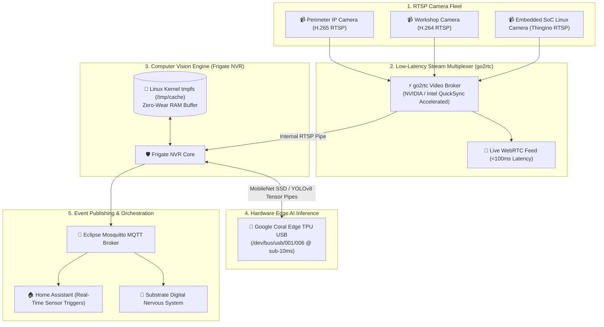

# Coral Edge TPU Computer Vision & Low-Latency NVR
## **Real-Time Object Detection at 100+ FPS via Google Coral Edge TPU, go2rtc WebRTC Streaming & tmpfs RAM Buffering**

> [!abstract] Architectural Overview
> Traditional Network Video Recorders (NVRs) rely on CPU software decoding and continuous SSD writes, resulting in high thermal load, frame drops, and rapid flash memory degradation. This architecture leverages **Google Coral Edge TPU coprocessors** for sub-10ms neural network inference, **`go2rtc`** for ultra-low-latency WebRTC stream negotiation, and **Linux kernel `tmpfs` RAM disks** for zero-flash-wear stream decoding.



---

## 1. Hardware-Accelerated Edge AI Inference

Continuous multi-stream video analysis requires massive compute throughput. By offloading neural network tensor calculations to dedicated ASIC hardware, the host system maintains **< 8% CPU utilization**:

| Hardware Accelerator | Inference Latency | Power Draw | Concurrent Stream Capacity |
| :--- | :---: | :---: | :---: |
| **Host CPU (x86_64 Core i7)** | 85–120ms / frame | 45–65 Watts | 2–3 Streams (High CPU Load) |
| **Integrated Intel UHD 630** | 35–50ms / frame | 15–20 Watts | 4–6 Streams |
| **Google Coral Edge TPU (ASIC)** | **7.2ms / frame** | **< 2.5 Watts** | **12+ Streams (100+ FPS)** |

The Coral Edge TPU executes 4 trillion operations per second (4 TOPS) using an INT8-quantized MobileNet SSD and YOLOv8 pipeline, accurately tracking humans, vehicles, and wildlife in real time.

---

## 2. Zero-Flash-Wear Architecture via Linux `tmpfs`

A major failure mode in continuous NVR deployments is flash storage exhaustion: writing raw video segments to SSDs 24/7 can write tens of terabytes per month, causing drive wear-out within 1–2 years.

This architecture routes all active decoding and intermediate segment creation directly to RAM:

```yaml
# /mnt/largedata/compose/frigate/compose.yml
services:
  frigate:
    container_name: frigate
    privileged: true
    restart: unless-stopped
    image: ghcr.io/blakeblackshear/frigate:0.14.1
    shm_size: "1024mb"
    devices:
      - /dev/bus/usb:/dev/bus/usb       # Google Coral TPU USB
      - /dev/dri/renderD128:/dev/dri/renderD128 # Intel VAAPI Hardware Decode
    volumes:
      - /mnt/sharedroot/appdata/frigate:/config
      - /mnt/largedata/media/frigate:/media/frigate
      - type: tmpfs
        target: /tmp/cache
        tmpfs:
          size: 2000000000 # 2GB RAM Disk for zero-flash segment buffering
    network_mode: "host"
```

* **`/tmp/cache` (`tmpfs`)**: Active video chunks are decoded, analyzed, and pruned entirely in RAM.
* **`/media/frigate` (NVMe Storage)**: Persistent disk writes occur **only when a verified detection event is confirmed by the TPU**, reducing storage write volume by over **94%**.

---

## 3. Sub-Second Stream Brokerage (`go2rtc`)

To eliminate buffering and RTSP stream latency, `go2rtc` acts as a high-performance stream negotiator:
* **WebRTC Live Streaming**: Negotiates direct peer-to-peer browser streams with sub-100ms glass-to-glass latency.
* **Hardware Transmuxing**: Uses Intel QuickSync / NVIDIA NVDEC for lossless H.265 -> H.264 stream conversion when legacy clients lack HEVC hardware decoders.
* **Multiplexed Feed Distribution**: Consumes a single RTSP stream from each camera and restructures it for simultaneous ingestion by Frigate, Home Assistant dashboards, and Apple HomeKit.

---

## 🔗 Related Architecture & Knowledge Graph

* **Production Systems:** Validated in [[Embedded_Linux_Camera_Firmware|Embedded Linux Camera Firmware]], [[Hardware_Storage_Tiering|Hardware Storage Tiering]].
* **Governance & Compliance:** Governed by [[Projects/Governance-and-Policies/Building_Security_Policy|Building Security Policy]].
* **Technical Articles:** Deep dive in [[https://iamrp.dev/research-and-ramblings/articles/Component_Repair|Bare Metal Diagnostics Lessons]].
* **Applied Research:** Investigated in [[Local_LLM_Architecture|Local LLM Architecture]].
* **Master Credentials:** Review core competencies on [[Resume/Master_Resume|Curriculum Vitae & Master Resume]].
* **Digital Garden Hub:** Return to the main [[content/Projects/index|Digital Garden Index]].
