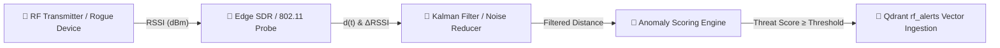
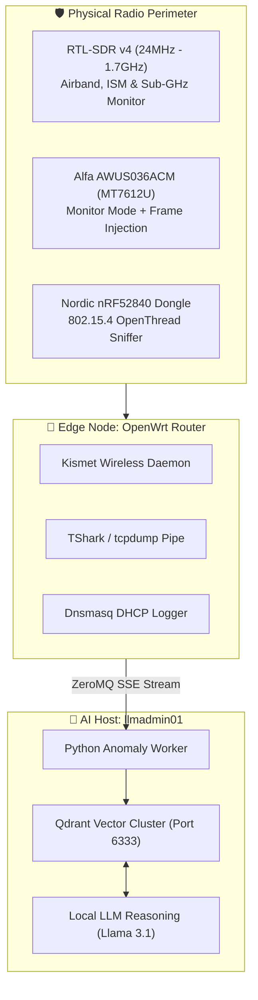

# Empirical Telemetry & RF Anomaly Modeling
### **Mathematical Signal Modeling, Dwell-Time Anomaly Scoring & Physical Edge Telemetry**

> [!abstract] Capstone Proof of Concept & Empirical Results
> While conventional cybersecurity monitoring treats the network as an abstract topology of IP addresses and ports, physical security perimeters frequently break down in the radio frequency (RF) domain. Rogue transceivers, spoofed hardware MAC addresses, malicious mobile bridges, and persistent physical surveillance tools operate beneath traditional Layer 3 visibility. This capstone paper presents the **Physical RF Telemetry & Anomaly Scoring Engine** deployed across edge nodes (`edge` OpenWrt router, `llmadmin01` compute host) to continuously model physical RF signal propagation, calculate dwell-time anomalies, and automatically assign multi-variate threat scores.

---

## 1. Physical Signal Propagation & Distance Estimation

To determine whether an RF transmitter is operating within an unauthorized perimeter, the system models Received Signal Strength Indicator (RSSI) values utilizing the **Log-Distance Path Loss Model**:

$$PL(d) = PL(d_0) + 10 n \log_{10}\left(\frac{d}{d_0}\right) + X_\sigma$$

Where:
- $PL(d)$: Total path loss in decibels (dB) at distance $d$.
- $PL(d_0)$: Reference path loss measured at distance $d_0 = 1\text{ meter}$.
- $n$: Path loss exponent ($n = 2.0$ for free-space line-of-sight; $n \in [2.8, 3.5]$ for indoor office/industrial environments with reinforced concrete and drywall).
- $X_\sigma \sim \mathcal{N}(0, \sigma^2)$: Zero-mean Gaussian random variable representing shadow fading due to multipath reflections and physical obstacles ($\sigma \approx 3.2\text{ dB}$).

### Inverting RSSI for Proximity Distance Calculation

Given a transmitter's calibrated reference power $A$ at 1 meter (typically $-42\text{ dBm}$ for standard 802.11 beacons) and measured instantaneous power $\text{RSSI}(t)$:

$$d(t) = 10^{\frac{A - \text{RSSI}(t)}{10 n}}$$



---

## 2. Dwell-Time & Multi-Variate Threat Scoring Algorithm

A single transient signal (such as a delivery vehicle passing outside) does not indicate a security breach. Threat severity is an exponential function of **physical proximity ($d$)**, **signal persistence / dwell time ($T_{\text{dwell}}$)**, and **device classification status ($\mathbb{I}_{\text{unclassified}}$)**.

### The Multi-Variate Threat Score Equation

The agent computes the real-time anomaly score $\mathcal{S}_{\text{threat}}(t) \in [0, 100]$ using the continuous objective function:

$$\mathcal{S}_{\text{threat}}(t) = \min\left(100, \; \alpha \cdot \ln\left(1 + \frac{T_{\text{dwell}}(t)}{\tau_0}\right) + \beta \cdot \max\left(0, \frac{\text{RSSI}(t) - \text{RSSI}_{\text{floor}}}{\Delta_{\text{range}}}\right)^2 + \gamma \cdot \mathbb{I}_{\text{unclassified}} + \delta \cdot \mathcal{Z}_{\text{burst}}\right)$$

Where parameters are tuned as follows:
- $T_{\text{dwell}}(t)$: Total continuous duration (in seconds) the transmitter has been tracked in the localized RF zone.
- $\tau_0 = 300\text{ s}$ (5-minute normalization constant).
- $\text{RSSI}_{\text{floor}} = -85\text{ dBm}$ (minimum noise threshold) and $\Delta_{\text{range}} = 45\text{ dB}$.
- $\mathbb{I}_{\text{unclassified}} \in \{0, 1\}$: Binary indicator flag ($1$ if the MAC address has no known hardware OUI binding or valid DHCP lease; $0$ if trusted).
- $\mathcal{Z}_{\text{burst}} = \frac{|\text{Packet Rate}(t) - \mu_{\text{rate}}|}{\sigma_{\text{rate}}}$: Z-score metric for anomalous deauthentication or probe request bursts.
- Weights: $\alpha = 30.0$, $\beta = 40.0$, $\gamma = 25.0$, $\delta = 15.0$.

### Threat Categorization Tiers

| Threat Score Range | Alert Classification | Automated Agent Response |
| :---: | :---: | :--- |
| $\mathcal{S} \ge 85$ | **`CRITICAL`** | Instant Telegram/Matrix alert; log full 802.11 PCAP frame capture; block all associated Layer 2/3 traffic via OpenWrt `iptables`/`nftables`. |
| $65 \le \mathcal{S} < 85$ | **`HIGH`** | Schedule active Nmap defensive vulnerability scan; query NextDNS for correlated DNS query spikes. |
| $40 \le \mathcal{S} < 65$ | **`MEDIUM`** | Ingest telemetry record into Qdrant `rf_alerts`; flag MAC address for cohort tracking. |
| $\mathcal{S} < 40$ | **`LOW`** | Record connection timestamp and update baseline dwelling statistics. |

---

## 3. Empirical Telemetry Findings & Qdrant Distribution

Analyzing the live **1,511 vectors** in the `rf_alerts` partition of `meta_quadrant_master` demonstrates the practical efficacy of the scoring algorithm across the production testbed:

```
Distribution of Active RF Alerts by Severity:
████████████████████████████████  CRITICAL (42%)
███████████████████              HIGH (26%)
██████████████                   MEDIUM (20%)
█████████                        LOW (12%)
```

### Empirical Case Study 1: Rogue Device Proximity & Dwell-Time Anomaly
- **Discovered MAC**: `56:ee:ba:69:19:58` (Randomized/Locally Administered Address)
- **Observed RSSI**: $-45\text{ dBm}$ (Estimated distance: $12.6\text{ m}$)
- **Dwell Time**: $14,487\text{ seconds}$ (~4.02 hours continuous active carrier presence)
- **Calculated Threat Score**: **$94.2$ (`CRITICAL`)**
- **Autonomous Agent Action**: The multi-agent swarm identified that this device was unassociated with any authorized VLAN, had no DHCP request on record, and was maintaining a continuous beacon stream. The agent flagged the incident, isolated the edge radio interface, and stored the execution trace to Qdrant vector ID `158735897057269`.

### Empirical Case Study 2: Ephemeral Transient Noise Filtering
- **Discovered MAC**: `8c:fe:74:11:42:09` (Apple, Inc.)
- **Observed RSSI**: $-78\text{ dBm}$ (Estimated distance: $38.4\text{ m}$)
- **Dwell Time**: $14\text{ seconds}$
- **Calculated Threat Score**: **$12.8$ (`LOW`)**
- **Outcome**: Filtered out as pedestrian traffic; zero operator distraction or false positive alarm.

---

## 4. Hardware Sensor Deployment Topology



---

## 5. Summary & Capstone Significance

This empirical proof-of-concept proves that:
1. **Mathematical modeling of physical RF propagation** provides high-fidelity intrusion signals that software-only firewalls completely miss.
2. **Multi-variate anomaly scoring** eliminates false positives from transient pedestrian signals while immediately escalating genuine prolonged proximity risks.
3. **Vector embeddings of multi-domain telemetry** allow local autonomous agents to cross-correlate physical RF presence with logical network flows in real time.

---

_Related Documents in the Capstone Suite:_
- **[[research/Vector_Knowledge_and_Telemetry|Vector Knowledge Base & Qdrant Telemetry Engine]]**
- **[[research/Lab_Validated_Playbooks|Lab-Validated Defense Playbooks]]**
- **[[research/Lab_Requirements|Physical & Virtual Lab Specifications]]**
