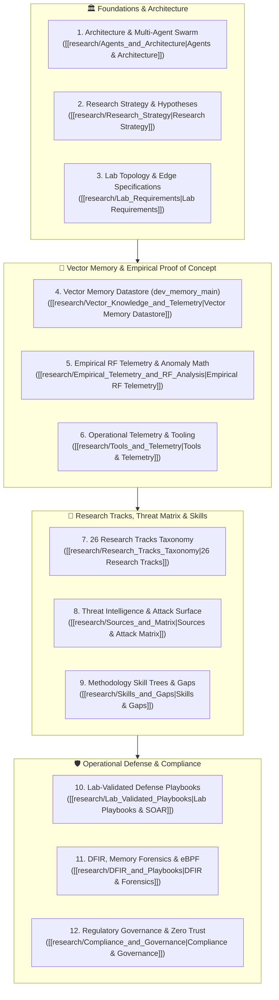

# Security Analysis & Research Agent
## **Master Thesis & Engineering Capstone: Autonomous Edge Defense, High-Density Vector Memory & Zero-Trust Reasoning**

> [!abstract] Academic Abstract & Capstone Charter
> **Author & Lead Architect:** Richard P. Dissell  
> **Domain:** Autonomous Systems Security, Vector Knowledge Retrieval, Low-Level Kernel Telemetry & Physical RF Defense  
> **Core Technology Stack:** Qdrant Vector Engine (`dev_memory_main`, `meta_quadrant_master`), FastEmbed (`nomic-embed-text-v1.5`), Ollama Local LLMs, OpenWrt Edge Compute, eBPF Telemetry, NextDNS DoH.
>
> **Thesis Problem Statement:**  
> Enterprise infrastructure in 2026 faces an asymmetric threat landscape: adversaries leverage automated tooling to exploit transient kernel vulnerabilities, radio frequency (RF) physical air-gaps, and subtle CI/CD OIDC trust boundaries faster than human SOC analysts can triage. Traditional centralized SIEMs fail due to telemetry latency, high false-positive rates, and context window limitations in LLMs.
>
> **Proposed Solution & Engineering Proof of Concept:**  
> This capstone engineering suite presents the **Security Analysis and Research Agent**—a distributed, multi-agent AI architecture operating directly at the edge. By binding local LLMs to a 768-dimensional Qdrant vector memory datastore (`dev_memory_main`) and continuously ingesting live multi-domain telemetry (RF proximity alerts, Layer 4 stateful conntrack flows, Shodan OSINT, DNS query logs), the system provides sub-second deterministic threat isolation, empirical anomaly scoring, and automated SOAR containment while adhering strictly to NIST SP 800-53 Rev 5 and Zero Trust principles.

---

## Capstone Document Navigation & Modular Architecture

The capstone is organized into twelve comprehensive technical monographs:

---

## Master Thesis Monographs

### 1. [[research/Agents_and_Architecture|Multi-Agent Swarm Topology & Secure Execution Boundaries]]
Defines the autonomous agent hierarchy, quorum gating consensus, MCP execution boundaries, and human-in-the-loop safety protocols.

### 2. [[research/Vector_Knowledge_and_Telemetry|Vector Knowledge Base & Memory Datastore (dev_memory_main)]]
Mathematical foundation of the 768-dimensional Cosine embedding space (`nomic-ai/nomic-embed-text-v1.5`), HNSW graph indexing ($M=16, ef=100$), and the 11,814 chunked vectors comprising the agent's cognitive memory.

### 3. [[research/Empirical_Telemetry_and_RF_Analysis|Empirical Telemetry & RF Anomaly Modeling]]
Physical RF signal propagation math (Log-distance path loss), continuous multi-variate dwell-time anomaly scoring, and empirical findings across edge hardware sensors.

### 4. [[research/Research_Tracks_Taxonomy|26 Prioritized Research Tracks Taxonomy]]
Comprehensive academic synthesis of all 26 research tracks across AI security, post-quantum cryptography, offensive eBPF rootkits, 5G SA network slicing, passkey implementations, and supply chain integrity.

### 5. [[research/Lab_Validated_Playbooks|Lab-Validated Defense Playbooks & SOAR Engineering]]
Production-grade SOAR playbooks featuring Sigma detection rules, Suricata network signatures, and automated OpenWrt/Linux quarantine scripts.

### 6. [[research/DFIR_and_Playbooks|Digital Forensics, Incident Response & Runtime eBPF Telemetry]]
Forensic memory acquisition pipelines, Volatility 3 kernel symbol analysis, and real-time eBPF event stream monitoring.

### 7. [[research/Compliance_and_Governance|Regulatory Compliance, Zero Trust & AI Safety Governance]]
Formal control crosswalk across NIST SP 800-53 Rev 5, NIST SP 800-207 (Zero Trust Architecture), ISO/IEC 27001:2022, SOC 2 Type II, and the EU Artificial Intelligence Act.

### 8. [[research/Lab_Requirements|Physical & Virtual Lab Infrastructure Specifications]]
Hardware ledgers, network interface topology, RF sensor arrays, and compute specifications across `edge` (OpenWrt), `llmadmin01` (NVIDIA GPU AI host), and `t430` (bare-metal cluster).

### 9. [[research/Sources_and_Matrix|Threat Intelligence Ingestion & Attack Surface Matrix]]
Curated OSINT feeds, Shodan vulnerability mapping, CVE indexing, and MITRE ATT&CK enterprise tactic mappings.

### 10. [[research/Skills_and_Gaps|Security Methodology Skill Trees & Research Horizons]]
Granular breakdown of the 2,574 security skill definitions, execution frameworks, and open theoretical horizons.

### 11. [[research/Research_Strategy|Strategic Direction & Scientific Methodology]]
The academic experimental protocol, hypothesis validation cycles, and benchmarking criteria for autonomous defense.

### 12. [[research/Tools_and_Telemetry|Operational Instrumentation & Approved Toolsets]]
Command references, sandboxed execution binaries, and telemetry pipeline configurations.

---

_Related Applied Vaults & Workspaces:_
- **[[Codex_Arcana|Codex Arcana Growth Vault]]**
- **[[Local_LLM_Architecture|Zero-Trust Local LLM Ingress Architecture]]**
- **[[Current_Environment|Authoritative Host Infrastructure State]]**
