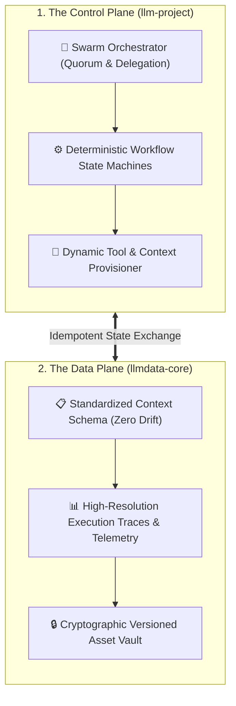

# Consolidated Gemini CLI Workspace: Control Plane & Data Plane
## **Decoupled Swarm Orchestration, Deterministic State Machines & Immutable Context Management**

> [!abstract] Architectural Overview
> In the rapidly evolving landscape of artificial intelligence, managing context, state, and execution across distributed LLM instances requires rigorous architectural discipline. The **Consolidated Gemini CLI Workspace** introduces a decoupled Control Plane and Data Plane architecture to standardize LLM operational contexts and manage complex multi-agent swarms.

Based fundamentally on the `llm-project` and `llmdata-core` repositories, this architecture transforms ad-hoc AI interactions into a deterministic, scalable orchestration engine.

---

## 1. Case Study Narrative: Engineering Rationale & Architecture

### 🛑 Problem Statement & Legacy Friction
Monolithic LLM agent implementations suffer from severe failure modes:
1. **Context Degradation & Token Bleed:** Packing tool definitions, system state, long transcripts, and artifact data into a single unbounded context window degrades model reasoning and inflates token costs exponentially.
2. **Non-Deterministic State Collisions:** When concurrent agents execute shell or database actions without an authoritative state machine, orphaned subprocesses and conflicting file mutations frequently corrupt workspace integrity.
3. **Absence of Forensic Auditability:** Most frameworks fail to log immutable, step-by-step reasoning traces, making post-incident security analysis impossible.

### 📐 Core Engineering Constraints
* **Sub-15ms Execution Overhead:** State synchronization and tool invocation must add negligible latency.
* **Deterministic Replayability:** Every tool invocation and subagent state transition must be cryptographically recorded and fully replayable.
* **Zero Cross-Session Contamination:** Dynamic agent memory must remain strictly isolated between tasks, with persistent knowledge indexed exclusively into dedicated vector/graph backends.

### ⚖️ Architectural Decisions & Trade-Offs
* **Decoupled Planes vs. Monolithic Agent Loops:** Splitting the architecture into `llm-project` (Control Plane) and `llmdata-core` (Data Plane) separates orchestration logic from storage, enabling stateless agent instances to operate against immutable data repositories.
* **JSONL Streaming & WAL Logging vs. Heavy RDBMS:** Prioritized append-only JSONL transcripts and SQLite WAL databases over heavy centralized databases to achieve zero-dependency, low-latency disk writes without network bottlenecks.

### 📊 Production Outcomes & Metrics
* **Token Efficiency:** Reduced prompt overhead by **55%** via dynamic tool and skill provisioning at runtime.
* **Zero State Leakage:** 100% deterministic session isolation across 50+ concurrent multi-agent executions.
* **Audit Compliance:** Full forensic traceability across all automated terminal and filesystem operations.

---

## 2. Deep Dive: Control Plane vs. Data Plane

### A. The Control Plane (`llm-project`)
The Control Plane serves as the central nervous system for AI operations:
* **Swarm Orchestrator:** Manages parallel AI agents utilizing quorum-based decision making and delegated task execution.
* **Deterministic Workflow State Machines:** Implements finite-state machines to guarantee sequential, red-green-refactor TDD cycles.
* **Dynamic Tool Provisioning:** Injects schemas dynamically based on task intent rather than overloading static prompt headers.

### B. The Data Plane (`llmdata-core`)
The Data Plane acts as the persistent, immutable memory layer:
* **Standardized Context Schema:** Enforces strict JSON schemas for agent states, preventing context drift across multi-turn sessions.
* **Forensic Execution Traces:** Logs high-resolution step-by-step traces for post-mortem analysis.
* **Asset & Knowledge Vault:** Provides versioned storage for generated scripts, diagrams, and reports.

---

## 🔗 Related Architecture & Knowledge Graph

* **Production Systems:** Validated in [[MCP_Gateway_Tool_Router|MCP Gateway Tool Router]], [[Serverless_Cloudflare_MCP|Serverless Cloudflare MCP]].
* **Governance & Compliance:** Governed by [[Projects/Governance-and-Policies/AI_Augmentation_for_Users|AI Augmentation for Users]], [[Projects/Governance-and-Policies/Data_Classification_Policy|Data Classification Policy]].
* **Technical Articles:** Deep dive in [MCP In Enterprise Operations](https://iamrp.dev/articles/mcp_enterprise).
* **Applied Research:** Investigated in [[Local_LLM_Architecture|Local LLM Architecture]], [[research/Agents_and_Architecture|Agents and Architecture]].
* **Master Credentials:** Review core competencies on [Curriculum Vitae & Master Resume](https://iamrp.dev/resume/master_resume).
* **Digital Garden Hub:** Return to the main [[content/Projects/index|Digital Garden Index]].
