> [!abstract] Architectural Challenge
> Local Large Language Models (LLMs) running on bare-metal hardware require access to internal knowledge bases and vector databases to be effective. However, exposing these sensitive internal services directly to external cloud-based AI agents (or even isolated local agents) presents a massive security risk. The challenge was to provide functional AI integration without compromising the internal network boundary.

This project outlines the architecture engineered to bridge external AI cloud services with internal, on-premise tools and databases using a strict Zero-Trust approach.

---

### ◈ The Solution: Cloudflare Workers & Secure SSE Tunnels

Rather than opening inbound ports or exposing internal APIs directly to the internet, I designed a decoupled ingress architecture.

#### 1. Cloudflare Workers as the Edge Proxy
All external AI agent requests are initially intercepted by a Cloudflare Worker at the absolute network edge.
- **Authentication & Validation:** The Worker performs rigorous OAuth token validation and payload inspection before the request ever reaches the physical infrastructure.
- **Rate Limiting:** Protects the internal hardware from being overwhelmed by runaway recursive agents.

#### 2. Model Context Protocol (MCP) Integration
Instead of building custom, brittle REST APIs for every internal tool, I standardized the integration using the **Model Context Protocol (MCP)**.
- Internal services, such as the `DocIngest` documentation engine and the `Qdrant` vector database, are wrapped in MCP servers.
- These servers provide a standardized interface for agents to query local knowledge without granting them raw database access.

#### 3. Secure Server-Sent Events (SSE) Tunnels
The connection between the Cloudflare Worker and the internal MCP servers is bridged using secure, outbound-only Server-Sent Events (SSE) tunnels.
- **No Inbound Open Ports:** The internal network initiates an outbound connection to the Cloudflare edge, establishing the tunnel.
- **Strict Identity-Bound Routing:** Traffic flowing through the tunnel is strictly routed to specific, localized MCP servers based on the validated identity from the Worker.

### ◈ Architectural Diagram

```mermaid
graph LR
    subgraph External
    A[Cloud AI Agents] -->|HTTPS Requests| B(Cloudflare Worker)
    end
    
    subgraph Internal Network Edge
    B <-->|Secure SSE Tunnel| C{Tunnel Client}
    end
    
    subgraph Local Zero-Trust Environment
    C -->|Validated MCP Payload| D[MCP Server: DocIngest]
    C -->|Validated MCP Payload| E[MCP Server: Qdrant]
    
    D --> F[(Local Markdown Corpus)]
    E --> G[(Vector Database)]
    end
    
    style A fill:#333,stroke:#666
    style B fill:#f9a826,stroke:#333,color:#000
    style C fill:#2b5c8f,stroke:#333
    style D fill:#2b5c8f,stroke:#333
    style E fill:#2b5c8f,stroke:#333
```

---

### ◈ Business Impact
This architecture successfully allowed the business to leverage cutting-edge AI capabilities for internal knowledge retrieval while adhering to strict information security and compliance policies. It completely eliminated the risk of a compromised AI agent pivoting into the broader corporate network.

---

## 🔗 Related Architecture & Knowledge Graph

* **Production Systems:** Validated in [[LLM_Control_Plane|LLM Control Plane]], [[MCP_Gateway_Tool_Router|MCP Gateway Tool Router]].
* **Governance & Compliance:** Governed by [[Projects/Governance-and-Policies/AI_Augmentation_for_Users|AI Augmentation for Users]], [[Projects/Governance-and-Policies/Data_Classification_Policy|Data Classification Policy]].
* **Technical Articles:** Deep dive in [[https://iamrp.dev/research-and-ramblings/articles/MCP_Enterprise|MCP In Enterprise Operations]], [[https://iamrp.dev/research-and-ramblings/articles/Zero_Trust_Edge|Zero Trust Edge Routing]].
* **Applied Research:** Investigated in [[research/Agents_and_Architecture|Agents and Architecture]].
* **Master Credentials:** Review core competencies on [[Resume/Master_Resume|Curriculum Vitae & Master Resume]].
* **Digital Garden Hub:** Return to the main [[content/Research-and-Ramblings/index|Digital Garden Index]].
