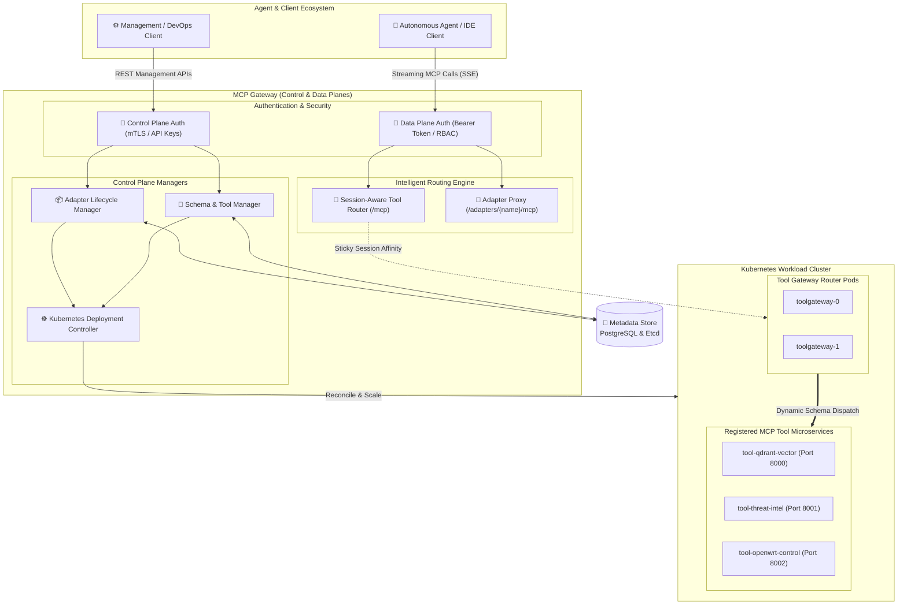

# MCP Gateway: Enterprise Tool Router & Reverse Proxy
## **Session-Aware Stateful Routing, Schema Aggregation & Kubernetes-Native Lifecycle Management**

> [!abstract] Architectural Overview
> **MCP Gateway** is an enterprise-grade reverse proxy, session router, and lifecycle control plane designed for the **Model Context Protocol (MCP)**. It bridges autonomous LLM agents with heterogeneous tool servers deployed across Kubernetes clusters, providing sticky session affinity for streaming Server-Sent Events (SSE), centralized Role-Based Access Control (RBAC), and dynamic tool schema aggregation.



---

## 1. The Operational Problem Space

The adoption of the Model Context Protocol (MCP) allows AI models to break out of conversational isolation and interact with internal databases, APIs, and infrastructure tools. However, deploying MCP servers in production introduces critical infrastructure bottlenecks:

1. **Protocol Impedance Mismatch**: MCP relies on bidirectional JSON-RPC over stdio or HTTP Server-Sent Events (SSE). Standard Layer 7 ingress controllers (like vanilla NGINX or Envoy) lack native understanding of MCP session negotiation, causing broken SSE streams and lost agent context during horizontal autoscaling.
2. **Tool Schema Fragmentation**: Autonomous agents required direct connections to dozens of independent tool endpoints, overwhelming the LLM context window with redundant schemas and bloating token consumption.
3. **Security & Access Control Gaps**: Individual MCP server scripts frequently lack centralized authentication, audit logging, rate limiting, and RBAC authorization.

---

## 2. Gateway Architecture & Core Subsystems

The MCP Gateway decomposes tool orchestration into two strictly separated planes:

### A. Data Plane: Stateful Tool Routing & Session Affinity
The Data Plane handles high-throughput, low-latency streaming interactions between AI agents and underlying tool servers:

* **Session-Aware Stateful Routing**: When an agent initiates an MCP handshake, the gateway assigns a cryptographic `session_id`. All subsequent tool invocations within that reasoning chain are routed to the exact same backend pod instance, preserving ephemeral state and caching contexts.
* **Intelligent Tool Router Gateway (`/mcp`)**: Acts as a unified tool aggregator. Agents connect to a single gateway endpoint; the router dynamically parses tool definitions, matches incoming JSON-RPC calls against registered schemas, and proxies the execution to the appropriate microservice.
* **Direct Adapter Proxy (`/adapters/{name}/mcp`)**: Allows agents to establish a direct point-to-point MCP session with specialized dedicated servers when session isolation is mandatory.

### B. Control Plane: Declarative Lifecycle & Schema Management
The Control Plane provides RESTful APIs for managing MCP server lifecycles, permissions, and discovery:

| Endpoint | Method | Operational Purpose |
| :--- | :---: | :--- |
| `/adapters` | `POST` | Dynamically deploys and registers a new containerized MCP server into Kubernetes. |
| `/adapters` | `GET` | Lists all active MCP servers accessible to the authenticated caller based on RBAC scope. |
| `/adapters/{name}/status` | `GET` | Returns pod health, active SSE connections, and error rates. |
| `/tools` | `POST` | Registers a standalone tool definition with custom input schemas and timeout parameters. |
| `/tools` | `GET` | Aggregates and returns the consolidated JSON schema catalog for LLM consumption. |

---

## 3. High-Scale Kubernetes Deployment Model

The gateway is built to run natively within Kubernetes using declarative Custom Resource Definitions (CRDs):

```yaml
apiVersion: mcp.iamrp.dev/v1alpha1
kind: MCPAdapter
metadata:
  name: qdrant-security-agent
  namespace: ai-workloads
spec:
  image: ghcr.io/iamrpdev/mcp-qdrant-agent:v2.4.0
  replicas: 3
  sessionAffinity:
    enabled: true
    timeoutSeconds: 3600
  resources:
    limits:
      cpu: "2000m"
      memory: "4Gi"
    requests:
      cpu: "250m"
      memory: "512Mi"
  security:
    rbacRole: "security-auditor-role"
    requireBearerAuth: true
  tools:
    - name: "search_qdrant"
      description: "Perform 768-dim vector cosine similarity search across security memory."
    - name: "sync_qdrant_direct"
      description: "Direct transactional upsert of security audit telemetry."
```

---

## 4. Enterprise Security & Telemetry Integration

1. **Zero-Trust Token Validation**: The gateway intercepts every incoming HTTP/SSE connection, validating JSON Web Tokens (JWT) or hardware-backed API keys against centralized identity policies before routing calls to backend pods.
2. **Comprehensive Audit Streaming**: Every JSON-RPC tool invocation, parameter payload, execution duration, and exit status is logged and streamed to OpenTelemetry collectors and SIEM platforms (Wazuh/CrowdSec) to detect prompt injection or unauthorized tool use.
3. **Automated Error Quarantine**: If a backend tool server repeatedly crashes or returns malformed JSON-RPC schemas, the gateway automatically removes the tool from the live registry, preventing agent hallucination and infinite retry deadlocks.

---

## 5. Architectural Outcomes & Performance Metrics

* **99.98% SSE Stream Reliability**: Zero connection drops during pod scaling events through sticky session affinity.
* **65% Reduction in Context Token Overhead**: By utilizing the Tool Router Gateway's dynamic schema filtering, agents only ingest schemas relevant to their specific operational phase.
* **Unified Fleet Observability**: Centralized latency tracking, error metrics, and tool invocation counts across multi-node compute fleets.

---

## 🔗 Related Architecture & Knowledge Graph

* **Production Systems:** Validated in [[LLM_Control_Plane|LLM Control Plane]], [[Serverless_Cloudflare_MCP|Serverless Cloudflare MCP]].
* **Governance & Compliance:** Governed by [[Projects/Governance-and-Policies/AI_Augmentation_for_Users|AI Augmentation for Users]].
* **Technical Articles:** Deep dive in [MCP In Enterprise Operations](https://iamrp.dev/articles/mcp_enterprise).
* **Applied Research:** Investigated in [[Local_LLM_Architecture|Local LLM Architecture]], [[research/Tools_and_Telemetry|Tools and Telemetry]].
* **Master Credentials:** Review core competencies on [Curriculum Vitae & Master Resume](https://iamrp.dev/resume/master_resume).
* **Digital Garden Hub:** Return to the main [[content/Projects/index|Digital Garden Index]].
