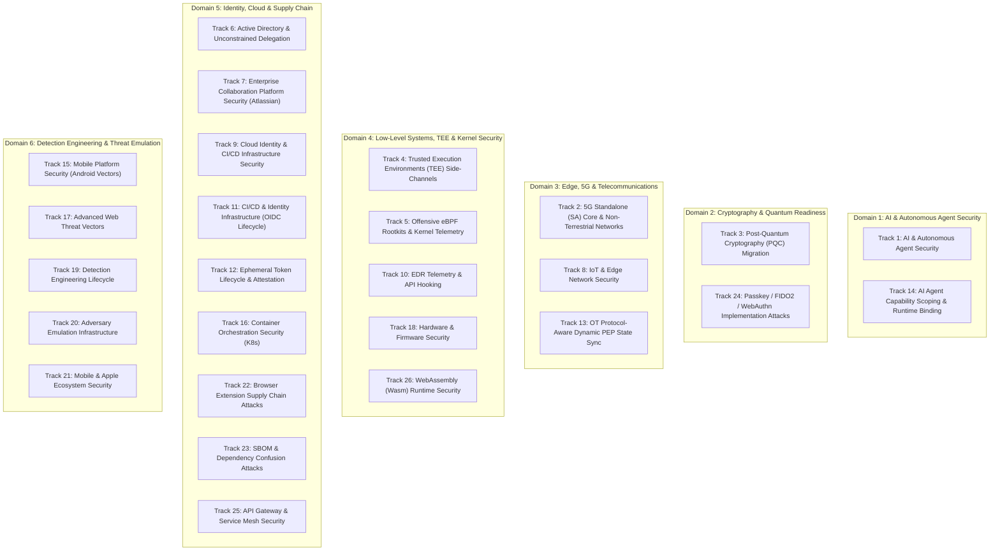

# 26 Prioritized Research Tracks Taxonomy
### **Academic Classification, Attack-Defense Mechanics & Theoretical Scope**

> [!abstract] Capstone Literature Review & Domain Taxonomy
> The research scope of the **Security Analysis and Research Agent** is organized into 26 distinct, prioritized research tracks mapped to NIST SP 800-53 Rev 5, MITRE ATT&CK, and Continuous Threat Exposure Management (CTEM). This taxonomy establishes the formal research boundary across six technical domains: Artificial Intelligence Security, Cryptographic Migration, Edge & Telecom, Kernel/Low-Level Systems, Cloud Identity & Supply Chain, and Detection Engineering.

---

## 1. Research Domain Overview Matrix

---

## 2. Complete 26-Track Master Catalog

| Track ID | Research Track Title | Classification Scope | Primary Attack Vector / Threat Model | Defensive Architecture & Countermeasures |
| :---: | :--- | :--- | :--- | :--- |
| **Track 1** | **AI & Autonomous Agent Security** | Emerging / High-Impact | Indirect prompt injection, sleeper memory poisoning, MCP tool-chain hijacking, jailbreak extraction. | Multi-agent quorum gating, cryptographic tool-use signing, schema validation, isolated runtime contexts. |
| **Track 2** | **5G SA Core & Non-Terrestrial Networks (NTN)** | Protocol Mechanics | UPF slice hopping, NRF discovery abuse for lateral transit, satellite feeder link eavesdropping. | Mutual TLS (mTLS) for all Service-Based Interfaces (SBI), rigorous UPF packet filtering, GTP-U tunnel validation. |
| **Track 3** | **Post-Quantum Cryptography (PQC) Migration** | Cryptographic Agility | Store-Now-Decrypt-Later (SNDL) adversary campaigns, RSA/ECC quantum factorization via Shor's algorithm. | Migration to NIST FIPS 203 (ML-KEM), FIPS 204 (ML-DSA), hybrid X25519+Kyber768 TLS 1.3 key exchange. |
| **Track 4** | **TEE Side-Channels (AMD SEV / ARM CCA)** | Hardware Microarchitecture | Transient execution attacks (Spectre/Meltdown derivatives), memory bus probing, TEE hypervisor escape. | Formal verification of Realm Management Monitors (RMM), hardware page encryption, memory bus scramblers. |
| **Track 5** | **Offensive eBPF Rootkits & Kernel Telemetry** | Kernel Space / Defensive | BPF program hijacking, `kprobe`/`tracepoint` stealth interception, kernel memory modification (BPFDoor/Symbiote). | Runtime verification of loaded BPF verifiers, mandatory signature enforcement for eBPF bytecodes, eBPF-aware EDR. |
| **Track 6** | **Active Directory & Unconstrained Delegation** | Enterprise Identity | PKINIT certificate persistence, shadow credentials, Kerberos unconstrained delegation (KB5014754 bypass). | Strong certificate binding enforcement, SID filtering, Protected Users security group placement. |
| **Track 7** | **Enterprise Collaboration Platform Security** | Application Security | Server-Side Template Injection (Velocity/OGNL), Atlassian Connect OAuth scope escalation, SSO token forging. | Context-aware output encoding, strict CSP headers, automated App permissions auditing. |
| **Track 8** | **IoT & Edge Network Security** | Embedded Physical | Unauthenticated firmware reflashing, JTAG/UART hardware bus tapping, Zigbee/Thread mesh routing subversion. | Secure Boot with cryptographic fuses, hardware root-of-trust (RoT), micro-segmented VLANs with strict dynamic ACLs. |
| **Track 9** | **Cloud Identity & CI/CD Infrastructure Security** | Cloud & DevOps | Ephemeral OIDC token interception in GitHub Actions, overly permissive IAM role assumptions. | Subject claim condition pinning (`repo:org/name:ref:refs/heads/main`), short-lived STS tokens (<15 min). |
| **Track 10** | **EDR Telemetry & API Hooking** | Endpoint Defense | Direct syscall invocation, AMSI memory patching in .NET 9+, ETW provider suppression. | Kernel-level eBPF instrumentation, hardware performance counters, hypervisor-enforced memory integrity. |
| **Track 11** | **CI/CD & Identity Infrastructure (OIDC Hardening)** | DevOps Hardening | Pipeline runner poisoning, malicious pull request workflow execution, secret exfiltration. | Ephemeral runner execution in sandboxed microVMs, mandatory branch protection rules, SLSA Level 3 compliance. |
| **Track 12** | **Ephemeral Token Lifecycle & Attestation** | Zero Trust Architecture | Replay of stolen JWT bearer tokens, clock skew manipulation in distributed microservices. | Cryptographically bound DPoP (Demonstrating Proof-of-Possession), short-lived mTLS sessions. |
| **Track 13** | **OT Protocol-Aware Dynamic PEP State Sync** | Industrial Control (ICS) | Modbus/DNP3 false command injection, physical actuator override without Layer 3 anomaly alerts. | Deep packet inspection (DPI) for industrial protocols, physical interlock controls, Policy Enforcement Point (PEP) sync. |
| **Track 14** | **AI Agent Capability Scoping & Runtime Binding** | Agent Governance | Autonomous agents executing state-modifying tools beyond authorization boundaries. | Strict capability-based security tokens (Object Capabilities), human-in-the-loop (HITL) approval gates. |
| **Track 15** | **Mobile Platform Security (Android Remote Vectors)** | Mobile Systems | Android Virtualization Framework (AVF) pVM escape, WebView JavaScript bridge exploitation in fintech apps. | Mandatory Knox/SELinux enforcement, sandboxed WebView isolates, runtime integrity attestation (Play Integrity API). |
| **Track 16** | **Container Orchestration Security (K8s)** | Cloud Native | Ephemeral container privilege abuse, ValidatingAdmissionPolicy (VAP) bypass, OCI manifest confusion. | Immutable root filesystems, distroless images, eBPF-based Falco runtime alerts, Pod Security Standards (Restricted). |
| **Track 17** | **Advanced Web Threat Vectors** | Application Defense | GraphQL batching denial of service, prototype pollution, HTTP/2 Rapid Reset and multiplexing starvation. | Strict GraphQL query complexity analysis, AST depth limiting, HTTP/2 stream concurrency governors. |
| **Track 18** | **Hardware & Firmware Security** | Bare Metal | UEFI shim/GRUB bypass chains, BMC/IPMI firmware implants, PCIe TLP and Thunderbolt DMA interception. | Intel Boot Guard / AMD Hardware Validated Boot, IOMMU DMA protection, isolated Out-of-Band (OOB) networks. |
| **Track 19** | **Detection Engineering Lifecycle** | Blue Team / SIEM | Adversary evasion of Sigma rules via command-line obfuscation, alert fatigue from noisy heuristics. | Automated Sigma-to-Elastic translation, MITRE ATT&CK continuous coverage mapping, synthetic attack validation. |
| **Track 20** | **Adversary Emulation Infrastructure** | Purple Team | Forensic detection of C2 beaconing signatures via JA3/JA4 TLS and JARM fingerprints. | Domain fronting, malleable C2 profile randomization, automated redirector rotation. |
| **Track 21** | **Mobile & Apple Ecosystem Security** | Mobile Systems | iOS Lockdown Mode bypasses, Transparency Consent and Control (TCC) DB tampering, AWDL proximity attacks. | Pointer Authentication (PAC), Memory Tagging Extension (MTE), strict sandbox profiles, iMessage PQ3 verification. |
| **Track 22** | **Browser Extension Supply Chain Attacks** | Browser Security | Manifest V3 background service worker persistence, Chrome Web Store automated review evasion. | Content Security Policy (CSP) restriction, DOM isolation, enterprise extension whitelisting. |
| **Track 23** | **SBOM & Dependency Confusion Attacks** | Software Supply Chain | PyPI/npm public namespace squatting, malicious `build.rs` execution in Cargo dependencies. | Private package registry scoping (`@corp/pkg`), CycloneDX/SPDX SBOM generation, automated VEX attestations. |
| **Track 24** | **Passkey / FIDO2 / WebAuthn Implementation Attacks** | Authentication | Cross-device passkey sync interception, conditional UI clickjacking, account recovery bypass. | Enterprise attestation policy enforcement, hardware-bound resident keys (`age-plugin-fido2prf`), PIN+Touch requirements. |
| **Track 25** | **API Gateway & Service Mesh Security** | Microservices | Envoy `ext_authz` filter bypass, Istio ambient mesh `ztunnel` Layer 4 visibility gaps. | Layer 7 authorization policies (Wasm plugins), mutual TLS (SPIFFE/SPIRE), aggressive gRPC rate limiting. |
| **Track 26** | **WebAssembly (Wasm) Runtime Security** | Cloud / Sandboxing | WASI Preview 2 capability leakage, out-of-bounds linear memory access in native host bindings. | Sandboxed Wasm memory virtualization, deterministic instruction counting, strict capability capability handles. |

---

## 3. Methodological Significance

Each research track maintains a dedicated knowledge base with lab validation tests, detection engineering rules, and empirical telemetry in the Qdrant vector database. This ensures that the portfolio is not merely a theoretical catalog, but a living, empirical security engineering research engine.

---

_Related Documents in the Capstone Suite:_
- **[[research/Vector_Knowledge_and_Telemetry|Vector Knowledge Base & Qdrant Telemetry Engine]]**
- **[[research/Lab_Validated_Playbooks|Lab-Validated Defense Playbooks]]**
- **[[research/Compliance_and_Governance|Compliance & Governance Frameworks]]**
