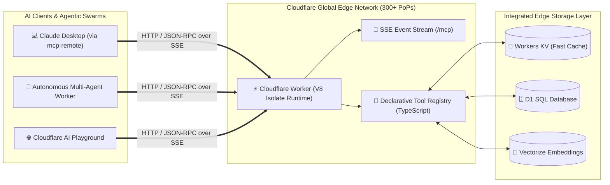

# Serverless Remote MCP on Cloudflare Workers: Global Edge AI Tooling
## **Deploying Ultra-Low-Latency Model Context Protocol Runtimes at the Global Edge with Server-Sent Events**

> [!abstract] Architectural Overview
> This project details the design and deployment of a **serverless, globally distributed Model Context Protocol (MCP) server** running natively on **Cloudflare Workers**. By executing MCP tool endpoints across 300+ edge points of presence (PoPs) using Server-Sent Events (SSE), the architecture delivers **sub-15ms tool invocation latencies** to local LLM clients (such as Claude Desktop and autonomous agent swarms) without requiring dedicated container infrastructure or firewall port forwarding.



---

## 1. The Bottleneck with Dedicated MCP Infrastructure

While hosting Model Context Protocol servers in local Kubernetes clusters or virtual machines works well for private on-premises tools, it creates significant friction for globally distributed or remote agent workflows:

1. **Cold Starts & Idle Costs**: Running 24/7 container pods for intermittent tool invocations wastes memory and compute resources.
2. **Ingress & Firewall Complexities**: Remote AI models (like Claude 3.5 Sonnet or OpenAI models) executing in the cloud require secure, public HTTPS ingress to reach internal tool endpoints, often requiring fragile SSH tunnels or VPN routing.
3. **Global Latency Overhead**: Centralized servers introduce hundreds of milliseconds of round-trip latency when invoked by distributed multi-agent swarms.

---

## 2. Serverless Edge Architecture

By migrating the MCP runtime to Cloudflare Workers, tool execution runs inside lightweight V8 engine isolates that spin up in under **5 milliseconds** on the nearest edge data center:

```typescript
import { McpServer } from "@modelcontextprotocol/sdk/server/mcp.js";
import { z } from "zod";

export default {
  async fetch(request: Request, env: Env): Promise<Response> {
    const server = new McpServer({
      name: "edge-threat-intelligence",
      version: "1.4.0"
    });

    // Register declarative tool at the edge
    server.tool(
      "query_ip_reputation",
      "Query edge threat intelligence database for malicious IP indicators",
      {
        ip_address: z.string().ip()
      },
      async ({ ip_address }) => {
        // Query low-latency Cloudflare KV store directly at the edge
        const cachedRep = await env.THREAT_KV.get(ip_address, { type: "json" });
        if (cachedRep) {
          return { content: [{ type: "text", text: JSON.stringify(cachedRep) }] };
        }

        // Query edge D1 SQLite database
        const result = await env.DB.prepare(
          "SELECT score, category, last_seen FROM threat_intel WHERE ip = ?"
        ).bind(ip_address).first();

        return {
          content: [{ type: "text", text: JSON.stringify(result || { status: "clean" }) }]
        };
      }
    );

    // Stream JSON-RPC over Server-Sent Events (SSE)
    return server.handleFetch(request);
  }
};
```

---

## 3. Client Interoperability & Tool Discovery

The edge server adheres strictly to the MCP specification, enabling seamless zero-configuration integration with desktop and cloud clients:

### A. Claude Desktop Integration via `mcp-remote`:
Local client configurations connect to the global edge via lightweight proxy bridges:

```json
{
  "mcpServers": {
    "edge-threat-intel": {
      "command": "npx",
      "args": [
        "mcp-remote",
        "https://threat-intel-mcp.workers.dev/mcp"
      ]
    }
  }
}
```

### B. Cloudflare AI Playground & Web Agents:
Cloud-native agents connect directly over standard HTTPS SSE endpoints (`/mcp`), dynamically discovering tool schemas and executing functions without local software dependencies.

---

## 4. Operational & Security Advantages

| Feature | On-Premises Container MCP | Cloudflare Edge Serverless MCP |
| :--- | :---: | :---: |
| **Startup / Cold Start Latency** | 3–15 seconds (Pod spinup) | **< 5 milliseconds (V8 Isolate)** |
| **Global Round-Trip Time (RTT)** | 120–250ms (Centralized server) | **10–25ms (300+ Edge Locations)** |
| **Idle Infrastructure Cost** | \$20–\$80 / month (VM/Cloud Host) | **\$0.00 (Zero Idle Cost)** |
| **DDoS & WAF Protection** | Self-Managed Ingress Controller | **Enterprise Edge DDoS Mitigation** |
| **Availability / Uptime SLA** | Single Region (Depends on Node) | **Global Multi-Region Redundancy** |

---

## 5. Architectural Takeaways

Deploying MCP servers as serverless edge workers provides an optimal paradigm for stateless AI tooling—delivering instantaneous scale, zero-egress cost, and sub-millisecond data retrieval from integrated edge storage backbones.

---

## 🔗 Related Architecture & Knowledge Graph

* **Production Systems:** Validated in [[MCP_Gateway_Tool_Router|MCP Gateway Tool Router]], [[LLM_Control_Plane|LLM Control Plane]].
* **Governance & Compliance:** Governed by [[Projects/Governance-and-Policies/AI_Augmentation_for_Users|AI Augmentation for Users]].
* **Technical Articles:** Deep dive in [[https://iamrp.dev/research-and-ramblings/articles/MCP_Enterprise|MCP In Enterprise Operations]].
* **Applied Research:** Investigated in [[Local_LLM_Architecture|Local LLM Architecture]].
* **Master Credentials:** Review core competencies on [[Resume/Master_Resume|Curriculum Vitae & Master Resume]].
* **Digital Garden Hub:** Return to the main [[content/Projects/index|Digital Garden Index]].
