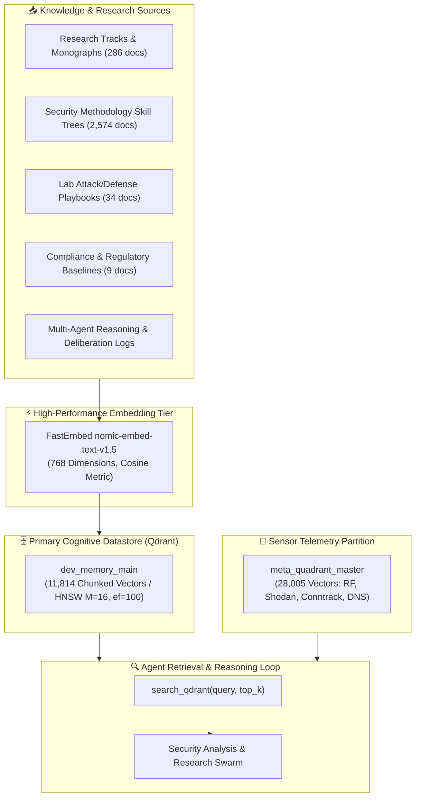

# Vector Knowledge Base & Memory Datastore (`dev_memory_main`)
### **768-Dimensional Embedding Space, Cognitive Memory Indexing & Multi-Domain Retrieval**

> [!abstract] Capstone Architectural Specification
> Traditional security information and event management (SIEM) systems struggle with high-dimensional contextual correlations across unstructured threat reports, security skill trees, and dynamic AI execution traces. The **Security Analysis and Research Agent** resolves this limitation by maintaining its primary operational memory and research knowledge in **`dev_memory_main`**—a high-density vector datastore hosted in **Qdrant** utilizing 768-dimensional `nomic-ai/nomic-embed-text-v1.5` embeddings in Cosine distance space.

---

## 1. Vector Space & Memory Datastore Architecture

The agent's cognitive memory (`dev_memory_main`) indexes over **11,814 chunked vectors** representing curated threat intelligence, research monographs, skill trees, API references, and multi-agent workflows.



### Vector Distance & Similarity Metric

Semantic proximity between an active query vector $u \in \mathbb{R}^{768}$ and stored knowledge chunk $v \in \mathbb{R}^{768}$ is computed using the **Cosine Distance metric**:

$$\text{Cosine Similarity}(u, v) = \frac{u \cdot v}{\|u\|_2 \|v\|_2} = \frac{\sum_{i=1}^{768} u_i v_i}{\sqrt{\sum_{i=1}^{768} u_i^2} \sqrt{\sum_{i=1}^{768} v_i^2}}$$

Cosine distance $\mathcal{D}_{\text{cos}}(u, v) = 1 - \text{Cosine Similarity}(u, v)$ guarantees that token density and document chunk lengths do not distort semantic relevance scores.

### HNSW Graph Indexing Configuration

`dev_memory_main` is configured for sub-millisecond retrieval under high-concurrency agent queries:
- **Vector Dimension**: `768` (`fast-nomic-embed-text-v1.5`)
- **Distance**: `Cosine`
- **HNSW Parameters**: $M = 16$, $ef\_construct = 100$
- **On-Disk Storage**: Payloads and vectors are persisted to NVMe storage with memory-mapped headers (`on_disk_payload: true`), allowing millions of points to scale within localized edge RAM footprints.

---

## 2. Memory Datastore Schema & Chunking Structure

Every chunk stored in `dev_memory_main` follows a strict schema designed for multi-turn conversational recall, contextual synthesis, and traceability back to source files:

| Field Name | Type | Description | Example Value |
| :--- | :---: | :--- | :--- |
| `id` | `UUID` | Unique point identifier | `000642fc-ef48-54c7-bf02-13edc43d5312` |
| `type` | `keyword` | Document category (`research`, `docs`, `memory`) | `research` |
| `source` | `keyword` | Source Markdown file or monograph | `20_detection_validation_purple_team_execution.md` |
| `chunk_id` | `integer` | Sequence index of the chunk | `3` |
| `total_chunks`| `integer` | Total chunks comprising the source document | `5` |
| `content` | `text` | Raw synthesized research text / code payload | Markdown monograph content block |

### Representative Payload Samples from `dev_memory_main`

#### A. Purple Team & Detection Engineering Chunk
```json
{
  "id": "000642fc-ef48-54c7-bf02-13edc43d5312",
  "type": "docs",
  "source": "20_detection_validation_purple_team_execution.md",
  "chunk_id": 3,
  "total_chunks": 5,
  "content": "Produces auditable detection coverage metrics over time, distinct from one-off red team engagements.\n* **Tools:** MITRE ATT&CK Navigator (coverage heatmap), CALDERA, internal reporting dashboard.\n* **Telemetry Requirements:** Atomic test execution telemetry correlated against Windows Event Log (Sysmon Event ID 1, 3, 7) and Linux eBPF execution maps."
}
```

#### B. Post-Quantum Cryptography (PQC) Migration Chunk
```json
{
  "id": "0023bb79-97f0-5419-be60-e7b203af52e9",
  "type": "research",
  "source": "api-reference.md",
  "chunk_id": 4,
  "total_chunks": 5,
  "content": "## MITRE ATT&CK Relevance\n| Technique | ID | PQC Relevance |\n|---|---|---|\n| Adversary-in-the-Middle | T1557 | Quantum adversaries with cryptanalytically relevant quantum computers (CRQC) can decrypt recorded classical key exchanges (Store-Now-Decrypt-Later). Migration mandates hybrid ML-KEM-768/X25519 key encapsulation. |"
}
```

---

## 3. Direct Qdrant Integration & Retrieval Pipeline

The agent utilizes a direct asynchronous Python client (`qdrant_client`) paired with `FastEmbed` to execute sub-50ms vector searches without prompting overhead:

```python
from qdrant_client import QdrantClient
from fastembed import TextEmbedding

def search_dev_memory(query: str, top_k: int = 5, doc_type: str = None) -> list:
    """Semantic vector search across the 11,814 vectors in dev_memory_main."""
    client = QdrantClient(url="http://127.0.0.1:6333", timeout=10)
    embedding_model = TextEmbedding("nomic-ai/nomic-embed-text-v1.5")
    
    # Generate 768-dimensional query vector
    query_vector = next(embedding_model.embed([query])).tolist()
    
    # Execute HNSW vector query
    results = client.query_points(
        collection_name="dev_memory_main",
        query=query_vector,
        using="fast-nomic-embed-text-v1.5",
        limit=top_k
    ).points
    
    return [
        {
            "score": pt.score,
            "source": pt.payload.get("source"),
            "type": pt.payload.get("type"),
            "content": pt.payload.get("content")
        }
        for pt in results
    ]
```

---

## 4. Multi-Tiered Vector Architecture: Memory vs. Telemetry

The overall research platform partitions operational state into two purpose-built collections:

1. **`dev_memory_main` (11,814 vectors)**: **Cognitive & Analytical Knowledge Base**. Houses security skills, research tracks, regulatory compliance standards, and playbooks. Evaluated during reasoning, planning, and hypothesis generation.
2. **`meta_quadrant_master` (28,005 vectors)**: **Live Sensor & Telemetry Store**. Houses high-frequency real-time events including Shodan host scans, RF proximity alerts, Layer 4 Conntrack session flows, and NextDNS logs.

This dual-tier separation ensures that high-volume sensor telemetry does not pollute or dilute semantic retrieval across core research knowledge and skill trees.

---

_Related Documents in the Capstone Suite:_
- **[[research/Empirical_Telemetry_and_RF_Analysis|Empirical Telemetry & RF Anomaly Modeling]]**
- **[[research/Research_Tracks_Taxonomy|26 Prioritized Research Tracks Taxonomy]]**
- **[[research/Lab_Validated_Playbooks|Lab-Validated Defense Playbooks]]**
